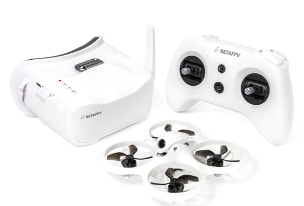
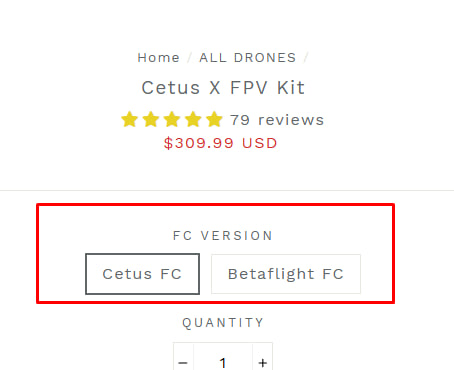
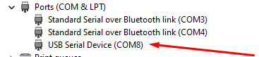
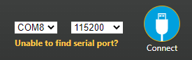
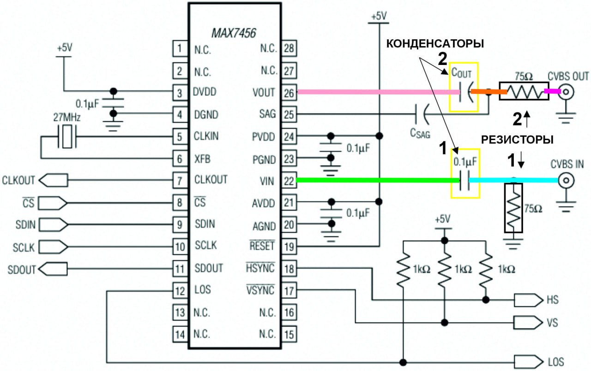

# Cetus X

## Описание
[Обзор FPV Cetus X Betaflight | BetaFPV | Первый дрон, старт в FPV. YouTube: Horizon](https://www.youtube.com/watch?v=MjO-WXwTGzM)  

[CETUS X от BETAFPV. Нужен ли он тебе? YouTube: Обо всём по чуть чуть](https://www.youtube.com/watch?v=KwPMTkQE93g)

Дрон идет в комплекте  комплекте [Cetus X FPV Kit](https://betafpv.com/collections/all-drone/products/cetus-x-fpv-kit)  
  

В него входят:  
- [дрон Cetus X](https://betafpv.com/collections/cetus-series/products/cetus-x-brushless-quadcopter)  
- [шлем VR03 FPV Goggles](https://betafpv.com/products/vr03-fpv-goggles)  
- [пульт LiteRadio 3](https://betafpv.com/collections/tx/products/literadio-3-radio-transmitter)

Преимуществом является тот факт что дрон, шлем и пульт уже сконфигурированы и связаны между собой. Это уменьшает порог вхождения в FPV хобби.  

Однако у данного комплекта есть свои недостатки.  
1. Дрон имеет тяжелую и хрупкую раму.  
2. Закрытая форма канопы снижает вентиляцию VTX.  
3. VTX часто перегорает. А замена усложняется тем, что это единый [модуль С04, спаянных вместе камеры и VTX](./../90_Komponenty/Camera_VTX_C04.md). Подробности ниже.  
4. У многих имеются нарекания к качеству и надежности "пластилиновых" моторов.  
5. На пульте LiteRadio стоят потенциометры (а не датчики Холла). Из за этого достаточно быстро появляется дребезг в стиках. Приходится или смазывать, или менять на купленные отдельно стики с датчиками Холла. Подробности про пульт и его особенности [написано здесь](../../../../10_RC/10_Modeli/30_Betafpv/LiteRadio/01_Literadio2_3.md)  

**!!! Категорически не рекомендуется** брать версию `Cetus FC`. Причины описаны ниже.

## Различия в версиях полетника

Cetus X бывает на полетниках двух версий: Cetus FC и Betaflight FC

Это означает, что рама и моторки одинаковые, а полетник и бутерброд отличаются.  
Версия Betaflight FC поставляется с полетником, который поддерживает прошивку Betaflight. Со всеми ее плюсами и гибкими настройками.  
Также этот полетник имеет встроенный приемник на протоколе ELRS, что опять же хорошо, потому что это современный протокол и железо. Так же Бутербродж к нему подключается по 5 проводам, что есть стандарт и в случае чего можно поменять бутерброд на любые совместимые VTX и камеру.

С версией Cetus FC все интереснее:  
Разработчики BETAFPV решили запилить дрон для полных новичков и детей, чтобы он мог удерживать высоту и позицию, как дроны DJI. То есть висеть на месте.  
Чтобы осуществить это дело, нужно иметь специальные датчики под брюхом дрона. Эти датчики будут смотреть на пол (землю) и если видят, что дрон смещается в сторону или по высоте - полетник вносит коррективы и удерживает дрон на месте.  
Выглядит круто и очень много новичков (в том числе и я) купились на эту экстра возможность. Ведь удобно же. У меня почти что DJI! ха-ха!  

И вот тут вылезают нюансы:  
1. Прошивка Betaflight НЕ УМЕЕТ работать с такими датчиками. Нет такой фичи. Говорят, она есть в прошивке INav, но это уже другая история.  
Ну раз Betaflight такого не умеет, программисты BETAFPV разработали свою прошивку, несовместимую с Betaflight, но умеющую обрабатывать данные с датчиков.  
Прошивка оказалась очень убогая по своим возможностям по сравнению с Betaflight. И настраивается такой дрон не через Betaflight Configurator, а через [BETAFPV_Configurator](https://github.com/BETAFPV/BETAFPV_Configurator).  
2. BETAFPV разработали свой полетник, у которого внизу два датчика для контроля положения и высоты. И разработали раму с окошками для датчиков. Ну а чтоб не париться, эта же рама используется и для дрона с полетником на Betaflight. Дырки в раме есть - а в полетнике нет датчиков. :)  
3. Вишенка на торте: хитрожопые сотрудники BETAFPV решили в полетник на своей прошивке встроить приемник не на ELRS а на устаревшем протоколе FrSky. Ну видимо завалялись на складе старые микросхемы. Ну вот и решили впарить. Итого мы получили дрон, который уже не может работать с пультами на распространенном протоколе ELRS. Естественно в Cetus X Kit вложили аппу с передатчиком на FrSky. Так что если развивать дальше в хобби, то ее придется просто выкинуть.  
4. Бутерброд на таком цетусе тоже нестандартный. На нем не три 5 проводов как по классике, а всего три: +/-/ и наверно м-линк. OSD кладет сам VTX а не полетник, как это принято в полетниках на Betaflight. Таким образом, если у тебя сгорит бутерброд на таком дроне - ты не сможешь поставить другой нормальный VTX и камеру. Придется покупать такой же бутерброд от BETAFPV.  

Теперь про Cetus Pro: в нем изначально стоит полетник и прошивка с датчиками. Соответственно это не прошивка Betaflight. Это прошивка от BETAFPV. И в всеми ругаемом BETAFPV Aquila 16 тоже есть датчики и такая же убогая прошивка от BETAFPV.  
Единственная радость, хоть приемник на протоколе ELRS, в не FrSky как в Cetus X.

Итого, новички клюют на то что можно купить комплектом дрон пульт и шлем и покупают Цетусы и Аквиллы. А если выбирают модель Cetus X, то клюют на датчики, которые по началу упрощают жизнь. Ну и получают убогую прошивку и устаревший протокол FrSky у приемника.  
Каюсь, я как раз и купил свой первый комплект Cetus X kit с датчиками. Он стоит капельку дороже. Ну, думаю, раз дороже, значит лучше :))))  
Про прошивки и протоколы я тогда еще не знал. И раскаяние пришло запоздало.
Ну ничего, лежит теперь мой цетус. Иногда балуюсь на нем. Детям даю. Ну и в случае чего,пойдет как донор, если нужны будут моторы. Все остальное от него нафиг не нужно :)  

## Как понять какой версии полетника у меня дрон?
Если протокол связи ELRS, а дрон можно конфигурировать через Betaflight Configurator - то это Betaflight верcия.  
Еще отличия:  
на бутерброде 3 контакта или 5.  
OSD меню выглядит по разному. Оно отличается от того что в Betaflight.  
Режимы у дрона с Cetus FC называются Normal, Sport и Manual. А в Betaflight Angle, Horizon и Acro.

## Дрон с ПК на прошивке `Cetus FC`
Для настройки Cetus X с полетным контроллером на прошивке `Cetus FC` и приемником на протоколе `FrSky` используется программа [BETAFPV_Configurator](https://github.com/BETAFPV/BETAFPV_Configurator).  
На текущий момент рабочая версия конфигуратора:  
[BETAFPV Configurator V2.0.0](https://github.com/BETAFPV/BETAFPV_Configurator/releases/tag/V2.0.0)  
К ней подключается и аппа и дрон.   
Программы доступны для скачивания по ссылке выше для Windows, Linux и MacOS.  
Дрон может подключаться к обоим программам. Интерфейс идентичен.

Сначала нужно подключить дрон к компьютеру при помощи [кабеля-переходника](30_Kabel_perehodnik.md), идущего в комплекте.  
В общем случае, при подключении к Windows 10/11 драйверов не требуется. Дрон определяется как COM порт в Диспетчере устройств.  
  
На самом дроне сначала моргает голубой светодиод, потом начинает медленно моргать желтый.  

**ВНИМАНИЕ**: при подключении к компьютеру передатчик на дроне сильно греется и может сгореть. Настоятельно рекомендуется организовать **обдув дрона вентилятором**.  

При запуске программы появившийся порт успешно определяется в списке портов.  
  
Остается нажать кнопку `Connect`.

## Инструкции
Ссылки на инструкции к дрона и китам на разных протоколах доступны на [странице производителя](https://betafpv.com/collections/all-drone/products/cetus-x-fpv-kit)

Переведенная на русский язык [Подробная инструкция BETAFPV Cetus X (Cetus FC / FrSky) FPV KIT](https://coptertime.ru/reviews/manuals/betafpv-cetus-x-fpv-kit-manual/)

## Дрон с ПК на прошивке `Betaflight`
Полетный контроллер имеет встроенный ELRS приемник подключенный по SPI порту.

### [Перевод дрона в режим Bind](./../../../../60_Bind/50_Rezhim_Bind_drona_s_SPI.md)

### [Ввод Bind фразы на дроне](./../../../../60_Bind/54_Bind_fraza_drona_s_SPI.md)

## Светоиндикация на дроне
- При подключении к компьютеру сначала быстро моргает `голубой` светодиод, потом начинает медленно моргать `желтый`.  
- Если дрон подключен к компьютеру и произошла связь с аппаратурой вместо желтого медленно моргает `красный`.  
- При подключении к дрону батарей сначала быстро моргает `голубой` светодиод, потом начинает медленно моргать `желтый`.  
- Если дрон произошла связь с аппаратурой вместо желтого медленно постоянно горит `голубой`.  

## Советы новичкам
1. Общая рекомендация: прежде чем начать летать на дроне, отлетать хотя бы часов 10 в симуляторе.
2. Если включать дрон и не летать (например для настройки в конфигураторе), обязательно нужно обеспечить его вентиляцию. Иначе VTX сгорит еще до того, как будет осуществлен первый полет. В качестве альтернативы можно через OSD меню переводить VTX в PIT mode. Или настроить в Betaflight на кнопку на пульте переключение мощности.  
Подробности в видео от Петра:  
 [Cetus X - перегрев видео передатчика - часть 1. Отчего перегрев и как исправить.](https://www.youtube.com/watch?v=T5I1-_kiTXA)
 [FPV как переключать канал или мощность vtx с пульта](https://www.youtube.com/watch?v=ElDQzcKTmy0)  
3. Пересмотреть по возможности [Плейлист от Petrokey с набором видео по Cetus X](https://www.youtube.com/watch?v=tGPvwgN4XSA&list=PLibQsrRt3X1cWiIiE2T3RKKdAgSZxIGjX)  

## Замена силового провода
[Как паять в FPV - замена силового провода betafpv CetusX. Оборудование и подручные средства. YouTube: Петрокей](https://www.youtube.com/watch?v=hoLExyj6YCo)  

Комментарии к видео: 
Когда припаиваешь провод к разъему BT2.0 к контактам, надо помнить что разъем пластиковый и пластик может поплыть при долгом контакте жала с металлом (перестанет втыкаться из за искривления конструкции).  
В больших разъемах это решается тем,что при пайке папа в маме находится, и мама «держит» геометрию разъема и забирает часть тепла с «папы» (и наоборот)  
Но там разъем на проводах батки находится (далеко от самой батки). А в этих слишком уж близко. Я не возьмусь рекомендовать втыкать в этом случае батку во время пайки, уж слишком близко.  
Просто помнить , что он может поплыть и не держать дольше необходимого.  
И не паять слишком погранично низкой температурой - придется дольше припой разогревать, и соответственно разогревать и пластик.

## Видео

Плейлист [по Cetus X на канале Петрокей](https://www.youtube.com/playlist?list=PLibQsrRt3X1cWiIiE2T3RKKdAgSZxIGjX)

[My Overkill Cetus X - Part 1. YouTube: Kurose AE](https://www.youtube.com/watch?v=FM6PtLo4Wes)  
[My Overkill Cetus X - Part 2. YouTube: Kurose AE](https://www.youtube.com/watch?v=ycntprAcmZM)  

### Отдельные видео

[мини fpv квадрокоптер Betaflight Cetus X - от А до Я - обзор, вопросы, нюансы. YouTube: Петрокей](https://www.youtube.com/watch?v=tGPvwgN4XSA)

[Betafpv Cetus X - угомонись! Дрон прыгает, дрейфует и прилипает к стенам. Настройка FPV для квартиры. YouTube: Petrokey](https://www.youtube.com/watch?v=kPr2hmY9g5g)  
В этом видео:  
- почему так сложно летать дома на Cetus X?
- настройка angle, acro, профайлы
- трим горизонта
- прилипание к стенам и air mode
- прыганье на полу 

[BetafpvCetus X - перегрев видео передатчика - часть 1. Отчего перегрев и как исправить. YouTube Petrokey](https://www.youtube.com/watch?v=T5I1-_kiTXA)  

[Betafpv Cetus X - перегрев видео передатчика - часть 2. Таблица мощностей. Добавил 200мВт. YouTube Petrokey](https://www.youtube.com/watch?v=hDFj-GG1LZ8)

[FPV как переключать канал или мощность vtx с пульта. YouTube Petrokey](https://www.youtube.com/watch?v=ElDQzcKTmy0)  

## Ремонт OSD
Решением поделился пользователь `@Valery_Lyashenko`  
Проблема: черный экран, канал отображается сверху справа, ОСД нет, картинки нет. Установлен родной «бутерброд» - камера C04+M04 VTX, полётник - F4 2S 15A V1.0 FC.

1. Визуальный осмотр оборудования проблем не выявил. С виду полётник, камера, VTX, антенны выглядят целыми.  
2. В Betaflight Configurator настройки портов, OSD, сетки частот установлены верно, готовность видеопедатчика отображает значение «НЕТ».  
3. Был произведён «прозвон» платы полётника согласно [схемы работы OSD](https://microsin.ru/programming/arm/max7456-osd.html?ysclid=mh1tzo4jy8453362244) обычным мультитестером.  
4. Выявлно: а) Замыкание резистора 1 (см.фото и схему, голубая линия) на массу. Лечение — перепайка резистора, причем помогла перепайка того же самого резистора. б) Отсутствие контакта от резистора 2 до выхода VO (на схеме линия малинового цвета). Лечение — припайка дополнительного провода между этими контактами.  

Проблема решилась - видеосигнал и OSD появились.😁

  
  
