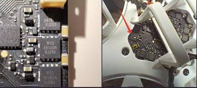
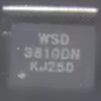
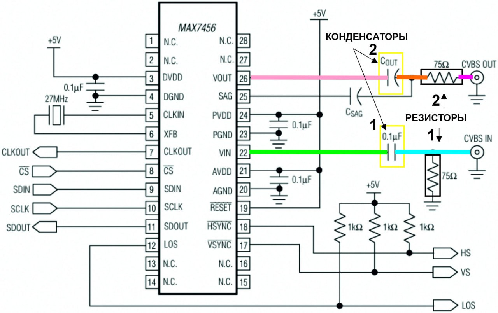
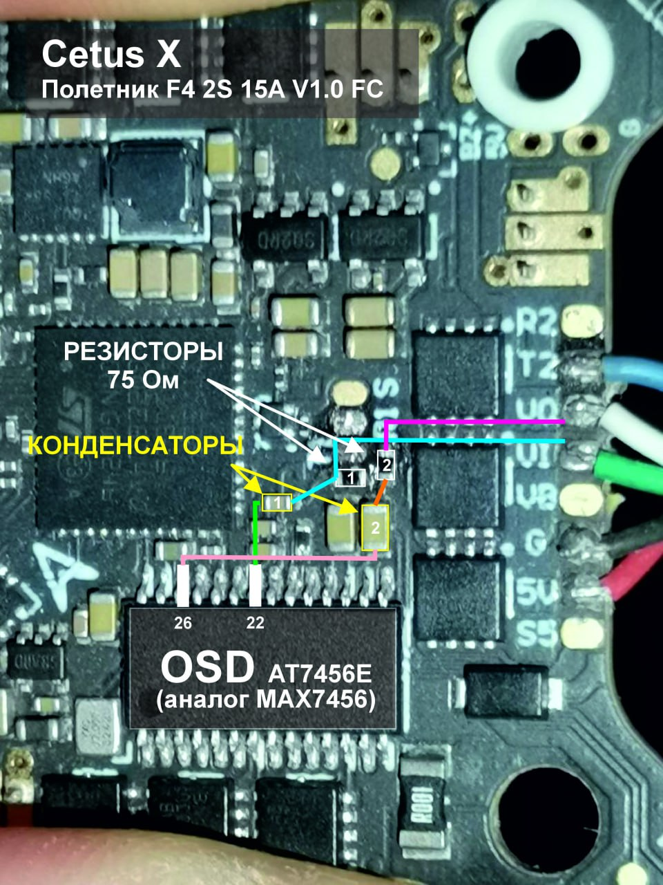

# Ремонт дрона

## Мосфет
[10PCS 100%New Original WSD3810DN 3810 DFN-8(3x3) MOSFET](https://www.aliexpress.com/item/1005005286869527.html)  
[5PCS MOS WSD3810DN 3810DN MOSFET WSD3810 DFN3x3-8](https://aliexpress.ru/item/1_286155021.html?sku_id=5000001539377086)

  

## Ремонт OSD
Решением поделился пользователь `@Valery_Lyashenko`  
Проблема: черный экран, канал отображается сверху справа, ОСД нет, картинки нет. Установлен родной «бутерброд» - камера C04+M04 VTX, полётник - F4 2S 15A V1.0 FC.

1. Визуальный осмотр оборудования проблем не выявил. С виду полётник, камера, VTX, антенны выглядят целыми.  
2. В Betaflight Configurator настройки портов, OSD, сетки частот установлены верно, готовность видеопедатчика отображает значение «НЕТ».  
3. Был произведён «прозвон» платы полётника согласно [схемы работы OSD](https://microsin.ru/programming/arm/max7456-osd.html?ysclid=mh1tzo4jy8453362244) обычным мультитестером.  
4. Выявлно: а) Замыкание резистора 1 (см.фото и схему, голубая линия) на массу. Лечение — перепайка резистора, причем помогла перепайка того же самого резистора. б) Отсутствие контакта от резистора 2 до выхода VO (на схеме линия малинового цвета). Лечение — припайка дополнительного провода между этими контактами.  

Проблема решилась - видеосигнал и OSD появились.😁

  
  

