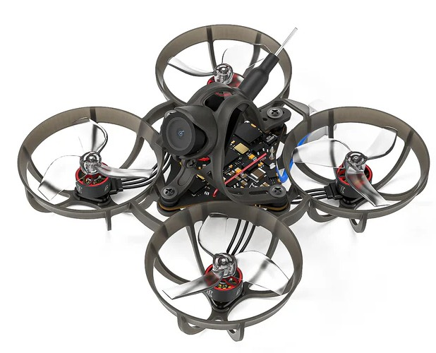
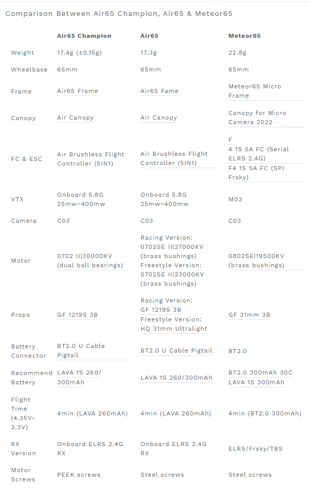
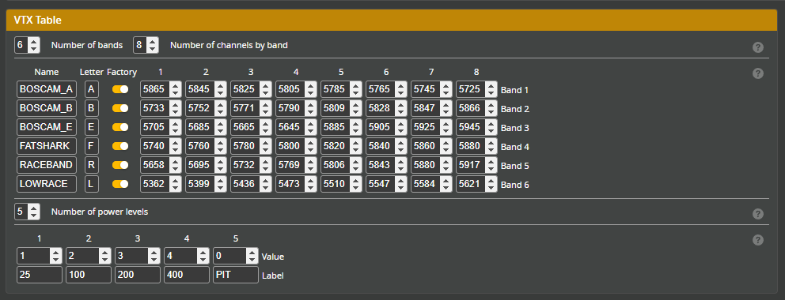

# Air65 Champion Edition
[Страница на сайте производителя](https://betafpv.com/collections/meteor-series/products/air65-brushless-whoop-quadcopter)  

[Micro Air Canopy](https://betafpv.com/products/micro-air-canopy)  
[Meteor65 Air Brushless Whoop Frame](https://betafpv.com/products/meteor65-air-brushless-whoop-frame)  
Props for Champion Edition[Gemfan 1219S 3-Blade Propellers (1.0mm Shaft)](https://betafpv.com/products/gemfan-1219s-3-blade-propellers-1-0mm-shaft)  
Air65 Champion Edition FC: [Matrix 1S Brushless Flight Controller](https://betafpv.com/collections/brushless-flight-controller/products/matrix-1s-brushless-flight-controller)  
[Battery LAVA 1S 300mAh 75C Battery](https://betafpv.com/products/lava-1s-300mah-75c-battery-5pcs?variant=40374765387910)   
Motor [0702 II|30000KV (dual ball bearings)](https://betafpv.com/collections/brushless-motors/products/0702-brushless-motors?variant=40175488237702)  

## VTX Table

## Bind
Полетный контроллер имеет встроенный ELRS приемник подключен через `UART`.

### [Перевод дрона в режим Bind](./../../../60_Bind/40_Режим_Bind_дрона_с_UART.md)

### [Ввод Bind фразы на дроне](./../../../60_Bind/44_Bind_фраза_дрона_с_UART.md)

## Светоиндикация на полетнике

### RX
Моргает зеленым - нет коннекта с аппаратурой.  
Горит зеленым - есть коннект с аппаратурой.  
Быстро моргает - включен WiFi. Переходит в этот режим после минуты отсутствия соединения с аппаратурой.  
Моргает 2 раза - режим Bind. Переходит после трех-кратного подключения батареи.  

### VTX
Три светодиода:  
Левый моргает красным с частотой 1 секунда.  
Средний все время горит синим.  
Правый красный:
- Мелко моргает красным - PIT Mode  
- Моргает с интервалом от 1 до 4 вспышек - режимы мощности от 25 до 400 мВт.

## Обзоры
[BetaFpv air65 Champion - в чем фишка лимитки. YouTube: Петрокей](https://www.youtube.com/watch?v=KkHr0nEDnQI)
