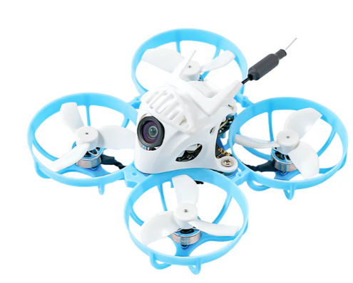

# Meteor65 Pro
[Страница на сайте производителя](https://betafpv.com/collections/meteor-series/products/meteor65-pro-brushless-whoop-quadcopter-1s)  

[C03 FPV Micro Camera](https://betafpv.com/products/c03-fpv-micro-camera)  
[M03 5.8G VTX](https://betafpv.com/collections/expresslrs-series/products/m03-25-350mw-5-8g-vtx)  
[Gemfan 35mm 3-Blade Propellers (1.0mm Shaft 4PCS)](https://betafpv.com/products/gemfan-35mm-3-blade-propellers-1-0mm-shaft-4pcs?variant=39586100052102)  
[Gemfan 35mmS-2 35mm 2-Blade Propeller 1mm](https://vi.aliexpress.com/item/1005007922211102.html)  

## Bind
Полетный контроллер имеет встроенный ELRS приемник подключен через `UART`.

### [Перевод дрона в режим Bind](./../../../60_Bind/40_Rezhim_Bind_drona_s_UART.md)

### [Ввод Bind фразы на дроне](./../../../60_Bind/44_Bind_fraza_drona_s_UART.md)

## Светоиндикация

### RX (Зеленый)
Моргает - нет коннекта с аппаратурой.  
Горит - есть коннект с аппаратурой.  
Быстро моргает - включен WiFi. Переходит в этот режим после минуты отсутствия соединения с аппаратурой.  
Моргает 2 раза - режим Bind. Переходит после трех-кратного подключения батареи.  

### Полетник (Синий)
батарея не подключена - медленно мигает  
батарея не подключена, жмем арм -  быстро мигает и переходит в медленное  
батарея подключена, стик газа НЕ в нижнем положении - синий медленно мигает  
батарея подключена, стик газа в нижнем положении - синий НЕ горит  
батарея подключена, арм	- синий горит  

### VTX
Синий - PIT Mode  
Зеленый - 25mW  
Желтый - 100mW  
Красный - 200mW  
Фиолетовый - 350mW  