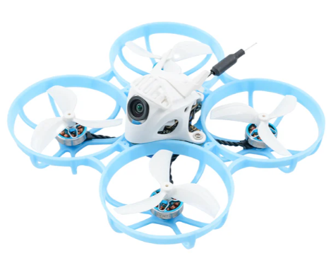

# Meteor75 Pro
[Страница на сайте производителя](https://betafpv.com/collections/meteor-series/products/meteor75-pro-brushless-whoop-quadcopter)  
 

[METEOR 75 PRO МНЕНИЕ О ВУПЕ. YouTube: АквариуМИСТИКА FPV](https://www.youtube.com/watch?v=2zEOoNoXRAQ)  

[Meteor75 Pro vs Air75: Which TinyWhoop is Right for You? YouTube: NordFPV](https://www.youtube.com/watch?v=sfPQj4Wa40Y)

## Bind
Полетный контроллер имеет встроенный ELRS приемник подключен через `UART`.

### [Перевод дрона в режим Bind](./../../../60_Bind/40_Rezhim_Bind_drona_s_UART.md)

### [Ввод Bind фразы на дроне](./../../../60_Bind/44_Bind_fraza_drona_s_UART.md)

## Proshivka
Есть две версии дрона: 2023 года с полетником [F4 1S 5A AIO](https://betafpv.com/collections/brushless-flight-controller/products/f4-1s-5a-aio-brushless-flight-controller-elrs-2-4g) и 2024 года с полетником [Matrix 1S](https://betafpv.com/products/matrix-1s-brushless-flight-controller).  
Прошивки можно [качать тут](https://support.betafpv.com/hc/en-us/articles/16846305078297-CLI-for-Meteor75-Pro-2024)/  
Если у тебя новая версия, то надо качать: `BF473 4.5.0_M75_PRO_A_Matrix.txt`.  
Если же покупал раньше, надо скачать на той же странице ниже: `BF411 4.4.0_M75 Pro_A_ELRS V2.0_ELRS_20230209.txt`

