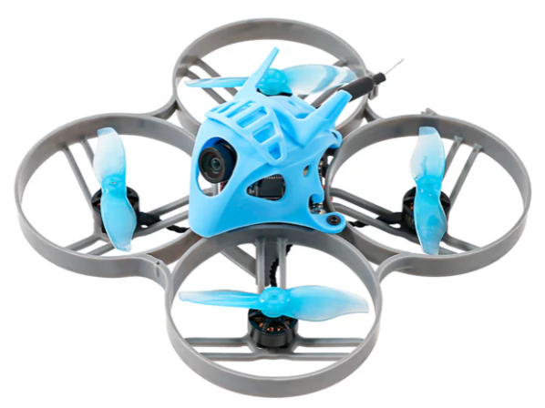
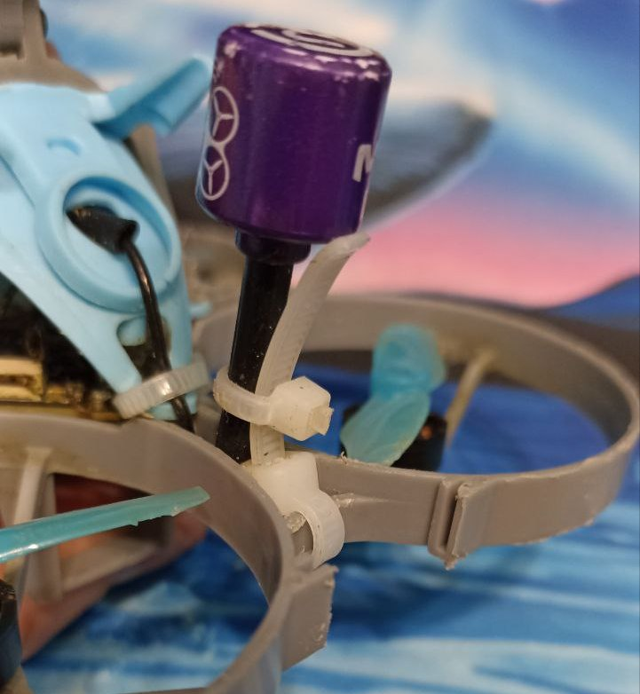
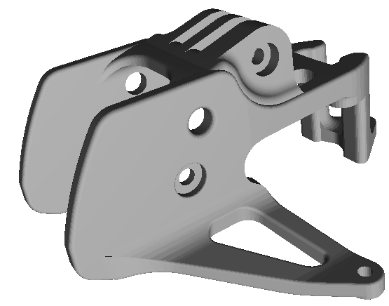
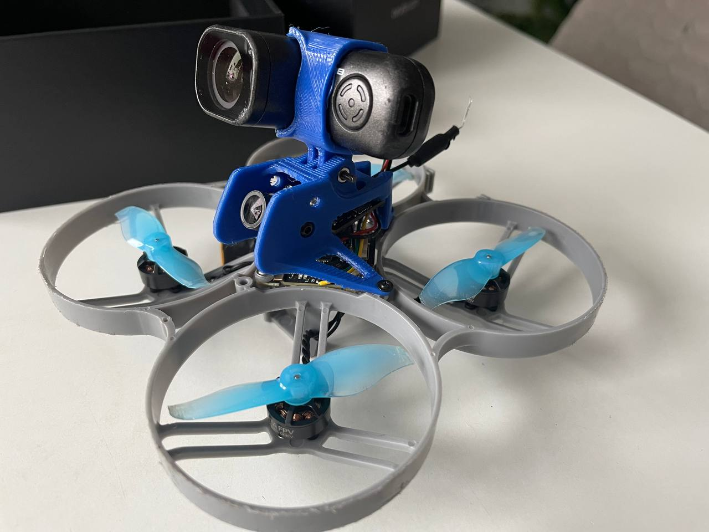
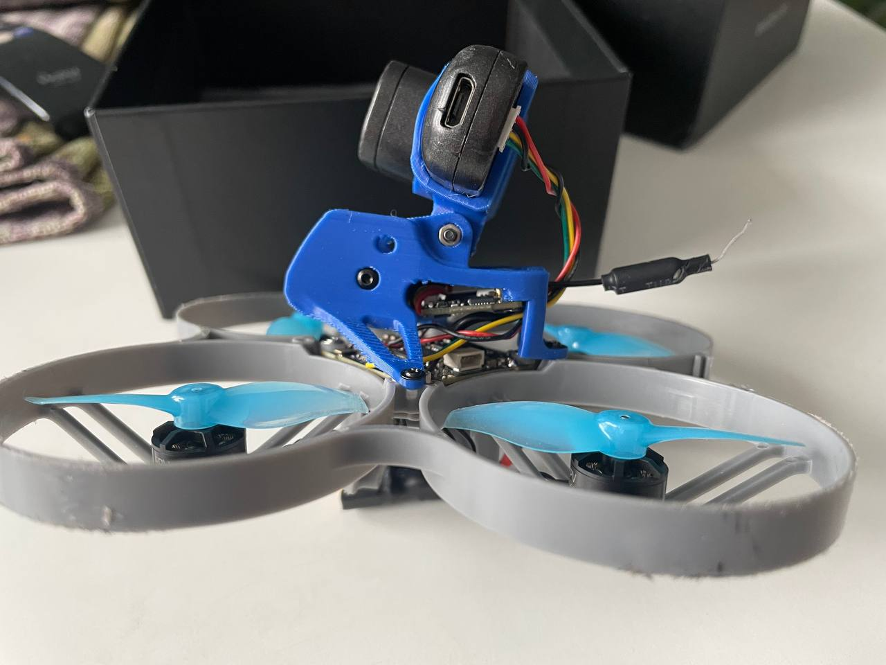
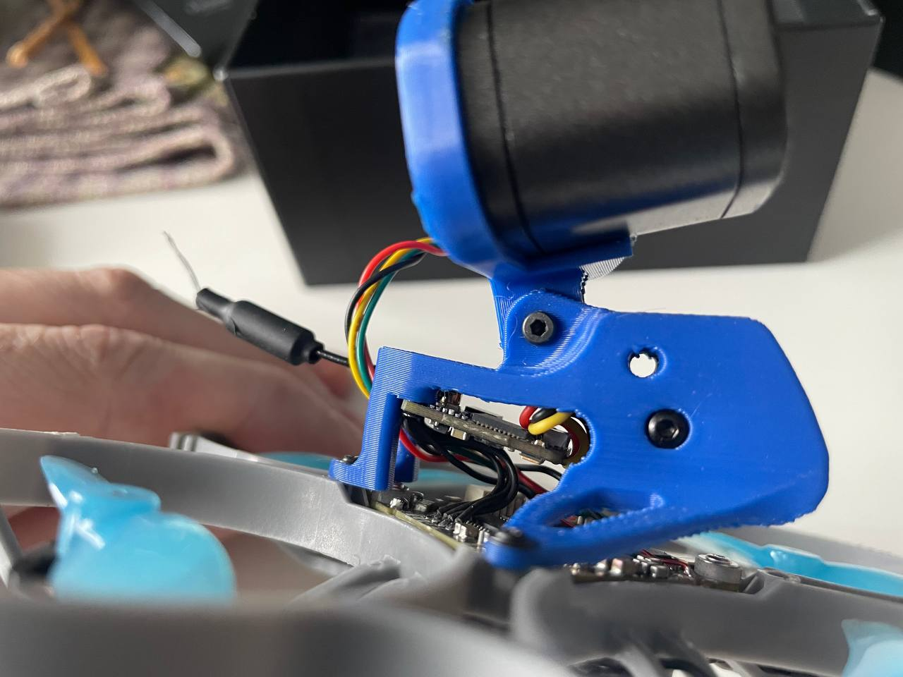
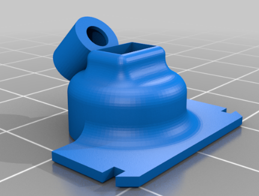
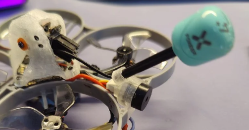

# Meteor85 (2022)
[Официальный сайт](https://betafpv.com/collections/meteor-series/products/meteor85-brushless-whoop-quadcopter-2022)  

 - Weight: 43.85g (without battery)
 - Flight Controller: [F4 1S 12A FC AIO](../../../22_FC/Modeli/BETAFPV_FC_F4_1S_12A_AIO.md)
 - Motors: [1103 11000KV with connector
](https://betafpv.com/collections/motors/products/1103-brushless-motors?variant=14762596007980)
 - Props:  
[Gemfan 2015 2-Blade Propellers](https://betafpv.com/products/gemfan-2015-2-blade-propellers-4pcs-1-5mm-shaft)  
[Gemfan 2020 4-Blade Propellers 1.5mm Shaft](https://betafpv.com/collections/propellers/products/gemfan-2020-4-blade-propellers-1-5mm-shaft)
 - Camera: [Caddx C03 ](../90_Komponenty/Camera_C03.md)
 - VTX: [M03 25-350mW](../90_Komponenty/VTX_M03.md)
 - Frame: [Meteor85 Brushless Whoop Frame](https://betafpv.com/products/meteor85-brushless-whoop-frame)
 - Canopy: [Micro Canopy for HD Camera](https://betafpv.com/collections/canopy-holder/products/micro-canopy-for-hd-camera)
 - Receiver Option: ELRS 2.4G, SPI Frsky
 - Battery: [LAVA 2S 450mAh 75C Battery](https://betafpv.com/products/lava-2s-3s-4s-450mah-75c-battery-2pcs)

## Bind
Полетный контроллер имеет встроенный ELRS приемник подключенный по SPI порту.

### [Перевод дрона в режим Bind](./../../../../60_Bind/50_Rezhim_Bind_drona_s_SPI.md)

### [Ввод Bind фразы на дроне](./../../../../60_Bind/54_Bind_fraza_drona_s_SPI.md)

[Аппаратура не биндится с Meteor85](/10_RC/10_Modeli/10_Radiomaster/01_Pocket/12_Bind_s_Meteor85.md)

## Крепление антенны от Eugenius Makhorin

## Печатная канопа с креплением Runcam Thumb от V8787

  
[Файл для 3D печати](Meteor_85_canopa.stl)  

Внешний вид:  
  
  
  

## 3D модель крепления антенны, пищалки или конденсатора

  
[Betafpv meteor85 active buzzer or capacitor mount](https://www.thingiverse.com/thing:6186817)  
  
