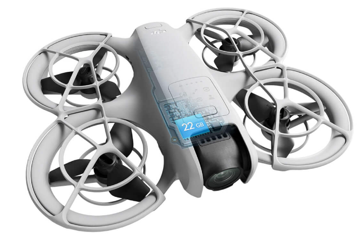

# DJI Neo

[На сайте производителя](https://www.dji.com/ee/neo)

## Комплектации

### DJI Neo (No RC)
Дрон и одна батарея

### DJI Neo Fly More Combo
- Дрон  
- 3 батареи  
- DJI RC-N3 Remote Controller  
- Two-Way Charging Hub  

### DJI Neo Motion Fly More Combo
- Дрон  
- 3 батареи  
- Goggles N3  
- RC Motion 3  
- Two-Way Charging Hub  

## Отзыв от `SanyaEesti`
На мой взгляд, это ОТЛИЧНЫЙ дрон для своих задач, каковыми могут быть синематик и селфи-съемка для НЕкомерции.  

Преимущества:  
- Компактность и безопасность.  
- Наличие умных режимов.  
- Можно начинать снимать даже без пульта и очков. Достал дрон включил, выбрал режим, запустил с руки.  
- Если подключить к телефону по WiFi через программу `DJI Fly App`, появляется возможность писать звук с микрофона, больше настроек и ручное управление.  
- Если подключить к пульту, появляется возможность FPV на экране, управление и дальность до 10км
- Есть стабилизация по GPS и/или оптическим датчиком и лидаром.  
- Самая низкая цена из всех выпускаемых дронов с таким функционалом. На текущий момент альтернатив просто нет. Разве что DJI Neo 2 выпустят :)

Недостатки:  
- Легкий и большая парусность. При сильном ветре может сильно качать и плохо работает стабилизация.  
- Камера О4 имеет узкий угол обзора. Съемка и полеты в помещении могут быть некомфортными.
- Нет датчиков препятствий.

