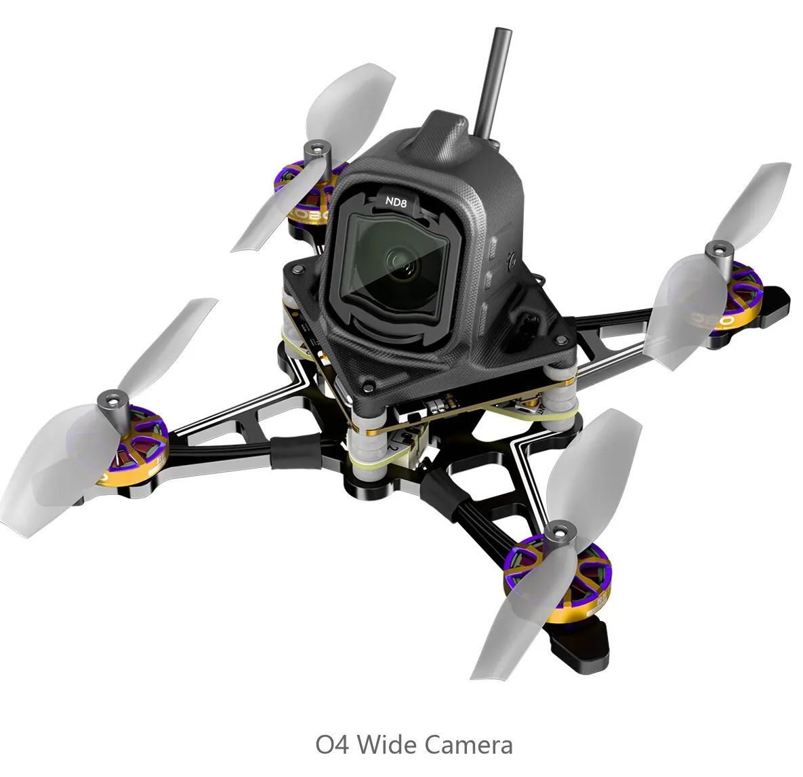
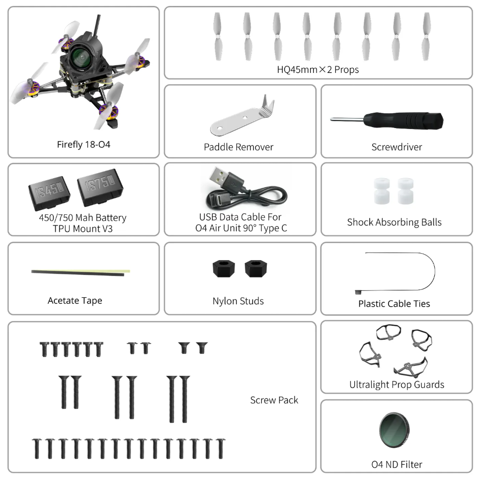

# FlyWoo Firefly18 1S Nano Baby V3

[На сайте производителя](https://flywoo.net/products/firefly18-1s-nano-baby-v3-o4-tiny-drone)

## Спецификация

|  Name                   |   Description                                                                                                                                             |
| ----------------------- | --------------------------------------------------------------------------------------------------------------------------------------------------------- |
| Model                   | Firefly18 1S Nano Baby V3 O4 Tiny Drone                                                                                                                   |
| Frame                   | [Firefly18 1S Nano Baby V3 O4 Frame kit](https://flywoo.net/products/firefly16-18-1s-nano-baby-v3-frame-kit?sku=18070506827565194383224030)               |
| Electronic              | [GOKU F405 HD 1S 1S 5A AIO W/TXCO ELRS （BNF-DJI without ELRS RX）](https://flywoo.net/products/goku-f405-hd-1s-1s-5a-elrs-aio-for-dji-o4-walksnail-hdzero) |
| Transmission            | [DJI O4 Air unit](https://flywoo.net/products/dji-o4-air-unit)                                                                                            |
| Camera                  | [DJI O4 Camera](https://flywoo.net/products/flywoo-o4-lite-camera) \ [Flywoo O4 Wide Camera](https://flywoo.net/products/flywoo-o4-wide-camera-set)       |
| Propeller               | [HQ 45MMX2 (Firefly18)](https://flywoo.net/products/hq-45mmx2-2-blade-propller-1.5mm-shaft)                                                               |
| Motor                   | [ROBO 1002 19800KV（Firefly18）](https://flywoo.net/products/flywoo-robo-1002-19800kv-23500kv-fpv-motor-1pc?sku=18059436389646194932922494)                 |
| Battery Connector       | A30                                                                                                                                                       |
| Weight                  | 25.9g（without O4）                                                                                                                                         |
| Flight Times & throttle | Flywoo 1S 450mAh / 4m17s / 32% （Firefly18 O4）  Flywoo 1S 750mAh / 5m40s / 35% （Firefly18 O4）                                                        |

## In the box : 
1*  Firefly18 1S Nano Baby V3 O4 Tiny Drone  
1* USB Data Cable For 04 Air Unit 90° Type C   
1* 1S 450mah battery tpu mount  
1* 1S 750mah battery tpu mount  
1* O4 ND 4 Filter （Only the O4 version includes filters）  
8* 45mmx2 1.5mm shaft Props  
1* Screwdriver  
1* hardware set  

## Видео и обзоры

[Flywoo Firefly 18 O4 Wide V3 Unboxing & Setup _ Waterproofing + Buzzer Mod - YouTube: Alex K – Drone pilot](https://youtu.be/GVi4T-XI1GQ)

