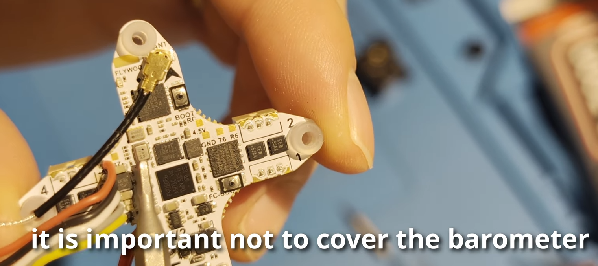
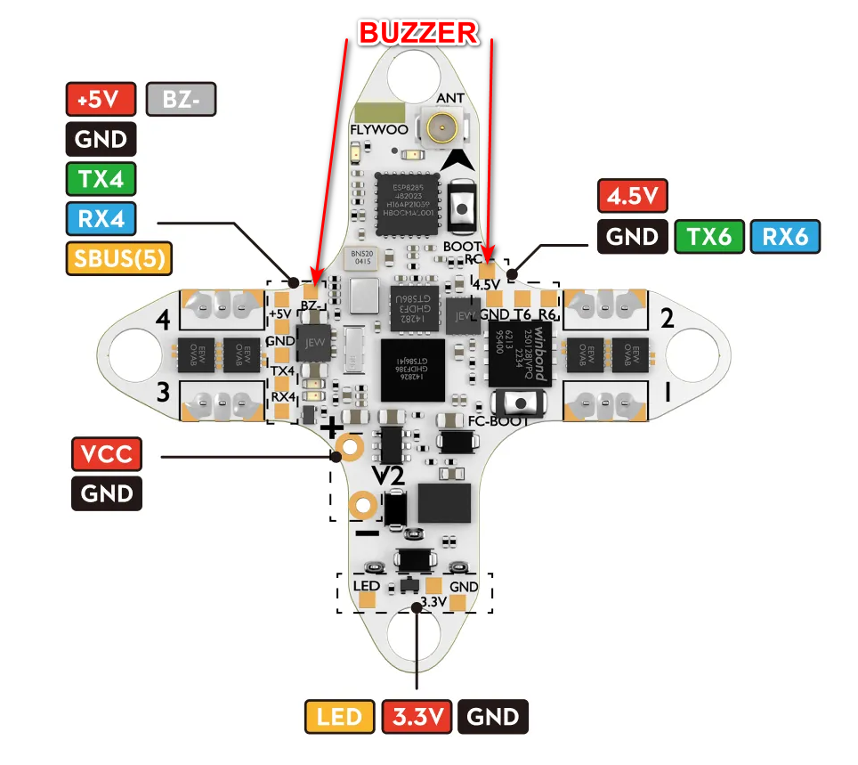

# Доработки и улучшения

## Защита от воды и buzzer

[Flywoo Firefly 18 O4 Wide V3 Unboxing & Setup _ Waterproofing + Buzzer Mod - YouTube: Alex K – Drone pilot](https://youtu.be/GVi4T-XI1GQ?t=521)

### Разборка
Слегка откручиваем винты, чтобы снять модуль О4.  
Откручиваем крепление О4 из канопы  
Снимаем канопу и откладываем в сторону.  
Отключаем шлейф О4 от полетника и откладываем в сторону O4 модуль.  
Отключаем коннекторы моторов от полетника  
Вынимаем полетник из рамы  

### Гидроизоляция полетника
Покрываем нижнюю сторону полётника гидроизоляцией

Покрываем верхнюю сторону полётника гидроизоляцией. !!! Важно не залить барометр !!!  
  
В том числе фиксируем коннектор антенны ELRS и места пайки проводов к плате

### Гидроизоляция О4 модуля
Возможно он уже покрыт.  
Поэтому можно зафиксировать места пайки проводов и коннекторы.

Раскручиваем камеру.  
Покрываем места коннекторов и плату

###  Установка пищалки (buzzer)
Устанавливается Active Buzzer 95.5mm TMB09A05

Напаивается на `BZ-` и `5V`.  
Так как `5V` может быть занят шлейфом для O4 модуля, можно напаять на `4.5V`.  

Длина проводов сантиметра 2-3.  
Припаиваем провода к полетнику и к пищалке. Натягиваем термоусадку и покрываем гидроизоляцией.

Температура паяльника 340 градусов.  

### Сборка

