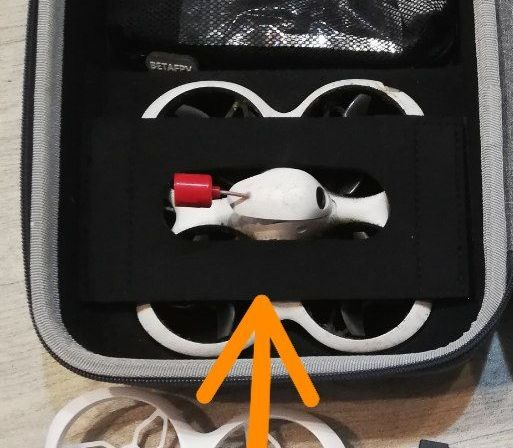

# Замена штатных антенн

## Антенны на шлем/очки 
[На этой странице](./../../../../15_Шлемы_Очки/20_Антенны_на_аналог.md)

## Антенны на дрон
[На этой странице](./../../../20_VTX/Антенны_на_аналог.md)

[Betafpv Cetus X - замена антенны. Lumenier Micro AXII 2 и Lollipop 4 на аналоговый FPV тайнивуп. YouTube: Петрокей](https://www.youtube.com/watch?v=G2w1dMCCnoc)

## Способы крепления антенны

### Вариант 1

### [How to install a U.FL antenna - BETAFPV Cetus X. YouTube: GR4YK3Y](https://www.youtube.com/watch?v=ErxKLmwsnYQ)

### [BetaFPV Cetus X Lollipop Antenna Upgrade. YouTube: JP FPV](https://www.youtube.com/shorts/JutsAVWGMDE)

### вариант от от [Lex RES](https://t.me/meganoobe)
Антенна зафиксирована простым стержнем от шариковой ручки, разрезанным вдоль. Затем для красоты усажено всё в термоусадку.  
  
  
  
 
### Вариант от `Banderos`
Я в канопе просверлил отверстие сверху, и сквозь неё пропустил провод и залил отверстие клеем. В таком случае у вас антенна на дроне и на очках остаются вертикально ориентированными, что должно лучше работать, когда одна горизонтально, другая вертикально.  
  
