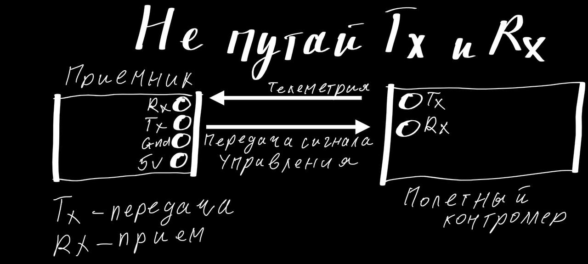

# Сборка и пайка

## Кратко от пользователя `Тимур`
Инструкция по пайке с нормальным паяльником типа fnirsi hs01-hs02, pinio, чего-то там 100-101 и иже с ними выглядит примерно так:  
Паяльник на 260 градусов для мелких проводов, на 320 для жирных силовых(выше 270 градусов паяльник не советую долго держать нагретым-окислится).  
Мажем все, что хотим спаять флюсом, на паяльник набираем припой и мажем этим припоем все, что хотим спаять по отдельности.  
Если припой не ложится и не растекается-можно поднять температуру на 20 градусов и повышать пока не станет норм. Когда все залужено-соединяем и касаемся соединения нашей волшебной палочкой.  
Для пущей красоты можно еще добавить флюса (его много не бывает).  
Потом берем щетку, спирт и чистим плату от остатков флюса. Спирт можно и на плату нанести...   

Еще нюансик: жилы проводов очень желательно скручивать-так они и распушиваться будут меньше и залудятся быстрей и качественнее.  
Еще из необходимого: плетенка медная(или медная лента)!!! Для очистки площадок.  
Еще можно (дополнительно к плетенке!!!) взять вакуумный экстрактор - это если с силовых надо лишний припой убрать или еще где капля здоровая.

## Протокол  UART 
[UART и с чем его едят](https://habr.com/ru/articles/109395/)  
[ЧТО ТАКОЕ UART?](https://dzen.ru/a/aEwWBVhLgCKX_TfV)  
[Интерфейс передачи данных - UART](https://3d-diy.ru/blog/interfeys-peredachi-dannykh-uart/)  

### Назначение RX и TX контактов в UART портах
Tx - передача сигнала  
Rx - прием сигнала  

Поясню на примере связи дрона с аппой.  
  
По пину Тх приемник передает сигнал управления, а полетник по Rx пину принимает этот сигнал.  
И так же в обратную сторону, Rx приемника - принимает телеметрию с полетника, а Tx пин полетника эту самую телеметрию отдает приемнику.

Таким образом. подсоединять нужно Тх на Rx, а Rx на Тх.

## Обзоры и статьи
[Как паять в FPV - замена силового провода betafpv CetusX. Оборудование и подручные средства. YouTube: Петрокей](https://www.youtube.com/watch?v=hoLExyj6YCo)  

[Как паять? Большой урок по пайке электроники. YouTube: AlexGyver](https://www.youtube.com/watch?v=h9RTe8-vmxo)  

[Most FPV pilots need to watch this soldering tutorial. YouTube: Joshua Bardwell](https://www.youtube.com/watch?v=GoPT69y98pY)  
[Это же видео с русской озвучкой](https://www.youtube.com/watch?v=p2hnrnJQqUU)  

[A Beginner’s Guide to Soldering for FPV Drones (https://oscarliang.com/)](https://oscarliang.com/soldering-guide/)

[Всё для пайки с Aliexpress](https://alexgyver.ru/all-for-soldering/)

[Как подключать и паять почти всё к полетнику](https://dzen.ru/a/ZjsxtoQT520u_RUV)  

[Учимся паять. Урок по пайке. Как выпаять микросхему. YouTube: HamRadio Tag](https://www.youtube.com/watch?v=dnnaHS9W5i8)

 

