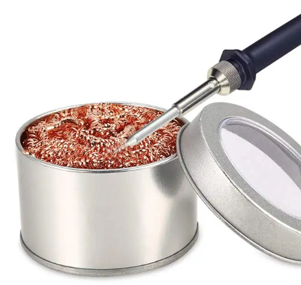
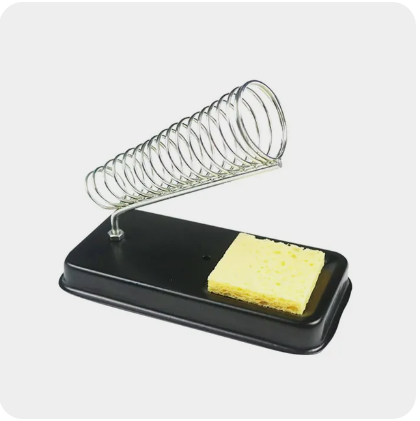

# Паяльные принадлежности

## Обзор с канала [Knock-Knock-Knock](https://t.me/knock_knock_fpv)
Я использую бюджетный паяльник и бюджетный флюс, пайка получается превосходная.   
Паяльник SH72 с тремя типами жал: bc2, bc1, C4 ( три жала на все случаи жизни)  
Флюс ТТ бессмывочный ( но я все равно смываю)  
Ну и припой kaina , обязательно СИНЯЯ!!  
Для очистки жала использую стружку, так как считаю что мокрые тряпочки пагубно влияют на жало при резкой смене температуры.  

 

Вот ссылки на товары:  
[SH72 65W Mini Electric Soldering Iron Adjustable Temperature Portable Solder Welding Station SH-K KU BC2 C4 Tip w/ Power supply](https://sl.aliexpress.ru/p?key=1rlQ3J2)  
[Припой](https://ozon.ru/t/25YO6Uo)  
[20 мл Keller TT Флюс гель индикаторный](https://ozon.ru/t/7o6EaoF)  
[Подставка под паяльник W.E.P X-2-1 с подставкой для жал](https://ozon.ru/t/fchs8dy)

## [Паяльники и паяльные станции](20_Payalniki.md)

## Припой 
### Припой Cynel Unipress Sn60Pb40
  

### Припой Kaina CF-10
  

## Флюс, канифоль
### Паяльная паста Cynel-1
  
[Паяльная паста Cynel-1. YouTube: Роман Гребеников](https://www.youtube.com/watch?v=_FO-WMO29II)  
[Польская паяльная паста Cynel-1, канифоль Cynel и китайская паяльная паста Sparta. YouTube: MrDemalit](https://www.youtube.com/watch?v=ZJiSA_qnDjM)

### Активный и пассивный флюс
- **Активный флюс** разъедает оксидную пленку на металле сразу. **Пассивный** начинает работать только в определенном температурном диапазоне.  
- **Активный** смывать обязательно, **пассивный** - нет.   
- Пример активного - паяльная кислота или большинство всяких паяльных паст. Пассивный - канифоль.

## Другое

### Отмывание припоя
Изопропиловый спирт  

Зубная щетка, мягкая и желательно с утончающимися концами

### [Губка (sponge) для очистки жала](https://vi.aliexpress.com/item/1005005424742555.html)  
5/10Pcs Yellow Cleaning Sponge Cleaner for Enduring Electric Welding Soldering Iron   
  

### [Металлическая мочалка для очистки жала](https://vi.aliexpress.com/item/1005001265506615.html)   
Metal Wire Welding Desoldering Soldering Solder Iron Tip Dross Cleaner Cleaning Steel Ball Mesh Filter Tin Remove   
  

### [Медная оплетка для убирания припоя](https://vi.aliexpress.com/item/1005006585043266.html)  
  

### Подставка для паяльника
[AliExpress.ru](https://aliexpress.ru/item/4001290312540.html?sku_id=10000015632308860)  
[AliExpress.com](https://vi.aliexpress.com/item/4001290312540.html)  
  
  
### [Третья рука (штатив с четырьмя крокодилами, лупой и вентилятором)](https://aliexpress.com/item/1005005033959635.html)
  

### [Термофен и термоусадка](https://aliexpress.com/item/1005006091801688.html)  
  
  

### [Лупа-очки со сменными линзами](https://vi.aliexpress.com/item/1005001692835936.html)
  

### [Настольная лупа с подсветкой (AliExpress.ru)](https://aliexpress.ru/item/32904815182.html)  
  

### Вентилятор с фильтром для очистки дыма
[AliExpress.ru](https://aliexpress.ru/item/1005006330933807.html)  
[AliExpress.com](https://aliexpress.com/item/1005006330933807.html)  
  

### Обжимка для наконечников YE-013B Crimping tool for JST terminals
[AliExpress.com](https://vi.aliexpress.com/item/1005002913209387.html)  
Как пользоваться: [Подключение аналоговой камеры и vtx к FPV дрону на примере Betafpv Cetus X. Yutube: Петрокей](https://youtu.be/D5YvAAP_2PU?si=yOUME8uug0k-nNpx&t=917)  
  

