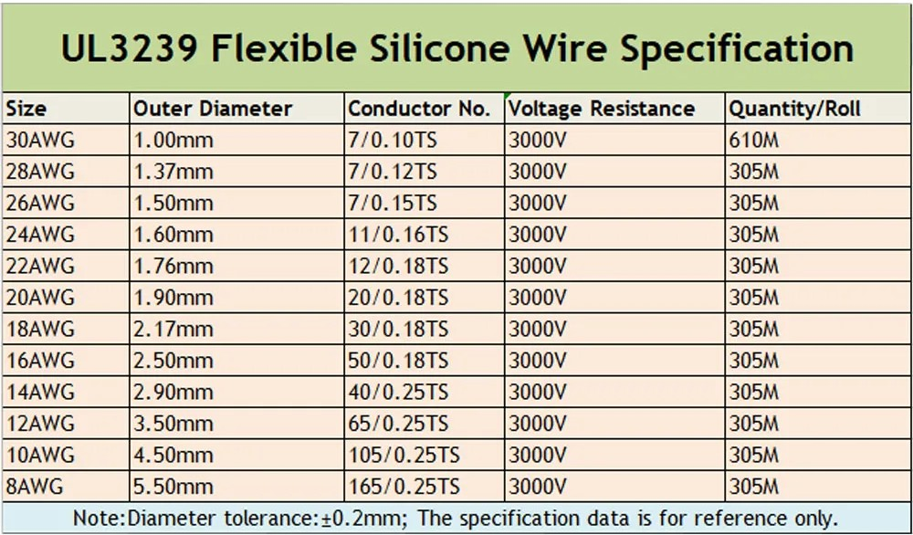
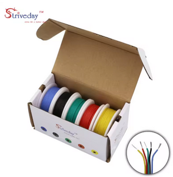
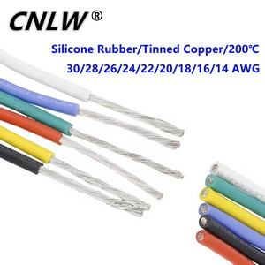
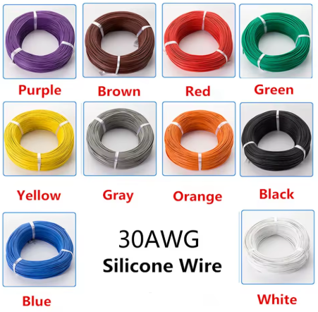
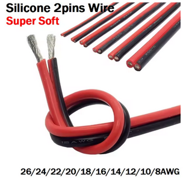
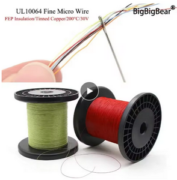

# Провода

## Какие провода использовать

### 1S вупы
- Сигнальные и моторы - 30AWG  
- Питание (BT2.0) - 28AWG  

### 2S вупы
- Сигнальные и моторы - 28AWG
- Питание (XT30) - 18AWG

### Больше 2 дюймов
- Сигнальные и моторы - 28-26AWG  
- Питание XT30 - 16-18AWG  
- Питание XT60 - 14AWG  

## Диаметр проводов


## Статьи и обзоры
[Сечение провода, AWG, необходимый диаметр провода для питания мини коптера](https://rcdetails.info/sechenie-provoda-awg-neobhodimyj-diametr-provoda-dlya-pitaniya-mini-koptera/)  

[Провода для FPV дрона. Что такое AWG и как с ним бороться. YouTube: Записки FPV пилота](https://www.youtube.com/watch?v=aXWXfRIX_eM)  

[ПРОВОДА. Как перевести AWG в миллиметры. Максимальный ток для проводов AWG. YouTube: TrySo](https://www.youtube.com/watch?v=vDIIQvxg4gw)  

[Everything You Need to Know About Electrical Wires and Connectors in FPV Drones](https://oscarliang.com/wires-connectors/)  

[What AWG Wires To Use](https://intofpv.com/t-what-awg-wires-to-use)  

## Ссылки на провода

[30 28 26 24 22 20 18awg (5 colors set kit) High Quality Stranded Wire Flexible Soft Silicone Cable Electrical Tinned Copper Wire](https://vi.aliexpress.com/item/32872439317.html)  
  

[5 Meters Heat-resistant Cable Wire Soft Silicone Wire UL3239 14AWG 16AWG 18AWG 20AWG 22AWG 24AWG 26AWG 28AWG 30AWG DIY](https://vi.aliexpress.com/item/32625434966.html)  
  

[10meters 30AWG Flexible Silicone Wire RC Cable 11/0.08TS Outer Diameter 0.8mm Electronic Wire Conductor DIY Electrical](https://vi.aliexpress.com/item/4000142644098.html)  


[Copper Wire Silicone Rubber Cable Super Soft 8 10 12 14 16 18 20 22 24 26 AWG 2Pins Flexible DIY LED Lamp Connector Black Red](https://vi.aliexpress.com/item/1005002372808912.html)  
  


### Рекомендация от гонщика [kur4sawa](https://t.me/kur4sawa):  
```
Вердикт по новым кабелям на моторы и камеры:  
1. Выдержали вчера 5 часовую тренировку ни разу не отвалились даже при самых лютых крашах.  
2. На 0.30 с копейками легче обычных проводов  
3. Красивее)))  
4. Максимально легко паять  
Ссылка где купить (32 или 34 awg берем на моторы и камеру, я юзаю 32):  
```
[10M/100M UL10064 FEP Wire 40/36/34/32/30/28/26AWG PTFE Plastic Ultra Fine Micro Litz Wires Solder High Conductivity Copper Cable](https://vi.aliexpress.com/item/1005005454857771.html)  

