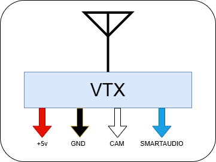
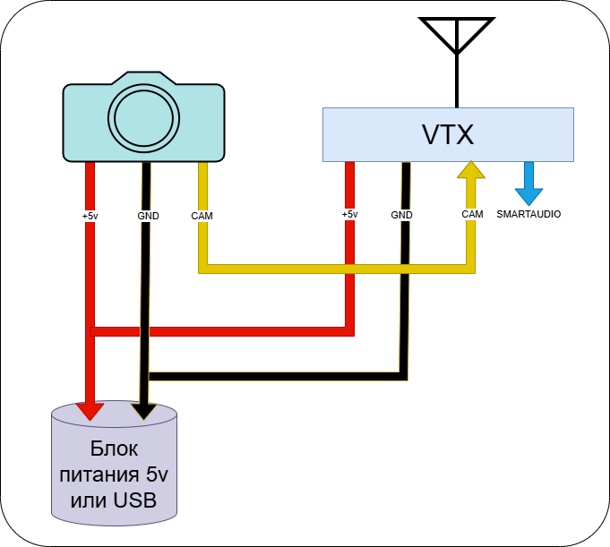
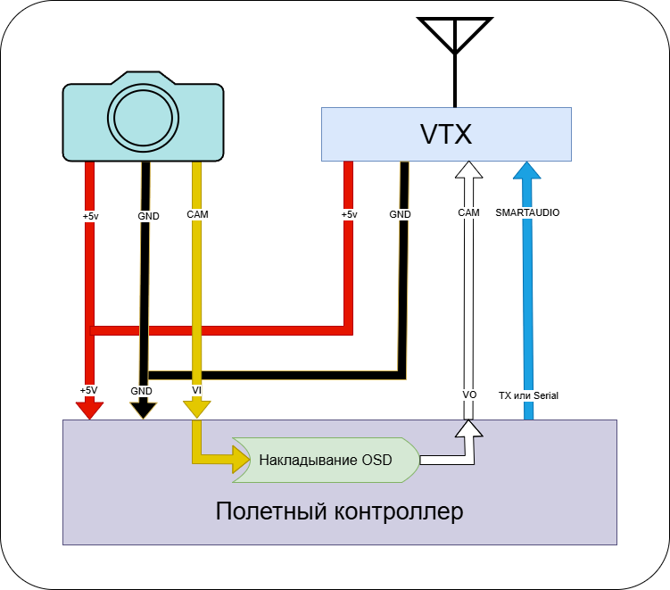
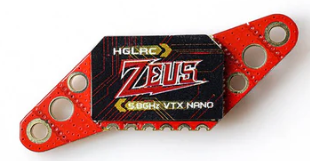
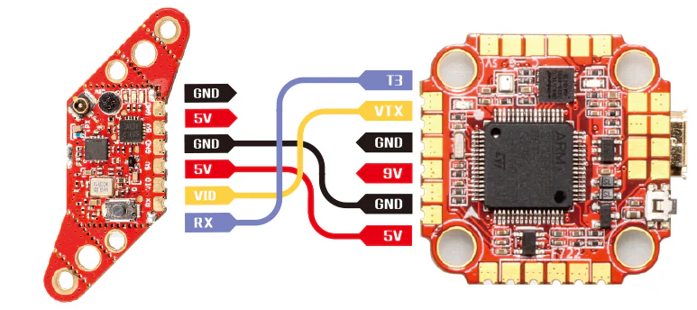
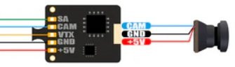
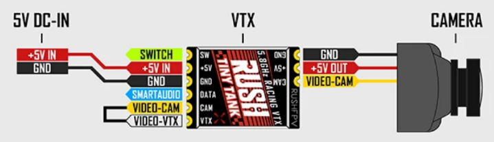
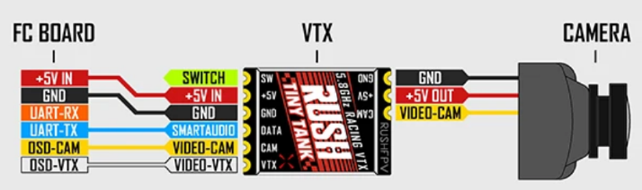
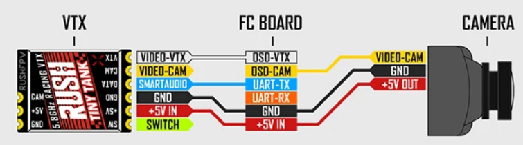
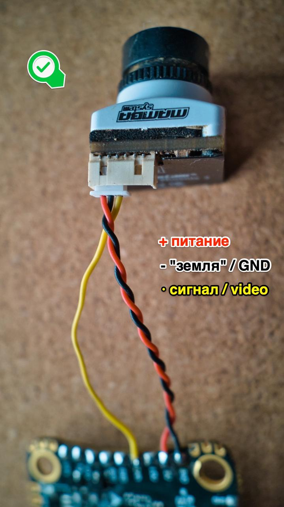

# Устройство аналоговой видеосистемы на дрон
Для того чтобы передавать видео с аналоговой курсовой видеокамеры дрона нужна, собственно камера и видеопередатчик (`VTX`), подключенный к полетному контроллеру.

**Дисклеймер**: В статье ниже указывается напряжение 5в, которое подается и на камеру и на VTX. Такое чаще всего бывает на компонентах для вупов и небольших дронов. 
Для больших дронов напряжение питания на камеру и VTX может быть разным, 7-36в. В этои случае оно может подаваться отдельно с полетника или с `BEC`.

## Камера
В общем случае курсовая камера имеет **три** вывода:  
- Питание +5в, красный провод   
- Земля (`GND`), черный провод    
- Выход видео сигнала: `CAM` или `VO`, желтый провод  

## Тип подключения №1

### Видеопередатчик (VTX)
В общем случае видеопередатчик (VTX) имеет **четыре** вывода:  
- Питание `+5v`, красный провод   
- Земля (`GND`), черный провод    
- Вход видео сигнала для его передачи в эфир: `VI` или `VID`, обычно белый провод  
- Управляющий вход, для установки мощности и выбора канала передатчика: `SMARTAUDIO`, обычно голубой  

### Тестирование видеосистемы
Таким образом, можно собрать простенькую схему для тестирования видео системы: подать питание и землю на камеру и VTX, соединить выход из камеры с видеовходом VTX и поймать сигнал в аналоговом шлеме/очках.  
В качестве блока питания можно использовать простое зарядное устройство 5в, например для телефона с USB кабелем. 

### Подключение к полетнику
Говоря о подключении аналоговой системы к полетнику, полезным является накладывание на изображение с камеры телеметрию дрона (OSD) и передачи готового изображения в эфир. Такая схема подключения будет выглядеть следующим образом:  
  

- Камера и VTX питаются от полетника.  
- Видеосигнал камеры заходит в полетник. Там накладывается OSD и итоговое изображение отдается в VTX на передачу в эфир.  
- SMARTAUDIO вход камеры соединяется с контактом TX одного из UART полетника или на SERIAL. Подробности настройки в Betaflight нужно смотреть в инструкции к VTX.  

Такая схема VTX и способ подключения используется в [HGLRC Zeus nano VTX](https://www.hglrc.com/products/hglrc-zeus-nano-vtx-350mw-for-fpv-racing-drone).  
  
  
Из схемы видно что камера подключается к полетнику независимо от VTX.  

## Тип подключения №2

### Видеопередатчик (VTX)
Приведенный выше вариант может быть не всегда удобен. На полетник приходится напаивать отдельно провода от камеры и VTX. Или же, если элементы соединяются коннекторами, то надо вести два коннектора.  
Поэтому существуют VTX со следующей архитектурой.  

Первый набор из **трех** контактов предназначен для подключения камеры к VTX:  
- Питание `+5v` подается, красный провод   
- Земля (`GND`), черный провод    
- Вход видео сигнала с камеры: `VI` или `CAM`, желтый провод  
Таким образом камера получает питание от VTX и отдает в него видеосигнал.

Второй набор из **пяти** контактов предназначен для подключения VTX к полетному контроллеру:  
- Питание `+5v`, красный провод   
- Земля (`GND`), черный провод    
- Управляющий вход, для установки мощности и выбора канала передатчика: `SMARTAUDIO`, обычно голубой  
- Выход чистого видео с камеры на полетник для накладывания OSD: `VI` или `CAM`, желтый провод   
- Вход видео из полетника с наложенным OSD для передачи его в эфир: `VO` или `VTX`, белый провод  

Примером таких VTX являются:  
[BETAFPV M03](https://betafpv.com/collections/camera-vtx-1/products/m03-25-350mw-5-8g-vtx)  
[BETAFPV C04 Camera and VTX Module](https://betafpv.com/products/c04-camera-and-vtx-module)  
[RUSHFPV TINY TANK Nano VTX](https://rushfpv.net/products/tank-tiny-vtx)

### Тестирование видеосистемы
С таким VTX тоже можно собрать простенькую схему для тестирования видео системы. Нужно подключить камеру к VTX, закоротить контакты входа и выхода видео, подать питание на VTX.  
Вот вариант схемы на примере [RUSHFPV TINY TANK Nano VTX](https://rushfpv.net/products/tank-tiny-vtx)  
  

Вот [статья с примером создания такого кабеля](10_Кабель для проверки VTX и камеры.md).

### Подключение к полетнику
В данном варианте все пять проводов с VTX подключаются к полетнику. Простой пайкой или коннектором. От камеры тянуть провода не нужно.
Вот вариант схемы на примере [RUSHFPV TINY TANK Nano VTX](https://rushfpv.net/products/tank-tiny-vtx)  
   

Но при желании такой VTX можно подключить и по первому способу, завести камеру на полетник независимо:   
   

В качестве практического примера подключения аналоговой системы разных вариантов можно почитать статью [Замена модуля С04 (VTX + камера) на BETAFPV Cetus X](../01_Models/Betafpv/10_Cetus_X/Замена_VTX_C04.md)

## Скрутка проводов от камеры
Информация с канала [shtarkfpv](https://t.me/shtarkfpv):  
Общепринято делать "скрутки" из всех проводов "гребенки", но в случае аналогового сигнала - на многих сетапах будет гораздо меньше помех в картинке видео, если сигнальный провод - вести отдельно от земли (GND) и питания.  
На фото показана часть с камерой, аналогично можно делать - с той частью, которая идет к VTX.  

P.S. Естественно будет также иметь значение рядом с чем будет проложен сигнальный провод. 

