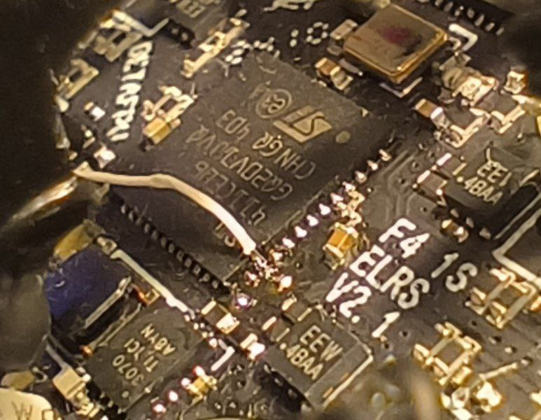

# Вопросы, проблемы и решения

## Длина антенн
Для VTX на 5.8 ГГц: Длина антенны обычно составляет около 12.92 мм или половину этого значения (6.46 мм), что соответствует полной или половинной длине волны. 

Для ELRS на 2.4 ГГц: Длина антенны обычно составляет около 31.23 мм или половину этого значения (15.61 мм), что соответствует полной или половинной длине волны  

## Дрон кувыркается при попытке взлететь 
Если квад армится, а при попытке лететь, кувыркается и дизармится, то надо проверить:  
1. Проверить, как себя моделька в Betaflight ведёт при наклонах/поворотах дрона, надо чтобы совпадало с тем что делаешь(иначе развернуть положение гиры в Betaflight)  
2. Совпадает мапинг моторов, т.е. что 1 мотор это задний правый и т.д.  
3. Совпадает направление вращения моторов  
4. Правильно установлены пропеллеры (не вверх ногами и не перепутаны левый правый)  
5. Стоит флажок props out, если это требуется на основе того как установлены пропы   
6. Порядок каналов стиков совпадаети в аппе и в Betaflight. Типичный порядок `AETR`.  

## Провод для коннекта дрона с компьютером через USB Type-C переходник
[JST1.0 SH1.0 4pin cable (AliExpress.ru)](https://aliexpress.ru/item/1005005796723171.html?sku_id=12000034384188766)  
[JST1.0 SH1.0 4pin cable (AliExpress.com)](https://aliexpress.com/item/1005005796723171.html?sku_id=12000034384188766)  
  
Только нужно будет ему порядок пинов поменять с одного конца.

## [Почему дрон не реагирует на пульт](https://dzen.ru/a/ZTnTOxoL4BMRPRHg)

## Почему дрон не армится

[Betaflight: Сложности с Армом и команды в Betaflight](https://technobee.ru/index.php/soft/betaflight/item/arming-i-komandy-v-betaflight)

Актуальная таблица флагов, запрещающих ARM: [Description of arming prevention flags](https://betaflight.com/docs/wiki/guides/current/Arming-Sequence-And-Safety#description-of-arming-prevention-flags)

В этой статье перечислены причины, и таблица со значениями флагов.  
[FPV Drone Doesn’t Arm? Let’s Troubleshoot and Fix it.](https://oscarliang.com/quad-arming-issue-fix/)  
Но таблица немного устарела (см. таблицу по ссылке выше)

Если на дроне установлен бипер (buzzer), то он издает длинные и короткие писки указывающие на причину проблемы.  
Один длинный равен числу 5. Короткий - 1. Сложив, мы получим число, которое означает значение в таблице флагов.  
Например: 3 длинных, 2 коротких. 3*5 + 2 = 17. Что означает MSP connection is active

## Propwash (пропвош)
[Турбулентность (Propwash) у квадрокоптера, как исправить](https://profpv.ru/turbulentnost-propwash-u-kvadrokoptera-ka/)  
[Что такое пропвош. Почему появляется и как с ним бороться. YouTube: Записки FPV пилота](https://www.youtube.com/watch?v=KgLhCgSpCrY)  
[Propwash или PID осцилляции?. YouTube: Кошерное Хобби](https://www.youtube.com/watch?v=cQ-U_fNLXmw)  

[Getting Rid Of FPV Drone Propwash? You Might Just Need To Fly Better! - FPV Questions. YouTube: Joshua Bardwell Livestream Clips](https://www.youtube.com/watch?v=XkDJqh588xE)  
Перевод и сжатое содержание:  
**Избавление от пропвоша (Propwash) в FPV-дронах**  
Вопрос: как уменьшить высокочастотный пропвош?  

Ответ:  
Основной способ — снизить фильтрацию (сдвинуть фильтр вправо), увеличить D-gain, но при этом моторы будут сильнее греться и есть физический предел ускорения моторов.  
Можно попробовать пропеллеры с меньшим шагом.  
Увеличение моторов даёт больше тяги, но может снизить отзывчивость из-за массы. Для 5" с моторами 2207.5–2208 мощности обычно достаточно.  

Пропвош не всегда проблема тюнинга — часто причина в стиле пилотирования.  
Аналогия с автомобилем: если при повороте визжат шины, иногда дело не в машине, а в манере вождения.  
У опытных пилотов гладкий полёт достигается комбинацией тюнинга, сборки и навыков пилотирования.

**Итог:** уменьшение пропвоша зависит не только от настроек и механики, но и от качества управления дроном.

---


## Мой приемник всегда светится зеленым и не биндится
Проблема бывает, если полетник от iFlight и при подключении приемника он всегда светится, не шьется, не поднимает WiFi.  
Решения:
1. Перенести приемник на UART1
2. Сделать подтяжку как на картинке (но проще перенести на 1й юарт)  


[Отсюда](https://t.me/expresslrs_rus/66110)

## Проблема со  светодиодами (LED) на кресте BETAFPV
На бетовских 5а крестах, вроде леды одновременно с бидиром не работали, там к ноге стмки нужно было паяться из-за косяка разводки 

  
Если поискать по чатам, то можно что-то такое найти
```
resource LED_STRIP 1 A15
timer A15 AF1
dma pin A15 0
feature LED_STRIP
set dshot_bitbang = ON
```