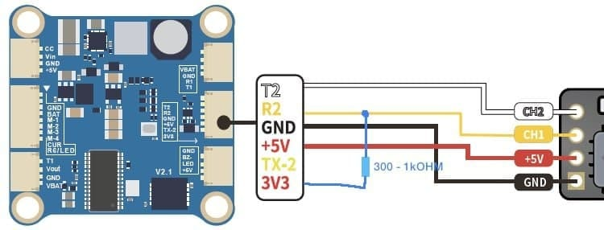

# Вопросы, проблемы и решения

## Длина антенн
Для VTX на 5.8 ГГц: Длина антенны обычно составляет около 12.92 мм или половину этого значения (6.46 мм), что соответствует полной или половинной длине волны. 

Для ELRS на 2.4 ГГц: Длина антенны обычно составляет около 31.23 мм или половину этого значения (15.61 мм), что соответствует полной или половинной длине волны  

## Провод для коннекта дрона с компьютером через USB Type-C переходник
[JST1.0 SH1.0 4pin cable (AliExpress.ru)](https://aliexpress.ru/item/1005005796723171.html?sku_id=12000034384188766)  
[JST1.0 SH1.0 4pin cable (AliExpress.com)](https://aliexpress.com/item/1005005796723171.html?sku_id=12000034384188766)  
  
Только нужно будет ему порядок пинов поменять с одного конца.

## [Почему дрон не реагирует на пульт](https://dzen.ru/a/ZTnTOxoL4BMRPRHg)

## Почему дрон не армится

[Betaflight: Сложности с Армом и команды в Betaflight](https://technobee.ru/index.php/soft/betaflight/item/arming-i-komandy-v-betaflight)

Актуальная таблица флагов, запрещающих ARM: [Description of arming prevention flags](https://betaflight.com/docs/wiki/guides/current/Arming-Sequence-And-Safety#description-of-arming-prevention-flags)

В этой статье перечислены причины, и таблица со значениями флагов.  
[FPV Drone Doesn’t Arm? Let’s Troubleshoot and Fix it.](https://oscarliang.com/quad-arming-issue-fix/)  
Но таблица немного устарела (см. таблицу по ссылке выше)

Если на дроне установлен бипер (buzzer), то он издает длинные и короткие писки указывающие на причину проблемы.  
Один длинный равен числу 5. Короткий - 1. Сложив, мы получим число, которое означает значение в таблице флагов.  
Например: 3 длинных, 2 коротких. 3*5 + 2 = 17. Что означает MSP connection is active

### RPMFILTER arming status flag
[BETAFLIGHT WON'T ARM RPMFILTER arming status flag. YouTube: Joshua Bardwell](https://www.youtube.com/watch?v=TiptP3KAFQ0)

Перевод от Gemini:

Сводка: Betaflight не активируется из-за флага RPMFILTER  
Понимание флагов блокировки активации: Betaflight блокирует активацию квадрокоптера и показывает "arming disable flags" (например, RPMFILTER) на вкладке Setup, чтобы сообщить точную причину, по которой полет небезопасен.

Что такое двунаправленный D-shot: Эта функция позволяет регулятору скорости (ESC) отвечать контроллеру полета (FC) информацией о фактическом числе оборотов двигателя в минуту (RPM), подобно тахометру в автомобиле.

Зачем нужны данные RPM: Данные об оборотах двигателя необходимы для "Gyro RPM Filter" (фильтра RPM гироскопа) во вкладке PID tuning, что является настоятельно рекомендуемой функцией для улучшения летных характеристик.

Значение флага RPMFILTER: Этот флаг появляется, когда фильтр RPM включен, но FC не получает необходимых данных RPM от ESC, что, в свою очередь, блокирует активацию.

Основная причина: Устаревшая прошивка: Самая частая причина – прошивка ESC не поддерживает двунаправленный D-shot. Поддерживаемые варианты включают BLHeli32 v32.7 или новее, либо BLHeli_S с прошивкой JESC.

Главные решения: Либо перепрошейте ESC на поддерживаемую версию прошивки, либо перейдите на вкладку Configuration и отключите функцию двунаправленного D-shot.

Второе решение: Подайте питание на ESC: Если вы подключены только через USB, ESC может быть не запитан. Подключение основного полетного аккумулятора обеспечит питание ESC и обычно устранит этот флаг.

Другие возможные проблемы: К менее распространенным причинам относятся физические повреждения моторных проводов или самого ESC. Иногда простое перезапуск (power cycling) квадрокоптера может устранить случайный сбой связи.

## Propwash (пропвош)
[Турбулентность (Propwash) у квадрокоптера, как исправить](https://profpv.ru/turbulentnost-propwash-u-kvadrokoptera-ka/)  
[Что такое пропвош. Почему появляется и как с ним бороться. YouTube: Записки FPV пилота](https://www.youtube.com/watch?v=KgLhCgSpCrY)  
[Propwash или PID осцилляции?. YouTube: Кошерное Хобби](https://www.youtube.com/watch?v=cQ-U_fNLXmw)  

[Getting Rid Of FPV Drone Propwash? You Might Just Need To Fly Better! - FPV Questions. YouTube: Joshua Bardwell Livestream Clips](https://www.youtube.com/watch?v=XkDJqh588xE)  
Перевод и сжатое содержание:  
**Избавление от пропвоша (Propwash) в FPV-дронах**  
Вопрос: как уменьшить высокочастотный пропвош?  

Ответ:  
Основной способ — снизить фильтрацию (сдвинуть фильтр вправо), увеличить D-gain, но при этом моторы будут сильнее греться и есть физический предел ускорения моторов.  
Можно попробовать пропеллеры с меньшим шагом.  
Увеличение моторов даёт больше тяги, но может снизить отзывчивость из-за массы. Для 5" с моторами 2207.5–2208 мощности обычно достаточно.  

Пропвош не всегда проблема тюнинга — часто причина в стиле пилотирования.  
Аналогия с автомобилем: если при повороте визжат шины, иногда дело не в машине, а в манере вождения.  
У опытных пилотов гладкий полёт достигается комбинацией тюнинга, сборки и навыков пилотирования.

**Итог:** уменьшение пропвоша зависит не только от настроек и механики, но и от качества управления дроном.

---

## Проблема при подключении дрона или пульта к компьютеру с Windows

Раньше подключалось, теперь при подключении выпадает неизвестное устройство.  
Решение в этом видео:  
[USB устройство не опознано.Неизвесное USB устройство.Сбой запроса дескриптора устройства. YouTube: Включи Смартфон](https://www.youtube.com/watch?v=SAJjEnaH7gg)

## Мой приемник всегда светится зеленым и не биндится
Проблема бывает, если полетник от iFlight и при подключении приемника он всегда светится, не шьется, не поднимает WiFi.  
Решения:
1. Перенести приемник на UART1
2. Сделать подтяжку как на картинке (но проще перенести на 1й юарт)  


[Отсюда](https://t.me/expresslrs_rus/66110)

## Проблема со  светодиодами (LED) на кресте BETAFPV
На бетовских 5а крестах, вроде леды одновременно с бидиром не работали, там к ноге стмки нужно было паяться из-за косяка разводки 

  
Если поискать по чатам, то можно что-то такое найти
```
resource LED_STRIP 1 A15
timer A15 AF1
dma pin A15 0
feature LED_STRIP
set dshot_bitbang = ON
```

## Помехи на видео при арме
Вопрос: Я летаю на дроне с аналоговой видеосистемой. После арма на экране появляются темные и светлые полосы. 

Ответ: 
* **Связь с моторами:** Белые диагональные линии или черные полосы, которые появляются только после арма или усиливаются при повышении оборотов, напрямую связаны с работой бесколлекторных моторов и регуляторов скорости (ESC).  
* **Природа электрического шума:** Моторы создают электромагнитные помехи из-за постоянного переключения фаз и прерывистого потока электричества, необходимого для вращения ротора.  
* **Разница между аналогом и цифрой:** В аналоговых системах шум проявляется в виде визуальных артефактов на экране. В цифровых системах (как DJI или Walksnail) шум просто снижает битрейт и качество сигнала, но не выглядит как полосы.  
* **Проверка конденсатора — шаг №1:** Самая частая причина помех — отсутствие конденсатора, его недостаточная емкость или обрыв одной из его ножек. Конденсатор необходим для фильтрации бросков напряжения.  
* **Длина винтов моторов:** Слишком длинные винты могут касаться обмоток мотора. Это не всегда приводит к мгновенному сгоранию, но часто создает сильные наводки в видеосигнале.  
* **Схема питания видеопередатчика (VTX):** Питание передатчика напрямую от аккумулятора (VBAT) делает его уязвимым для шумов. Подключение через регулятор 9В или 12В на полетном контроллере обеспечивает более чистую картинку.  
* **Исправность компонентов:** Обычно проблема не в «бракованном» моторе или ESC, так как шумят абсолютно все регуляторы; задача пилота — правильно отфильтровать этот шум.  

Источник: [What Causes White Lines In Analog Video? - FPV Questions. YouTube: Joshua Bardwell Livestream Clips](https://youtu.be/_YXN8il4sCY?si=nftDqRa3T1bkjsUR)
