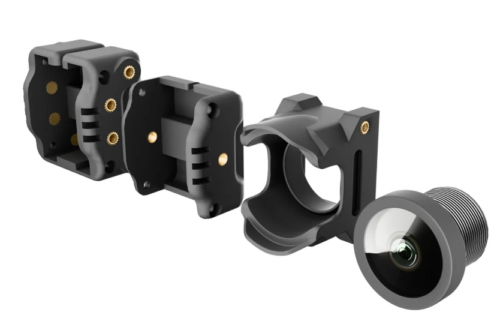
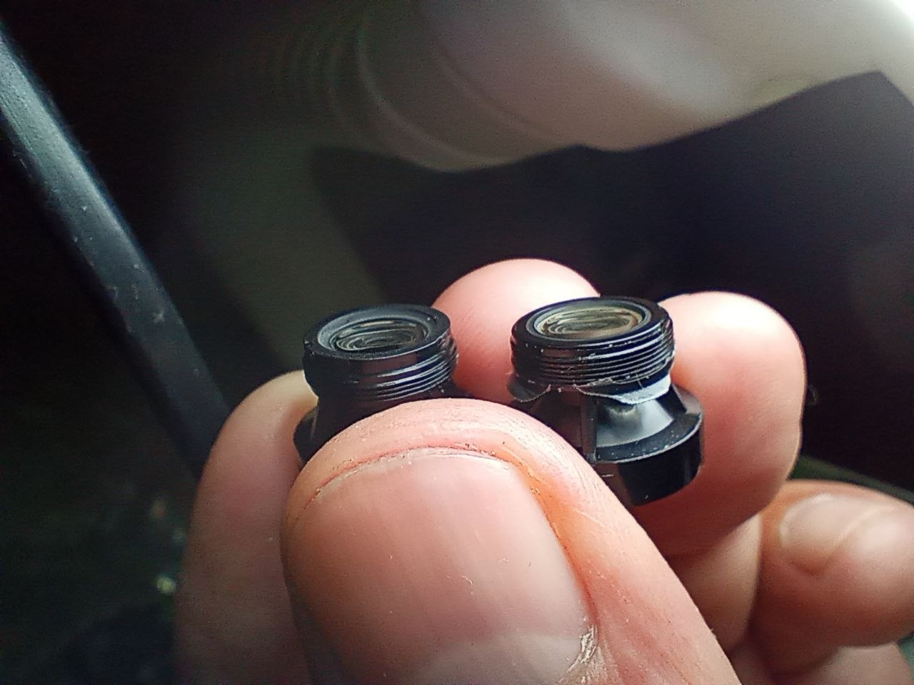
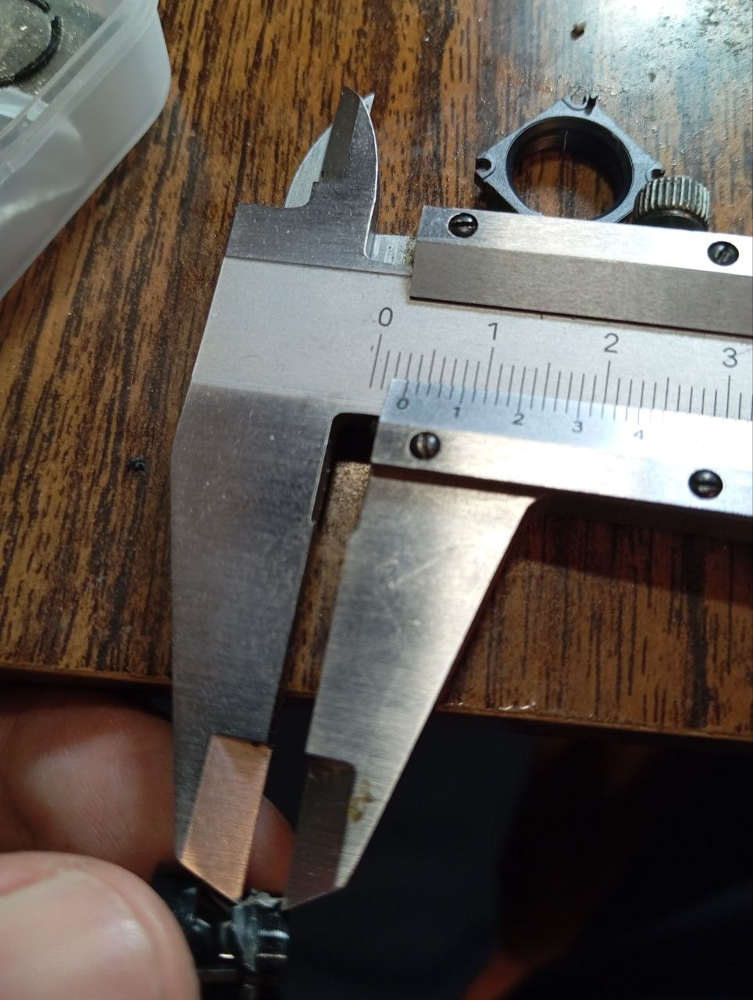
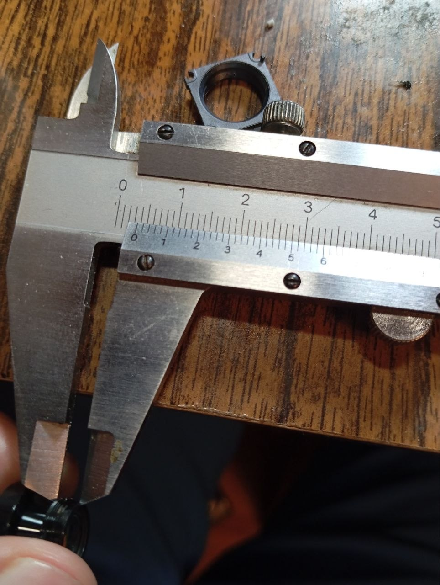

# DJI O4

## [Flywoo O4 Wide Lens Set](https://flywoo.net/products/flywoo-o4-wide-lens-set)

### Проблема
Ребят поясните в чем дело, поставил линзу Флайву на о4, закручиваю до конца а такое ощущение что резкости не хватает, дальше закручивать некуда, при откручивании картинка плывет. Поставил правильно, там иначе не станет, платка села на свое место.

### Ответ
Кратко - линза с али имеет бортик. Им упирается и не попадает в фокус. Не знаю, на сколько резонно за базовую плоскость измерений выбирать начало резьбы, но разница оригинала и али - 3 десятки.

  
  
  