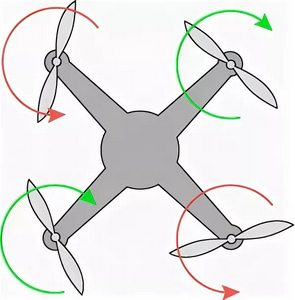

# Общее

[О моторах и пропеллерах для начинающих. YouTube: Хобби - летать.](https://www.youtube.com/watch?v=U98tdDM610w)

[Характеристики двигателей RC моделей. Электромотор. Щёточные и бесщёточные моторы. ESC. Что такое KV. YouTube: Товары из Китая](https://www.youtube.com/watch?v=kDG2CZCtUas)

[Выбор мотора, а правильнее говоря ВМГ. YouTube: UAVProf](https://www.youtube.com/live/IsR6LV8GW48)

[FPV motors and what you need to know!. YouTube: Illuminate Drones Light Shows](https://www.youtube.com/watch?v=17eIl9JDoXI)

[БАЗА про МОТОРИ | Як підібрати мотори для FPV? YouTube: Phoenix drones (укр.)](https://www.youtube.com/watch?v=bSuh5TiQWGw)

## Направление вращения

От камеры  


## Прошивка ESC на вупе
Идём на сайт [https://esc-configurator.com/](https://esc-configurator.com/).  
Втыкаем батарейку в вуп, прошиваем все регули на последнюю версию `BlueJay` 48/96khz.  
Для HM X12 поднимает `startup power` до 1100 и 1200 после прошивки на 48кгц

## Один или несколько моторов не запускаются
На Meteor 75 Pro не запускался мотор. Прямая пайка не помогла.  
Помогла прошивка Bluejay на 24kHz. Я так понимаю, подшипники изнашиваются и им тяжело крутить на 96 или 48kHz

## Простая проверка направления вращения моторов
**!!! Осторожно !!!**  
Заармить дрон. Пропы начнут небыстро вращаться и можно аккуратно листочком бумаги увидеть направление вращения.  
Можно снизить/поднять обороты на холостом ходу командой
```
set min_throttle=2000
save
```

## Проверка исправности трехфазного двигателя
Есть очень простой тест исправности трехфазного электродвигателя:  
Замыкаешь концы фазных проводов вместе, и крутишь мотор. Если он исправен, то будет туго крутиться, потому что в обмотках от вращения магнитами будет наводиться электрический ток. А поскольку концы проводов замкнуты, этот ток будет тормозить вращение.  
Если при замкнутых концах фазных проводов мотор вращается так же легко, как и при не замкнутых, значит где-то обрыв.

## Проверка мосфетов
Включаем тестер в режиме замера сопротивления.  
Плюсовый щуп `+` на разъем `+` для батарейки  
Минусовым щупом по каждому контакту мотора  

Потом так же но минус щуп на минус разъема батки, а плюсовым по всем разъемам нерабочего мотора.  
Ищешь аномалии в цифрах. При рабочем мосфете цифры должны быть примерно одинаковые.

## Замена мосфетов
[Ремонт meteor 75 pro 2022г. (Замена мосфета SIA517DJ-T1-GE3, eew питания мотора). YouTube: cev chevron](https://www.youtube.com/watch?v=tK6vfrA_kgw)


## Как выпаять коннектор
Вариант #1: Поддеваешь плоской тонкой отверткой разъем снизу, слегка раскачивая... И он потихоньку сползает с контактов. Контакты потом по отдельности выпаиваешь паяльником.

Вариант №2: Раскусить, выпаять по кускам. 

Вариант №3: Разогревать паяльником с широким жалом сразу 3 контакта, разжимая. В несколько итераций с двух сторон. Можно разбавить припой легкоплавким припоем, сплавом розе.

## Почему моторы набирают обороты при арме? Почему при посадке дрон прыгает/скачет?
[YouTube: SetUP](https://www.youtube.com/watch?v=kuZ_bh9Yz9Y)

## Пропеллеры неплотно сидят на валу:
- другие пропы  
- продеть зубную ленту/фум через отверстие в пропе и надеть на вал  
- чуть подплавить отверстие в пропе (горячей иголкой например)  

## Диагностика обмоток
1. Проверка обмоток на обрыв и КЗ  
- Переключите мультиметр в режим измерения сопротивления (Ω, обычно диапазон 200 Ом).  
- Проверьте сопротивление между каждой парой проводов (A-B, B-C, A-C).  
 Норма: Сопротивление должно быть примерно одинаковым (обычно несколько Ом).  
 Обрыв: Если сопротивление бесконечно (OL) — обмотка оборвана.   
 Короткое замыкание: Если сопротивление близко к 0 между всеми проводами — возможно межвитковое замыкание или КЗ на корпус.  

2. Проверка на замыкание на корпус  
- Переключите мультиметр в режим прозвонки (значок диода или звуковой сигнал).  
- Одним щупом касайтесь корпуса мотора (металлической части), другим по очереди — каждого из трёх проводов.  
 Норма: Звукового сигнала нет (сопротивление высокое).   
 КЗ на корпус: Если мультиметр пищит — мотор неисправен.  

Комментарий: Перед измерением нужно щупы между собой замкнуть и посмотреть значение. Не все мультиметры чистый ноль показывают. Вот то что покажут щупы, на то и нужно ориентироваться как на короткое замыкание. 

## Опытом перехода с разъёма на прямую пайку на метеор 75 про. 
Уже 4 месяца летаю на аналог метеор 75 про, на вторую неделю начались те самые симптомы, не армится один из моторов, не армится после краша, бывает в полёте даже исполняет, короче каждый раз приходилось поправлять разъем, проводки у разъема, порой по несколько минут, что очень бесило.  
В какой то момент купил моторы, поставил, проблема ушла, но вернулась буквально через 3 часа тренировки(что не удивительно, разъем на моторах и контакты в них тупо не предназначены для таких токов).  
Вчера решил убрать, имею хороший опыт пайки с различной техникой, но дроны не паял.  
Начал с фена, все обклеил термозащитной фольгой скотчем, грел на 480 самый низкий обдув(станция Китай, по факту было 300-350 )  
Грел долго, начал подниматься силиконовый коврик под платой (причем там была подушка из воздуха 1.5 см) , что означало о критической температуре. Разъем пластиковый начал плыть, а припой нифига.  
Снял пластик, попытался каждый штырь отдельно убрать, температура паяльника 350(реальную не знаю, тоже Китай ) ничего не идет, даже не плывет припой на плате.  
В итоге мне помог сплав Розе, пришлось все разъёмы аккуратно замещать с этим сплавом, после чего с помощью паяльника вышли как по маслу (китайцы специально тугоплавкий припой кидают на такой хрупкий текстолит?) 
После чего оплëткой зачистил все площадки от Розе и старого припоя, и начал пайку проводов от моторов.  
Площадки нестандартные, имеют соединение с торца текстолита между верхом  и низом платы, из-за чего припой бегает почти бесконтрольно на пятаке и пайка оказалась мега сложной и долгой, ввиду того что это делалось максимально аккуратно, чтобы ничего не сломать.после чего все залил т7000 для изоляции. 
Короче ребята, это того стоит, мало того что ушли проблемы, так еще и дрон начал вести себя в полёте гораздо чётче, отклик идеальный, никаких болтанок и пропвошей, от полёта одно удовольствие.  
Советую всем, и надеюсь мой опыт кому то поможет.  
