# Общее

[О моторах и пропеллерах для начинающих. YouTube: Хобби - летать.](https://www.youtube.com/watch?v=U98tdDM610w)

# Описание

Пропеллеры нужны для того, чтобы создать подъемную силу с помощью 
двигателя.
Они прямо влияют на то, как себя будет вести квадрокоптер в воздухе. 
Чтобы максимально эффективно использовать винто-моторную группу, нужно знать некоторые моменты о пропеллерах.

нужно учитывать 4 основных моментов:
1) Размер.
2) Шаг.
3) Форма и количество лопастей.
4) Материал.
5) Крепление.

## Маркировка
На рынке представлено очень большой выбор различных пропеллеров. Для того, что бы начать разбираться в них, нужно сначала изучить их маркировку.

Существует 2 типа формата, которые используют производители.

`Д x Ш x К` или `ДДШШ x К`,  
где Д - длина, Ш - шаг, К - количество лопастей. 
 
Например, пропеллеры 5×4,5 (также маркируются как 5045) имеют длину 5 дюймов и шаг 4,5 дюйма.  

Другой пример, 5x4x3 (иногда 5040×3) - это трехлопастной пропеллер длиной 5 дюймов с шагом 4 дюйма.

Шаг или угол наклона лопастей - обозначает расстояние, которое пропеллер пройдет за 1 полный оборот по своей оси.

## Влияние длины и шага пропеллера
Пропеллеры создают тягу, вращаясь и перемещая воздух. Чем быстрее вращается пропеллер, тем больше воздуха он может перемещать, а значит, тем больше тяга. 

Если увеличить длину или шаг пропеллера, это даст большую тягу и приведет к большему потреблению тока. По факту это увеличивает площадь поверхности и сопротивление, поэтому больше воздуха может быть перемещено и больше энергии требуется для его вращения, если количество оборотов будет одинаковым в обоих случаях.

В двух словах, более крупный пропеллер или большая длина шага увеличит скорость или тягу БЛА, но и потребует больше энергии.

Пропеллер с меньшим диаметром или шагом может вращаться быстрее (большее число оборотов), потому что двигателю не нужно прилагать столько усилий, чтобы раскрутить его, поэтому он потребляет меньше тока. Они, как правило, работают более плавно и лучше реагируют на стики. Более быстрое изменение числа оборотов из-за меньшей инерции способствует стабильности квадрокоптера.  
Пропеллер с большим шагом перемещает большее количество воздуха, что может создать турбулентность и привести к пропвошу. Пропеллеры будут вращаться медленнее, и вам может не хватать ощущения резкости. Но он создает большую тягу и более высокую максимальную скорость за счет более высокого потребления тока.

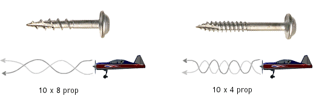

Пропеллер с большим шагом перемещает большее количество воздуха, что  может создать турбулентность и привести к пропвошу. Пропеллеры будут вращаться медленнее, и вам может не хватать ощущения резкости. Но он создает большую тягу и более высокую максимальную скорость за счет более высокого потребления тока.

Более легкий пропеллер обладает меньшим моментом инерции. Обороты меняются быстрее, и это делает ваш дрон более отзывчивым. Легкие пропы также лучше работают на более широком диапазоне двигателей, потому что для их раскрутки требуется меньший крутящий момент.

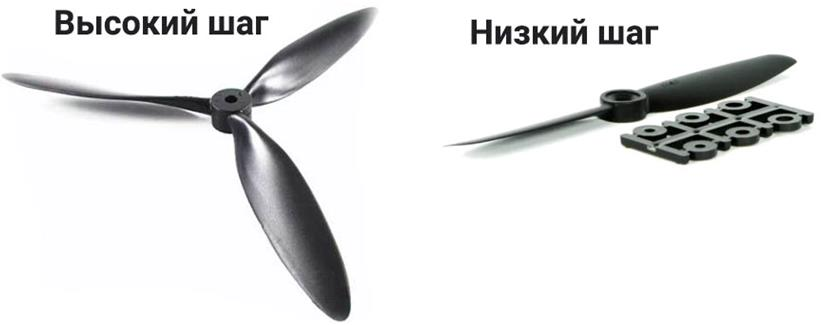

## Площадь поверхности и форма
Как уже сказали, чем больше площадь поверхности, тем больше воздуха может грести пропеллер и тем самым создавать большую тягу. Но обратной стороной является более высокое потребление тока, большее сопротивление и падение эффективности использования мощности.

Одна из задач, которую приходится решать конструкторам пропов - это баланс между тягой и сопротивлением. Вы можете создать только столько тяги, сколько нужно, прежде чем сопротивление станет слишком большим.

Форма винта играет большую роль в производительности, поскольку она тесно связана с площадью поверхности. Самым характерным отличием является кончик пропеллера. Бывают 3 вида:  
- обычный, классический заостренный кончик;  
- Bullnose (BN);  
- И гибрид из первого и второго варианта (HBN).  

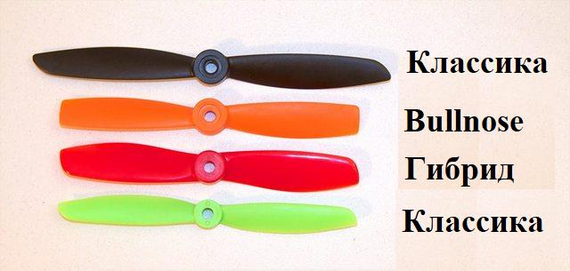

Гибрид имеет большую площадь поверхности, чем классика, а BN имеет еще большую площадь поверхности, чем гибрид. 

Классические пропы являются самыми эффективными из трех, однако они создают наименьшую тягу. Остальные 2 варианта могут дать больше мощности за счет большего потребления тока.

Если вы используете классические пропы, а они не тянут, то можно немного 
увеличить их «мощность» срезав кончик сделав из классического пропа –
Bullnose.  
Например, можно сделать обрезание классическому пропу 6045 и получить 
5050BN.

## Количество и форма лопастей
Классически пропеллеры представлены в нескольких вариантах лопастей от 2-х до 8.  
Но есть [экспериментальные модели 16 лопастных пропеллеров](https://www.youtube.com/watch?v=GLCN4y218Ws)  
И даже [1 лопастной вариант ☺](https://www.youtube.com/watch?v=GmDUnBp3eEc)

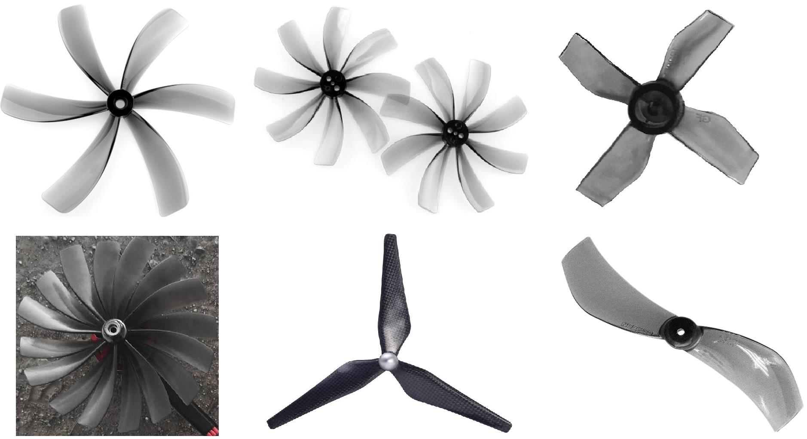

## Почему используют пропы с большим количеством лопастей? 

В основном конечно их используются для дронов небольшого размера и маловероятно, что вы увидите 3 или больше лопасти в размере 10 дюймов или выше и вот почему.  
Добавление дополнительных лопастей увеличивает площадь поверхности, и поэтому создается большая тяга за счет более высокого потребления тока и большего сопротивления.  
Из этого следует, что многолопастный винт меньшего диаметра 
способен создавать ту же подъемную силу, что и более крупный 
классический пропеллер.

Для гоночных и съемочных БЛА важен размер, чем меньше, тем лучше, но на небольшую раму нельзя поставить большие моторы и нельзя использовать большие пропеллеры. Поэтому для увеличения тяги используют многолопастные пропы, что бы увеличить тягу или скорость.  
Самые конечно популярные это 3 лопастные пропеллеры, но чем меньше дрон, тем больше увеличивается количество лопастей.   
Так же количество лопастей благоприятно отражается на управлении дроном.  
Двухлопастные пропы быстрее выходят на максимальные обороты и потребляют меньшее количество энергии.  
Основным недостатком таких винтов является большое потребление тока, 
сложность изготовления и центровки, а также достаточно высокая стоимость.

## Материал
Пропеллеры могут быть изготовлены из разных материалов:  
- Различные виды пластика;  
- Пластиковый композит;  
- Углеродного волокна (карбон);  
- Дерева и т.д.   

Самыми популярными являются «пластиковые» пропы, так как они находятся в категории популярных размеров до 13 дюймов. Их обычно производят из ABS пластика

«Пластиковые» пропы делают так же из различных видов пластика и сплавов.
1) ABS пластик.  
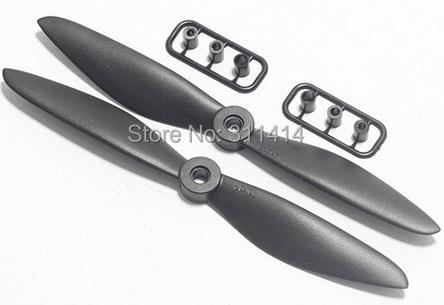

2) Поликарбонат  
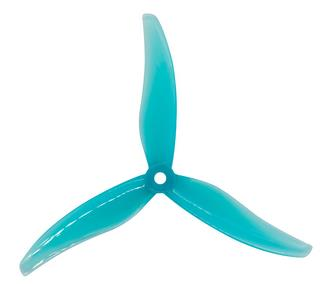

3) Усиленный углеродный нейлон  
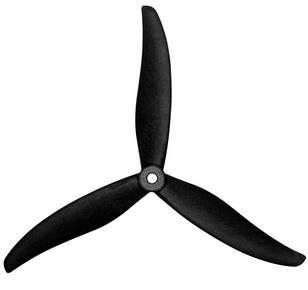

4) Стекловолокнистый нейлон  
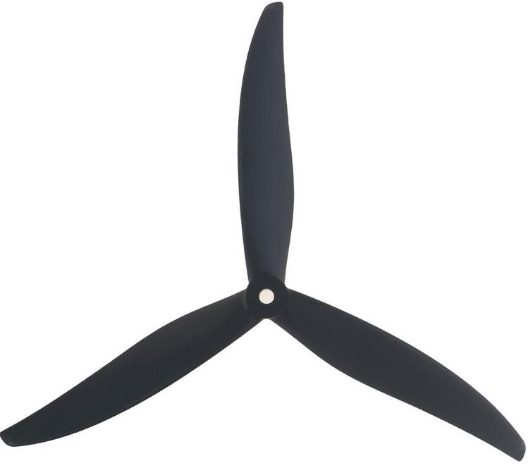

5) Карбон  
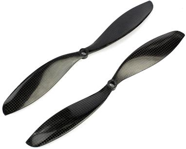

6) Дерево  
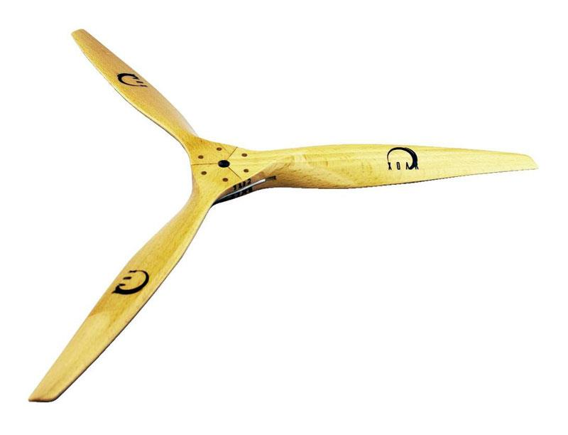

Каждый тип материала придает уникальные свойства.  
Чем больше пропеллер, тем большей жесткостью он должен обладать. Поэтому все пропеллеры больше 13 дюймов выполняют из чистого карбона или композита полимера с углеродным волокном.  
Такой материал легче, чем другие виды пластика, более жесткие, производят меньше вибраций за счет такой жесткости. Но стоят намного дороже и очень хрупкие. Так же если использовались не очень качественные материалы или не соблюдалась технология они могут быть разбалансированы с завода и может потребоваться дополнительная балансировка.

Пропы из ABS, поликарбоната и нейлона грубо говоря находятся в одной категории, но понятно, что отличаются по своим свойствам. 
В общих чертах они стоят дешевле, в большинстве случаев эластичны и после крашей можно использовать повторно. Но они тяжелее, чем карбон, могут создавать больше вибраций.  
Выбор материала пропеллеров зависит и от времени года. Пластмассы для пропеллеров термопластичны, то есть, их жесткость и пластичность зависит от температуры. Если летать зимой, то лучше ставить пропеллеры из АБС-пластика, так как поликарбонат на холоде дубеет и становится хрупким.  
Если летать в жару, то лучше использовать пропеллеры армированные стекловолокном для хорошей жесткости, так как АБС и поликарбонат будут становиться мягкими под действием жары от солнца и дрона потеряет тягу.

## Крепление
С развитием технологий и большой конкуренцией производители придумывают различные методы крепления пропеллеров.  
Естественно форма крепления зависит от крепления на моторе.  
Если раньше это был просто вал в виде штыря, на который насаживался пропеллер и закручивался гайкой, то сейчас существуют достаточное количество различных креплений:  
1) Обычное отверстие под вал размером М5.  
Фиксируется гайкой М5  
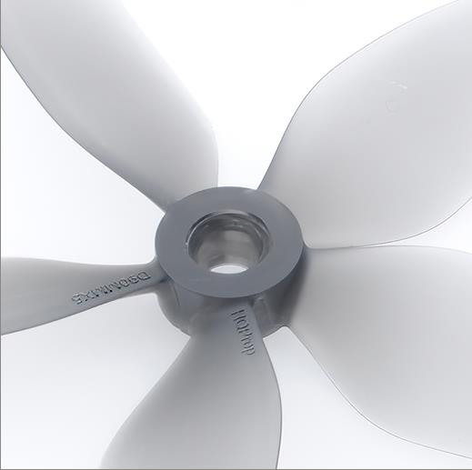

2) T mount.  
Отверстие под вал 1,5мм. Фиксируется 2 болтами в колокол мотора размером 1.9мм  

3) Отверстие под вал 1мм.  
Ничем не фиксируется на валу  
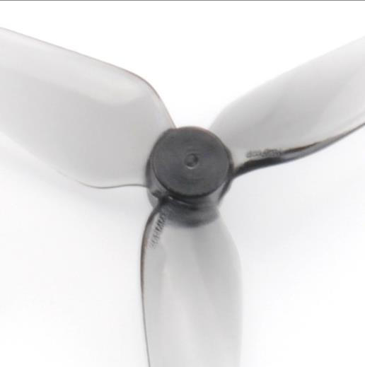

4) T mount с M5.  
Универсальное крепление в виде ромба. Подходит для вала размером М5.
Если вставить переходник, то подходит для вала 1,5мм.  
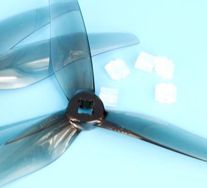

5) POPO. Подходит как и для обычного вала М5. Но предназначен для специального нового вала, быстроесъемного крепления  
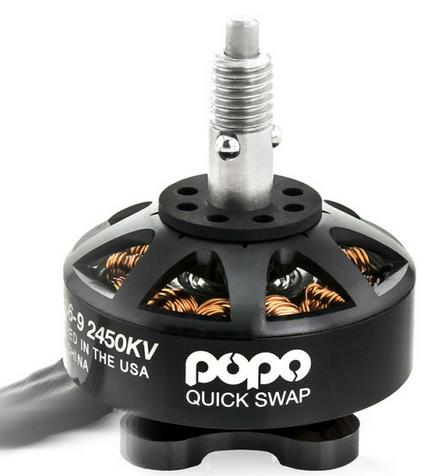  
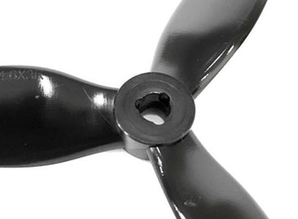

6) FOLD. Система для складных 3 лопастных пропеллеров под вал М5. 
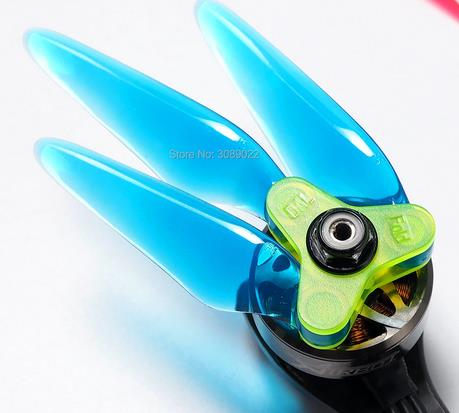  

7) Крепление DJI для складных 2 лопастных пропеллеров  
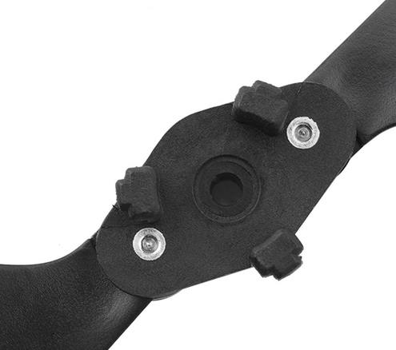  
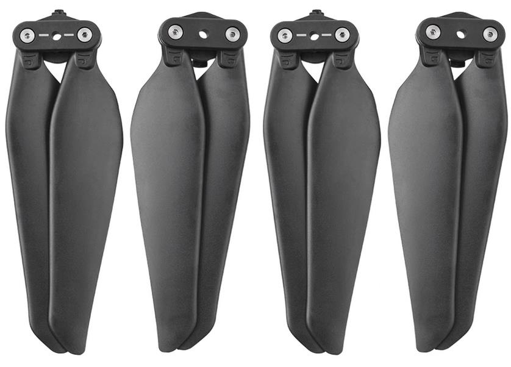  

8) T-Motor Quick Attach Detach propeller mount.  
Специальная, быстросъемная конструкция от фирмы Tmotor  
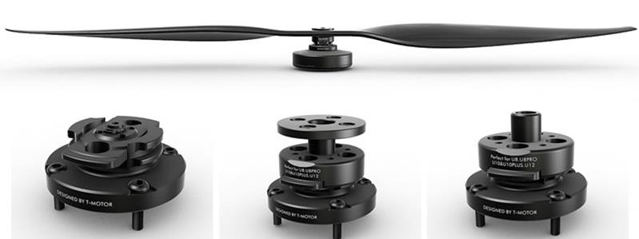

## Направления вращения
На дронах используются два типа двигателей – CW (с вращением вала по часовой стрелке) и CCW (с вращением вала против часовой стрелки).  
Схема установки моторов зависит от типа летательного аппарата. Пропеллеры устанавливаются в соответствии с выбранным типом БЛА.  
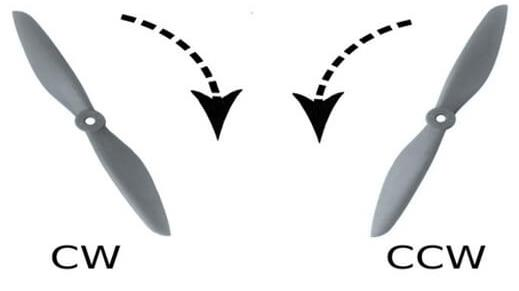
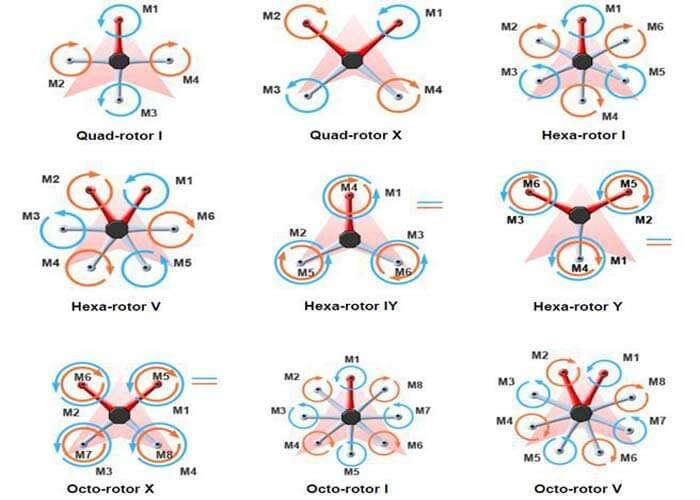  

## Популярные фирмы
1) Tmotor - https://store.tmotor.com/category.php?id=4, https://store.tmotor.com/category.php?id=85  
2) HQ prop - https://www.hqprop.com/  
3) Gemfan - https://www.gemfanhobby.com/list.aspx?cid=18  
4) Dalprop - http://dalprop.com/products.html  
5) Iflight - https://shop.iflight-rc.com/fpv-propellers-cat115  
6) JMRRC - https://www.jmrdrone.com/drone-propellers/  
7) DYS - http://www.dys.hk/product/PROPELLER.html  
8) Tarot - https://www.tarot-rc.com/Multirotor-drone-paddle-Props-c81690/  
