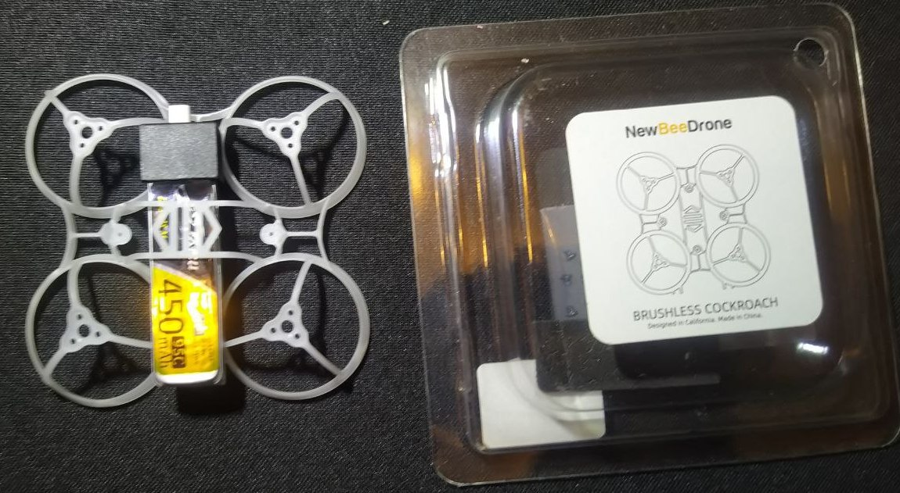
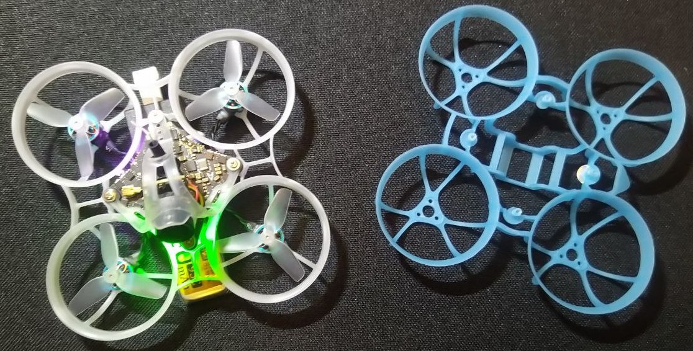
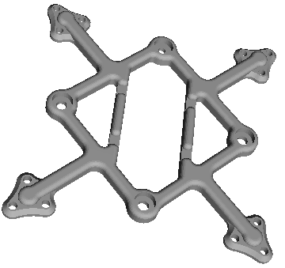

# Рамы для 1S вупа

## NewBeeDrone Cockroach 65mm

Пользователь `Lex RES` поделился опытом:  
В хозяйстве появился мелкий 65. Но что бы не переходить на новый тип баток, и остаться на 450, возникла потребность в креплении их на раме.  
Был вариант- "пилить" раму.  
Был вариант сесть потрохами от 65 на раму от 75.  
Но в итоге была приобретена рама (* не реклама) [NewBeeDrone Cockroach 65mm Brushless LiteAF Racing Frame](https://newbeedrone.com/collections/newbeedrone-frame/products/cockroach-brushless-liteaf), которая отлично подошла по размерам, под мою задачу.  
[На wildberries.ru](https://www.wildberries.ru/catalog/314322292/detail.aspx)

  
  

## Карбоновая рама
  

На AliExpress:  
[65mm 75mm 85mm 95mm Wheelbase 3K Carbon Fiber Bottom Plate Frame Kit 3-8g Toothpick Whoop Mini RC Drone FPV Racing Quadcopter](https://www.aliexpress.com/item/1005008636053345.html)  

[65mm Wheelbase 3K Carbon Fiber Bottom Plate Frame Kit 3g Toothpick Whoop Mini RC Drone FPV Racing Drone Quadcopter Frame Kit](https://www.aliexpress.com/item/1005008814106332.html)  

[75mm Wheelbase 3K Carbon Fiber Bottom Plate Frame Kit 3g Toothpick Whoop Mini RC Drone FPV Racing Drone Quadcopter Frame Kit](https://www.aliexpress.com/item/1005008814178222.html)

## 58mm квадратная рама
Модель для печати на 3D принтере или  резки из карбона.  
Автор `Pavel Gavrilov` `@reeson2003`

  
[Файл для печати](58mm_frame_square.stl)  
