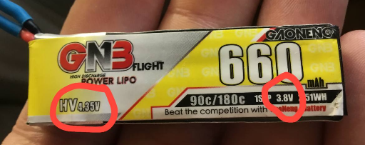
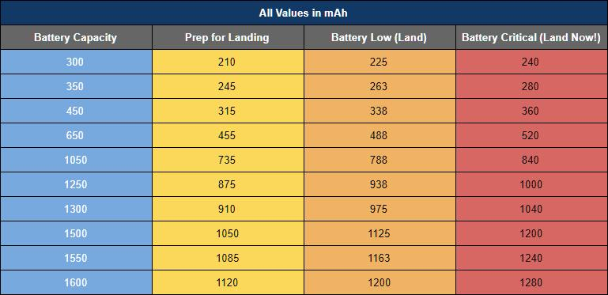
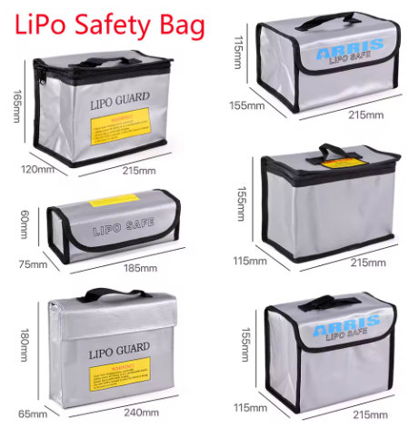
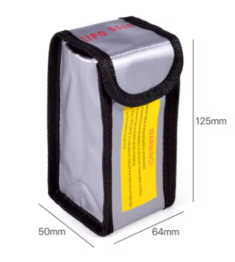

# Батареи

[**FPV аккумуляторы: Полный гайд для начинающих. YouTube: DRONOFLY FPV**](https://www.youtube.com/watch?v=IF4SG81BtWQ)

[FPV для начинающих. Базовые сведения об аккумуляторах (батках, аккумах и т. д). YouTube: Хобби - летать](https://www.youtube.com/watch?v=ffnMOonWRag)
 
## Уход за батареей
Чтобы продлить срок службы батареи лучше следовать таким правилам:  
 - Можно сразу заряжать новые батки.  
 - Полный заряд на одну банку: 4.2 (4.35 для LiHV).   
 - Хранить полностью заряженными **не более трех суток**  
 - НЕ разряжать ниже 3.3в на банку.  
 - Хранить зарядив до значения Storage около 3.8-3.85в на банку. Обычно напряжение хранения пишется на самой батке.  
  
 - Заряжать батарею желательно током не превышающим определенного расчетного значения. См.пункт ниже.
 
## Каким током заряжать
Чтобы продлить срок службы батареи, желательно ее заряжать током, не превышающим определенного расчетного значения.  
На батарее есть емкость, например, 450мАч.  
Может присутствовать характеристика Charge Rate. Например, 2С.
Если ее нет, то значит Charge Rate = 1С

Формула:  
 **Емкость(мАч) / 1000 * ChargeRage = ХХ ампер**

Например:  
450mAh/1000*1 = 0,45А +-10%
То есть рекомендуемый ток зарядки 0.4-0.5А

Подробнее почитать можно в статье [Всё о LiPo батареях для FPV дронов](https://dronomania.ru/faq/vsyo-o-lipo-batareyah-dlya-fpv-dronov.html)

## Внутреннее сопротивление
0-6 мОм - отлично  
7-12 мОм - хорошо  
13-20 мОм - плохо  
более 20 мОм - в утиль  

## Расход батареи
Дроны на прошивке Betaflight позволяют выводить в OSD расход батареи, что бывает удобно для понимания израсходованного количества и степени деградации емкости.  

Однако может потребоваться калибровка сенсора. Вот статья об этом:  
[Current Sensor Calibration in Betaflight](https://oscarliang.com/current-sensor-calibration/)

Ниже представлена таблица, показывающая критические значения уровней расхода батареи в зависимости от ее емкости.  

## Батарея сильно разрядилась
По тем или иным причинам батарея может разрядится до очень низкого уровня. Например до 0.5V на ячейку. Можно ли ее попытаться оживить? Зарядка типа WhoopStor выдает ошибку.

Нужно найти зарядку, которая может игнорировать минимальное напряжение на ячейке и попробовать ею подзарядить. Например, есть зарядки с режимом заряда свинцовых АКБ.  
**ВНИМАНИЕ!!** Зарядку нужно проводить под постоянным присмотром. Возможно возгорание.

## Огнеупорная сумка

### Lipo Guard Safety Bag
[Lipo Guard Safety Bag Fireproof Explosion-Proof Portable Lipo Safety Bag 215*115*155mm for RC FPV Racing Drone Car Battery Safe](https://vi.aliexpress.com/item/1005004478094343.html)  
 
 

### [Torvol LiPo Safe Bag](https://torvol.com/product/lipo-safe-bag/)  
  
[Torvol LiPo Safe Bag - Fire Test](https://www.youtube.com/watch?v=kdv4naeFL7g)

## [Коробка для 15шт 1S 300mah  баток (3D-печать)](../3D_models/Battery_box.md)