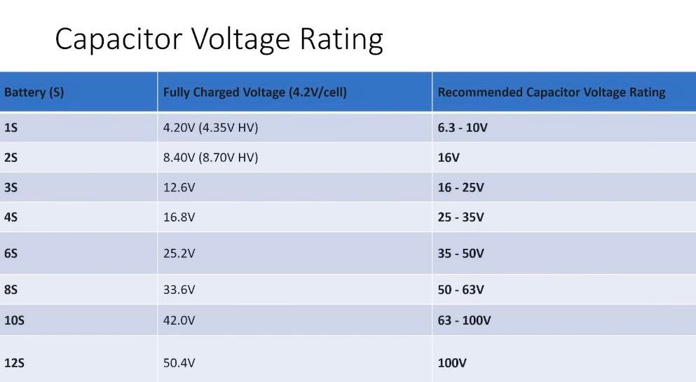
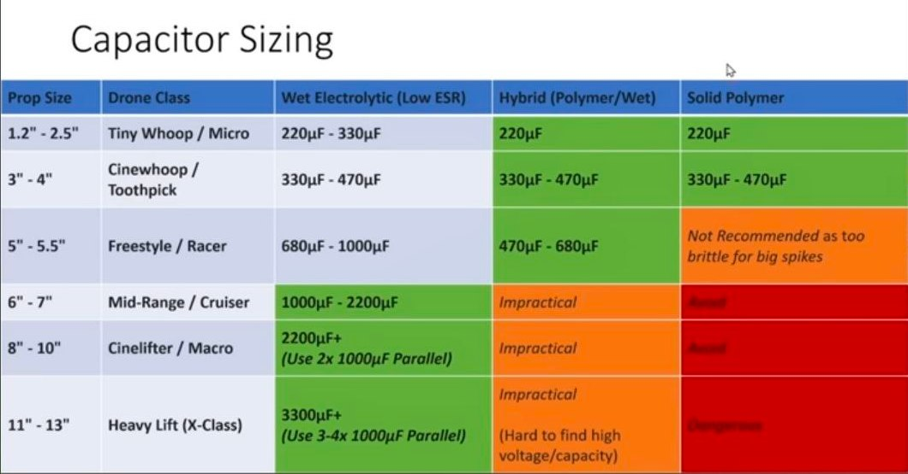
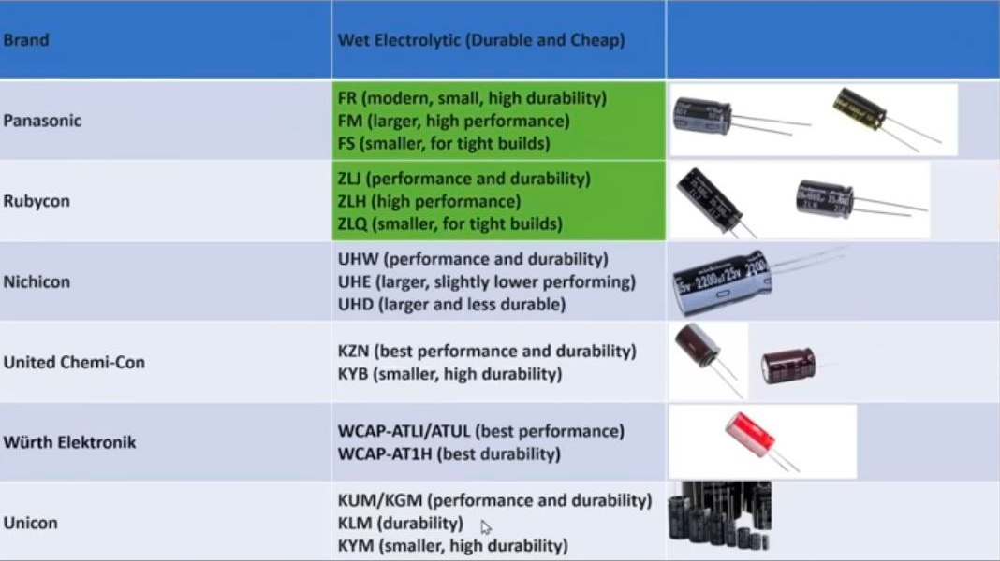
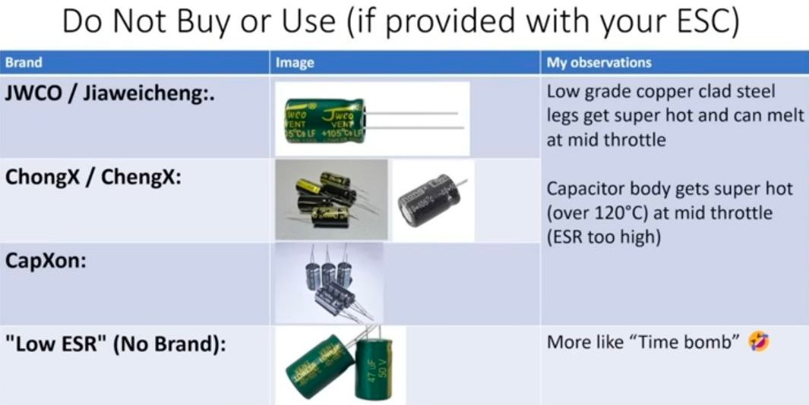
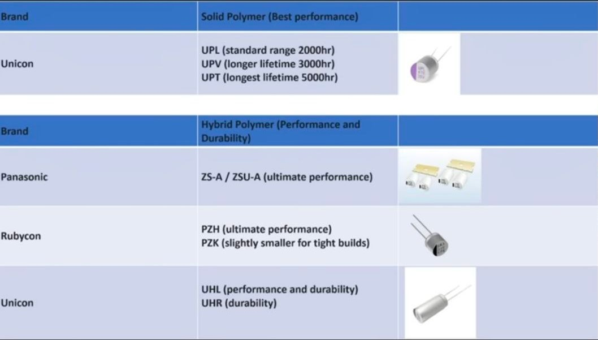

# Конденсатор

[Stop Killing ESCs: The Ultimate Capacitor Buying Guide. YouTube: Chris Rosser](https://www.youtube.com/watch?v=ANq7a2S0Gik)

## Краткий пересказ
Этот видеоролик подробно объясняет, почему качественные конденсаторы критически важны для выживания вашего дрона и как правильно их выбирать.

### **Проблема «горячих ножек»**: 
Основная причина выхода ESC из строя часто кроется не в самих транзисторах (FET), а в перегреве выводов конденсатора. Некачественные ножки могут разогреться до температуры плавления припоя, что приводит к отсоединению конденсатора и мгновенному сгоранию электроники из-за скачков напряжения.

### **Скрытая опасность: Сталь вместо меди**: 
Многие производители используют стальную проволоку с медным напылением (CCS) вместо чистой меди. Сталь обладает гораздо более высоким сопротивлением, работая как нагревательный элемент при прохождении высокочастотных токов, что ведет к тепловому разгону и аварии.

### **Типы конденсаторов**: 

#### Электролитические vs Полимерные**:

* **Жидкостные (Wet Electrolytic):** дешевые, обладают способностью к «самолечению», но теряют емкость на высоких частотах.  

* **Твердотельные полимерные (Solid Polymer):** имеют сверхнизкое ESR (сопротивление) и стабильную емкость, но не умеют восстанавливаться после скачков напряжения и могут взорваться при перегрузке.

#### **Гибридные конденсаторы (Hybrid Polymer)**: 
Оптимальный выбор для топовых сборок. Они сочетают низкое ESR полимерных моделей с надежностью и способностью к самовосстановлению жидкостных за счет добавления небольшого количества электролита.

### **Правило выбора напряжения**: 
Номинальное напряжение конденсатора должно составлять **от 1.5 до 2 раз** больше максимального напряжения вашего аккумулятора. Это создает необходимый запас прочности для гашения мощных импульсов тока.

### **Рекомендации по емкости в зависимости от пропеллеров**:
* **До 2.5 дюймов:** 220 мкФ (полимерные или гибридные).  
* **4 дюйма:** 330–470 мкФ (лучше гибридные).  
* **5 дюймов:** 680–1000 мкФ (жидкостные низкой серии ESR) или 470–680 мкФ (гибридные).  
* **7+ дюймов:** 2000–3000+ мкФ (рекомендуется использовать несколько конденсаторов в параллель для снижения общего ESR).

### **Проверенные бренды и серии**: 
Автор рекомендует использовать серии **Panasonic FR** (долговечные и компактные), **Panasonic FM** (максимальная производительность) или **Rubycon ZLJ/ZLH**.

### **Что покупать НЕЛЬЗЯ**: 
Избегайте дешевых брендов, таких как **JWCO, ChongX, Changx и Capexon**, а также любых конденсаторов без четкой маркировки бренда. Они часто имеют те самые опасные стальные выводы и высокое внутреннее сопротивление.

  
  
  
  
  
