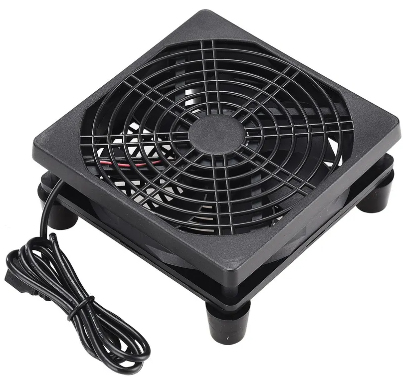
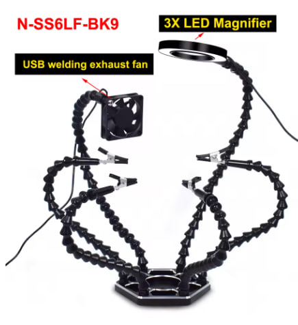
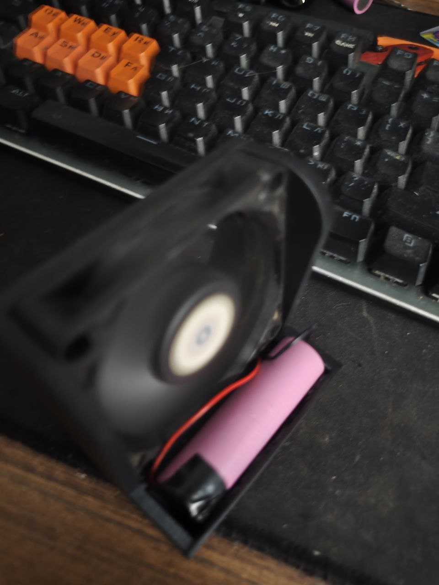
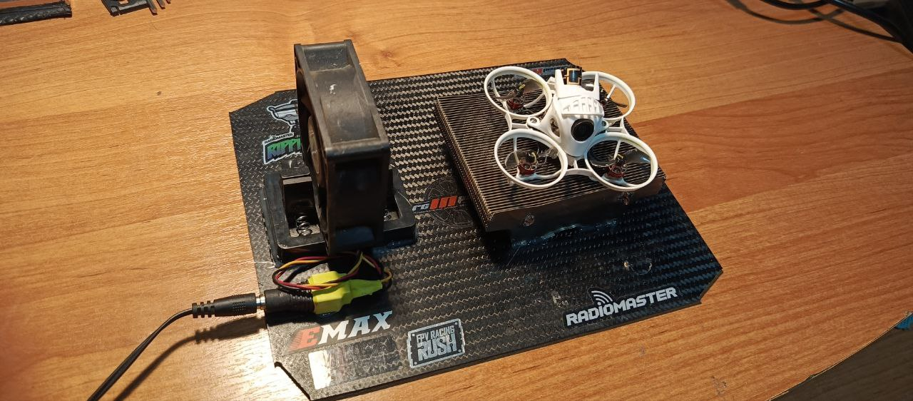

# Охлаждение, обдув

В процессе настройки дрона в конфигураторе, полетный контроллер или или VTX может нагреваться и даже сгореть. Чтобы этого не произошло рекомендуется организовывать обдув или охлаждение дрона.

Также очень рекомендуется перевести VTX в режим `PIT` или минимальной мощности.

Варианты решений представлены ниже.

## Фен для волос в режиме без подогрева
Шумно, не всегда удобно, но как крайний вариант вполне подойдет

## Вентилятор AD230207MQ01_zent
  

Ozon: [вентилятор AD230207MQ01_zent](https://www.ozon.ru/product/ventilyator-ad230207mq01-zent-1525025982/)  
Aliexpress.com: [120mm 4.72-inch 5V USB Router Cooling Fan, Mini Quiet Cooler for Electronics Devices](https://www.aliexpress.com/item/1005011829231416.html)

## Третья рука с вентилятором
  

Все лапы откручиваются. В том числе и с вентилятором. Питание от USB.  
И для пайки удобно, и лампа с лупой для разборки и ремонта, и вентилятор для охлаждения.  
Подключаю вентилятор к ноуту, кладу и направляю на дрон. И настраиваю дрон на компе

Вот тут разные модели:  
Aliexpress.com: [NEWACALOX Helping Hand Soldering Third Hands with 6 Flexible Arms 3X LED Magnifying Glass for Soldering, Assembly, Repair](https://www.aliexpress.com/item/1005005033959635.html?sku_id=12000037262867748)

Aliexpress.ru: [NEWACALOX Helping Hand Soldering Third Hands with 6 Flexible Arms 3X LED Magnifying Glass for Soldering, Assembly, Repair](https://aliexpress.ru/item/1005005033959635.html?sku_id=12000037262867748)

## Другие варианты решений 

