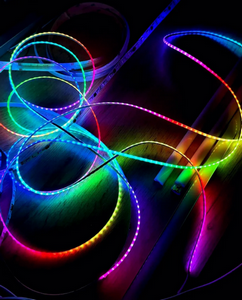
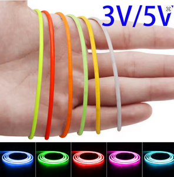
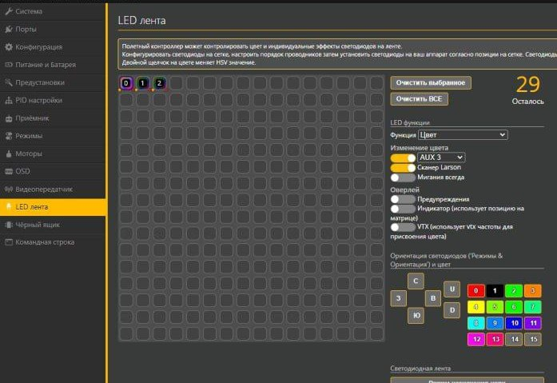

# LED, светодиодная подсветка

[533 Tiny Trainer LED setup - change LED color with aux channel! YouTube: Joshua Bardwell](https://www.youtube.com/watch?v=WIotROCU2VY)  
Настройка цветов

## Светодиодные ленты
[Светодиодная узкая COB лента адресная WS2811 5V 160LED 50см umvolt 360146751. Wildberries](https://www.wildberries.ru/catalog/360146751/detail.aspx)  

[3V 5V 2.7mm Ultra Slim COB LED Strip Lights Battery Powered DIY mini Figure 480LED/m Flexible Tape Light Red Warm White Dimmable](https://www.aliexpress.com/item/1005005549145092.html)  

## Подключение к 3-х позиционному переключателю

В нейтральном положении стоит цвет который вы выбрали (в моем случае черный).  
Нижнее положение предыдущий цвет (в моем случае красный)  
Верхнее положение следующий цвет (в моем случае зелёный)  
