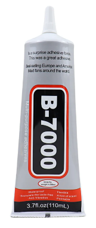
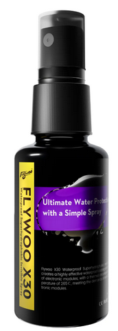

# Защита электроники дрона от воды

## **B7000 (лучшая рекомендация)**
  

[Защита электроники дрона от воды. YouTube: My FPV Hobby](https://www.youtube.com/watch?v=UN3pCRkmNeI)  

[B7000 Clear Contact Phone Repair Adhesive Universal Glass Plastic DIY Glue B-7000 With Precision Applicator](https://vi.aliexpress.com/item/1005003653423730.html)

[Как загерметизировать FPV дрон? Подготовка к дождю и снегу. YouTube: Антон Евдаков](https://www.youtube.com/watch?v=wsgYL4-icS0)

[Видео как снимать эти покрытия (B7000/T7000)](Как_снимать_B7000.mp4)

## Flywoo X30 Waterproof Superhydrophobic Spray
[на сайте производителя](https://flywoo.net/products/flywoo-x30-waterproof-superhydrophobic-invisible-spray)  

[Flywoo X30 Waterproof Superhydrophobic Spray - Easy Conformal Coating Alternative! YouTube: Mads Tech](https://www.youtube.com/watch?v=HftOrKM05p0)

## Aero 
[Готовим ФПВ дрон под воду и от дождя! Гайд для новичков. YouTube: Anik FPV](https://www.youtube.com/watch?v=CsVZRnY7M3M)

## Waterproof Silicone Conformal Coating
[Waterproofing your FPV drone is easier than you think. YouTube: It's Nick Random](https://www.youtube.com/watch?v=I4_Bsznt1IU)

## Мнения пользователей

### 1
Герметил Цетус лаком Plastik-71. Растекается хорошо, покрывает тонким слоем, заполнение можно контролировать уф-фонариком.  
Другие дроны гермечу клеем B7000, его нужно наносить немного и аккуратно, чтобы не было соплей

### 2
Сомневаюсь, что на Cetus есть барометр. Так что можно заливать все, кроме usb входа и кнопки dfu

