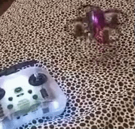

# Режимы полета Acro / Air / Angle / Horizon

## Acro (Rate) mode
`Acro` - это **базовый** "акробатический" или "мануальный" режим. В этом режиме дрон **не выравнивается** автоматически после отпускания стиков управления. Положение дрона определяется исключительно вашим управлением.  
Дрон **НЕ выравнивается** и сохраняет наклон или вращение, которое вы задали, пока вы не измените его с помощью стиков.  

Режим `Acro` включен и активирован, если в Betaflight **НЕ включены** никакие другие режимы. Нет кнопки его включить. Надо просто все отключить. И будет Acro.

## Angle (Stabilized)  mode
Это полностью стабилизированный режим. Дрон автоматически выравнивается, когда вы отпускаете стики управления. Угол наклона ограничен, чтобы предотвратить слишком резкие маневры.  
Максимальный угол наклона (обычно до 45 градусов), можно настраивать в Betaflight на вкладке `PID tuning`, в разделе `Angle/Horizon`.  

В этом режиме дрон хоть и выравнивается, по горизонтали, это не значит что он будет висеть в одной точке если у него нет GPS или других датчиков положения. То есть он может немного дрейфовать, например от ветра.

### Триммирование (Trim)
Если дрон сильно несет в сторону, можно внести коррективы и устранить этот дрейф.  
Подробно об этой процедуре [можно почитать в этой статье](./22_FC/Прошивка/30_Betaflight/Trim.md)

## Horizon (Hybrid) mode
Этот режим является промежуточным между Acro и Angle. При небольших движениях стиков дрон стабилизируется (как в Angle), но если отклонить стик до конца, можно выполнять флипы и роллы (как в Acro).  
Параметры этого режима можно настраивать в Betaflight на вкладке `PID tuning`, в разделе `Angle/Horizon`.  

Так же как и в режиме Angle дрон может нести в сторону и его можно триммировать.

## Air mode
`Air` mode позволяет поддерживать положение и угол наклона дрона. Особенно это может быть важно при нулевом значении газа.  
Например, если взлететь и опустить газ, дрон начинает дайвить. Если Air не включен, дрон начинает постепенно менять свой угол в пространстве и кувыркаться. Если Air включен, то даже при нулевом газу дрон будет сохранять свой угол в пространстве и не будет кувыркаться.  

Нежелательный побочный эффект от Air mode, который обычно мешает при полете в помещениях и на вупах - это **прилипание** к стене.  
Когда дрон касается или бьется об стену, он немного меняет свой угол. Air mode пытается вернуть дрон в положение до удара, увеличивает скорость вращения моторов и из-за пониженного давления воздуха над дроном он "прилипает" к стене.  
Отключение AIR mode также убирает синдром мячика при попытке сесть или при падении на пол.  

Если Air mode включен, он работает **совместно** со всеми режимами Acro, Angle или Horizon.  

Обычно по умолчанию Air mode всегда включен в Betaflight. За это отвечает переключатель `AIRMODE`, который находится на закладке `Configuration` в секции `Other features`.  

### Отключение Air mode
Если есть потребность включать/отключать Air mode, например кнопкой, нужно сделать следующее:  
 - Отключить `AIRMODE` на закладке `Configuration` в секции `Other features`.  
 - Сохранить изменения  
 - Перейти на закладку `Modes` и там появится отдельная позиция для переключения этого режима:  
  
 - Теперь можно назначить переключения режима на какой-нибудь канал.
 
Подробнее по настройке можно посмотреть в видео: [Betafpv Cetus X - угомонись! Дрон прыгает, дрейфует и прилипает к стенам. Настройка FPV для квартиры. YouTube: Petrokey](https://www.youtube.com/watch?v=kPr2hmY9g5g)  

Справедливости ради стоит сказать, что и без Air mode дрон тоже может прилипнуть к стене, но происходит это в более редких ситуациях.

### Включение/отключение Air Mode в зависимости от положения газа
В аппаратуре на EdgeTX можно настроить автоматическое включение/отключение Air Mode в зависимости от положения газа. Если газ ниже какого-то уровня, Air Mode включится, на высоких значениях газа - отключится.  
Настройки такой функции описаны в видео: [Betaflight Air Mode is bad for Whoops. Until now. Maybe. YouTube: Joshua Bardwell](https://www.youtube.com/watch?v=tCTI2J0QCwc)

## Индикация режима на OSD
 - Если на дроне **НЕ включены** режимы Angle или Horizon и **выключен** Air mode, на OSD отображается режим `ACRO`.  
 - Если на дроне **НЕ включены** режимы Angle или Horizon и **включен** Air mode, на OSD отображается режим `AIR`.  
 - Если на дроне **включены режимы** Angle или Horizon, вне зависимости от того, включен ли Air mode, на OSD отображается выбранный режим `ANGLE` или `HOR`.  

## 3D Mode
3D Mode в прошивке Betaflight — это специальный режим полета, предназначенный для выполнения акробатических маневров, включая полет в перевернутом положении (инвертированный полет). В отличие от стандартных режимов, таких как Acro, Angle или Horizon, 3D Mode позволяет дрону активно управлять тягой моторов в обоих направлениях, что дает возможность вращать пропеллеры как для подъема, так и для опускания дрона.

### Основные особенности 3D Mode:
1. **Реверсивная тяга**: В 3D Mode моторы могут вращаться в обратном направлении, что позволяет дрону выполнять маневры, такие как перевороты, полет вверх ногами или быстрые изменения направления. Это требует использования реверсивных ESC (регуляторов скорости) и специальных 3D-пропеллеров, которые эффективны в обоих направлениях вращения.
   
2. **Симметричное управление тягой**: В отличие от обычного режима, где стик газа управляет только подъемной силой, в 3D Mode среднее положение стика газа соответствует нейтральной тяге (моторы остановлены или минимально активны). Движение стика вверх увеличивает тягу для подъема, а вниз — для опускания (реверсивное вращение).

### Важные замечания:
- **Сложность управления**: 3D Mode требует от пилота опыта и точного контроля, так как управление тягой в двух направлениях значительно усложняет пилотирование.  
- **Риски**: Неправильная настройка или неподходящее оборудование (например, обычные пропеллеры вместо 3D) может привести к нестабильному полету или повреждению дрона.  
- **Совместимость**: Не все дроны и полетные контроллеры поддерживают 3D Mode. Например, в наборе [BETAFPV Cetus X FPV Kit](https://mydrone.ru/betafpv-cetus-x-fpv-kit/) версия с прошивкой Betaflight поддерживает 3D Mode (режим Air), в отличие от версии с прошивкой Cetus.

[ВЗЛОМ ГРАВИТАЦИИ! Полный гайд по 3D режиму. YouTube: SpiNiks FPV](https://www.youtube.com/watch?v=OY231ty5tdQ)

## Статьи и видео по теме
[Режимы полета – Angle, Horizon, Acro. Что они означают — Drone Digest](https://dronebook.wordpress.com/2019/03/19/modes-angle-horizon-acro/)  

[Difference between Horizon, Angle, Acro and Air Mode](https://risingsunfpv.com/blogs/helpful-guides/difference-between-horizon-angle-acro-and-air-mode)  

[FPV Drone Flight Modes- Angle, Horizon & Acro - Wedio](https://academy.wedio.com/fpv-drone-flight-modes/)  

[AIR MODE | Что за полетный режим? | Как оно работает. YouTube: SetUP](https://www.youtube.com/watch?v=GGumeuEE0ps)  

[Betafpv Cetus X - угомонись! Дрон прыгает, дрейфует и прилипает к стенам. Настройка FPV для квартиры. YouTube: Petrokey](https://www.youtube.com/watch?v=kPr2hmY9g5g)  

[как тримировать FPV дрон, трим горизонта. YouTube: Петрокей](https://www.youtube.com/watch?v=dqHI1HcI4w0)
