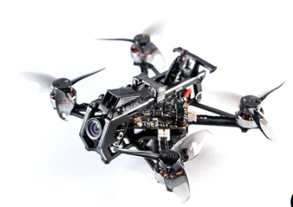

# HGLRC Draknight 2-inch toothpick Fpv drone
[На сайте производителя](https://www.hglrc.com/products/hglrc-draknight-2-inch-toothpick-fpv-drone)  


## Проблема при скачивании прошивки для полетника
В дроне установлен полетник SPECTER12 ES2-4S AIO flight controller  
Master control: STM32F411  
Firmware: BF HGLR-HGLRCF411SX1280_15A  

При автоматическом поиске прошивки В Betaflight на странице Firmware Flasher выводится `HGLRCF411SX1280_15A`.
Но при нажатии кнопки `Load Firmware [Online]` вываливается ошибка  
```
make: *** No rule to make target 'HGLRCF411SX1280_15A'.  Stop.
make failed with 2
``` 
Была создана [issue на сайте Betaflight](https://github.com/betaflight/config/issues/601)  
Ответ был следующим:  
Flash correct target:  
10A is SPI ERLS (HGLRCF411SX1280V2)  
12A and 15A is UART ELRS (HGLRCF411ELRS)  
Reference: [betaflight/unified-targets#1057](https://github.com/betaflight/unified-targets/pull/1057)

Таким образом для вышеуказанного полетника нужно указывать руками `HGLRCF411ELRS`

