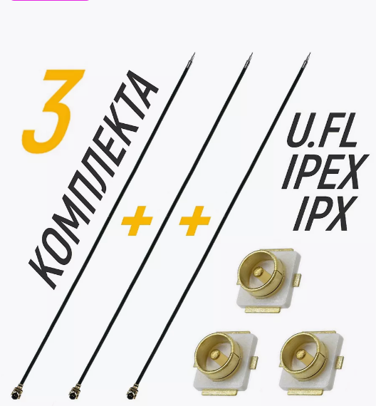
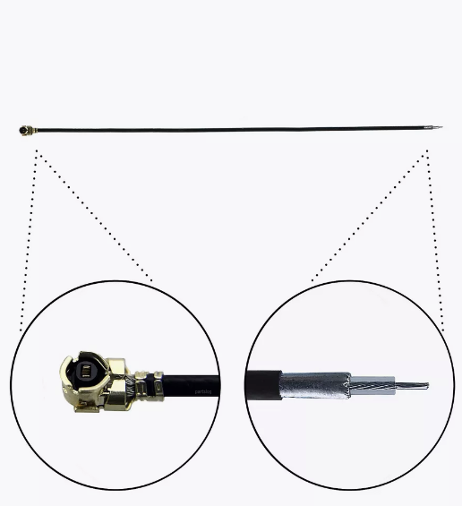
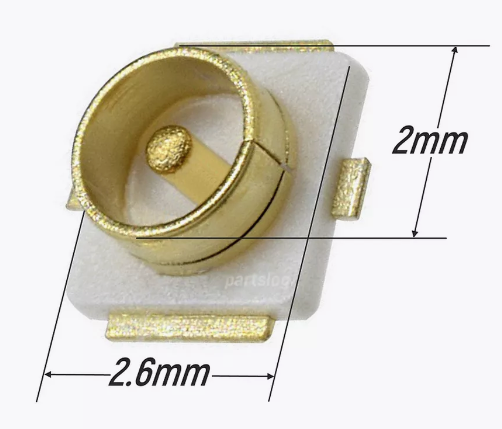
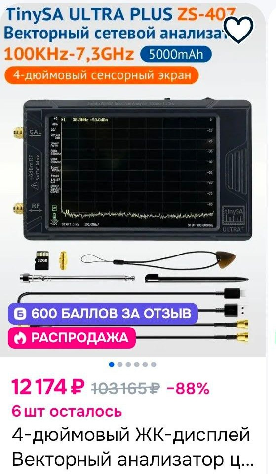

# Общая информация

## Проверка работы SmartAudio
1 Go to the Blackbox tab  
2 Set Blackbox debug mode to SmartAudio  
3 Hit Save and reboot  
4 Enable Expert mode in the top section of the configurator  
5 Switch to the Sensors tab  
6 Check the Debug box and deselect everything else  

## Как проверить, правильно ли переключается мощность на VTX
1. Неточный способ: отходим с очками дальше и дальше от дрона. Когда качество становится хуже, добавляем мощности  

2. Очень часто на VTX находятся светодиоды, показывающие текущую мощность передачи, бэнд и канал. Нужно узнать в мануале по VTX обозначение и сверять с реальным свечением.  

3. Замерять ток, потребляемый дроном при переключении мощностей.  
Для этого можно включить в OSD показ Battery Current Draw. Будет видно как меняется потребление тока в амперах.  
Пример значений для RUSH TINY TANK Nano VTX:  

| Mode     | Ток, А |
|----------|--------|
| PIT MODE | 0,42   |
| 25mw     | 0,52   |
| 100mw    | 0,57   |
| 200mw    | 0,60   |
| 350mw    | 0,63   |

4. Специальным прибором измерять мощность излучения антенной. 

## Полезная информация

[Betafpv Cetus X - перегрев видео передатчика - часть 1. Отчего перегрев и как исправить. YouTube Petrokey](https://www.youtube.com/watch?v=T5I1-_kiTXA)  
[Betafpv Cetus X - перегрев видео передатчика - часть 2. Таблица мощностей. Добавил 200мВт. YouTube Petrokey](https://www.youtube.com/watch?v=hDFj-GG1LZ8)

[BETAFLIGHT 4.3+. Изменение мощности VTX тумблером с аппаратуры. Smartaudio/Tramp. YouTube: SetUP](https://www.youtube.com/watch?v=ocmA_Z_sSA0)

[как переключать канал или мощность vtx с пульта – betafpv Cetus X, LiteRadio3, Radiomaster tx16s. YouTube Petrokey](https://www.youtube.com/watch?v=ElDQzcKTmy0)

[Про антенны. FPV для начинающих. Базовые сведения и прикладные советы. YouTube: Хобби - летать.](https://www.youtube.com/watch?v=nWuPP5ERxWY)

[Базовые знания по радио для FPV-шников простыми словами. YouTube: Хобби - летать](https://www.youtube.com/watch?v=x9G1zFIQhZs)

## Оторвался разъем антенны
Отпаиваешь феном остатки от пятака `UFL`, зачищаешь центральную жилу и два отвода экрана аккуратно припаиваешь, потом заливает все клеем b7000 или Т8000.   
Советую заказать разъемы на озоне и вайлберис и перепаять как должно быть.
[Коаксиальный кабель IPEX/IPX + Разъем UFL U.FL-R-SMT ](https://www.wildberries.ru/catalog/89028880/detail.aspx)  

## Анализатор спектра излучаемого сигнала
Используется для тестирования эффективности и качества антенн на разных частотах

### TinySA ULTRA PLUS ZS-407
  

[Zeenko TinySA ULTRA Plus ZS-405/406/407 Handheld Tiny Spectrum Analyzer TinySA](https://www.aliexpress.com/item/1005008563113683.html)

