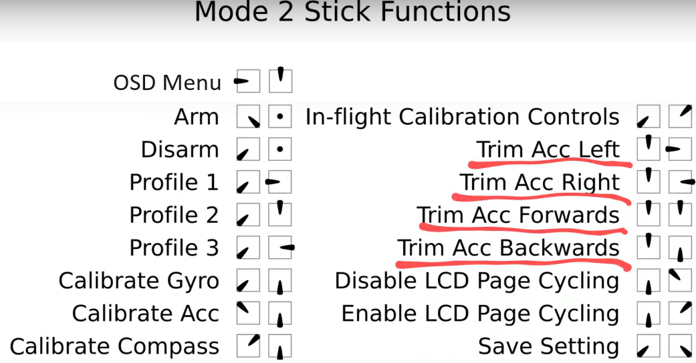

# Триммирование (trim) дрона
Проблема: в режиме стабилизации дрон несет в сторону/вперед/назад.  

Для решение этой проблемы требуется триммирование (калибровка) горизонта на дроне. Все описанное ниже применимо к дронам на прошивке `Betaflight`.  
Включаем дрон и пульт. Ждем пока они свяжутся.  
В режиме Disarm поднимаем на пульте газ вверх.  
Правым стиком делаем движение в сторону, противоположную от того, куда несет дрон.  
Если в процессе калибровки смотреть в экран шлема/очков, то при каждом движении правого стика на экране будут моргать звездочки.  
Опускаем газ вниз.  
Сохранение происходит автоматически.  

Видео по калибровке дрона: [как тримировать FPV дрон, трим горизонта. YouTube: Петрокей](https://www.youtube.com/watch?v=dqHI1HcI4w0)

Можно сделать сброс калибровки: левый стик потянуть по диагонали влево и верх, правый четко вниз.  
 
Картинка с разными функциями управления стиками. Калибровка подчеркнута красным:  

