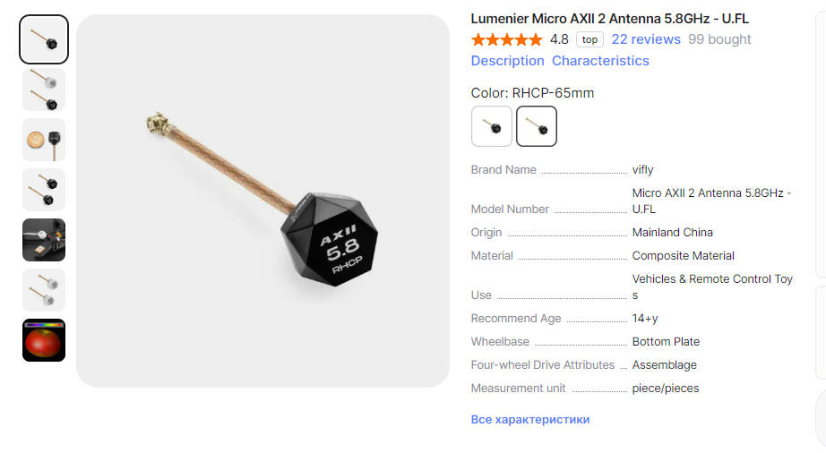
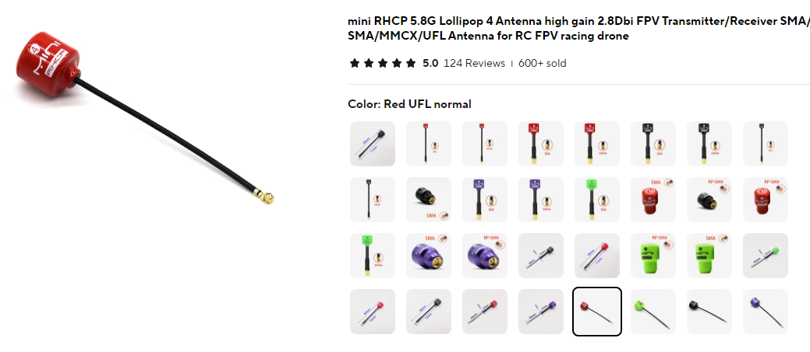
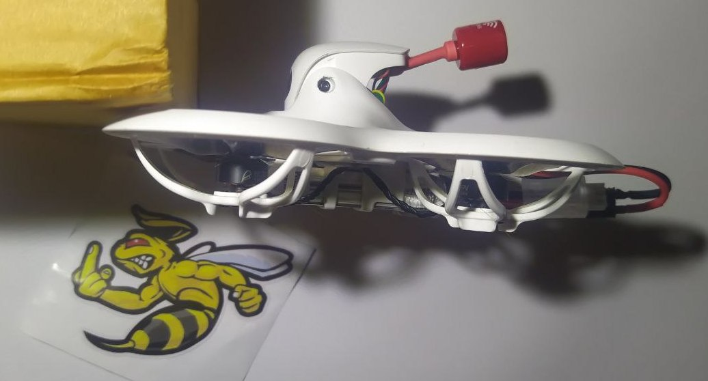

# Замена штатных антенн на дроне и шлеме

## Антенны с круговой поляризацией
Одним из плюсов таких антенн является снижение помех от отраженного сигнала.  
Бывают антенны с правой(RHCP) и левой(LHCP) поляризацией. 

Если и на дроне и на очках/шлеме стоят такие антенны: на них обоих должна быть одна и та же поляризация. Принято на ставить антенны с **правой поляризацией (RHCP) на аналоговые видеосистемы**.  

Если и на дроне и на очках/шлеме стоят такие антенны: на них обоих должна быть одна и та же поляризация.  
В случае если сменить антенну только на дроне или очках, связка работает конечно, но не так хорошо как хотелось бы. 

Антенны на шлем/очки можно посмотреть на [этой странице](./../../../15_Шлемы_Очки/20_Антенны_на_аналог.md)

## [Lumenier Micro AXII 2 Antenna 5.8GHz](https://www.aliexpress.com/item/1005006729452572.html)
Подробности в видео от Петра:  
[Betafpv Cetus X - замена антенны. Lumenier Micro AXII 2 и Lollipop 4 на аналоговый FPV тайнивуп](https://www.youtube.com/watch?v=G2w1dMCCnoc)  

[Или в этом видео с 22:00. YouTube: Horizon](https://youtu.be/MjO-WXwTGzM?si=I5wlKjKbi_qzUL37&t=1320)

Брать нужно `RHCP 65mm` (Regular).  

## Вариант 2
Проверенная антенна та Cetus X. С заменой антенны, качество сигнала и дальность полета увеличились.   

[mini RHCP 5.8G Lollipop 4 Antenna](https://www.aliexpress.com/item/4001364197035.html).  
Брать надо `UFL Normal` любого цвета.  

## [Foxeer Lollipop 4 Plus 4+ FPV Antenna 5.8G 2.6Dbi Omni Mini Antenna](https://vi.aliexpress.com/item/1005007675970891.html)
Брать надо `UFL R` (RHCP)  
  

## Способ крепления антенны от [Lex RES](https://t.me/meganoobe)
Антенна зафиксирована простым стержнем от шариковой ручки, разрезанным вдоль. Затем для красоты усажено всё в термоусадку.  
  
  
  
