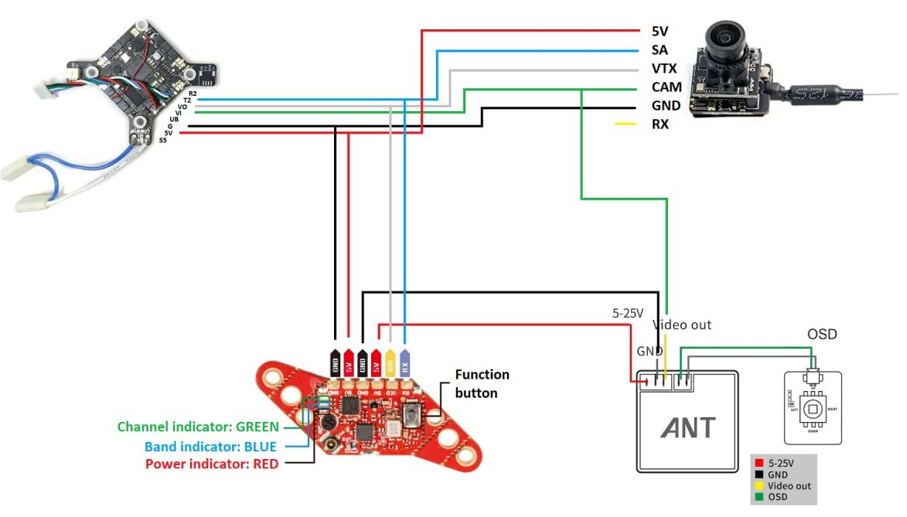
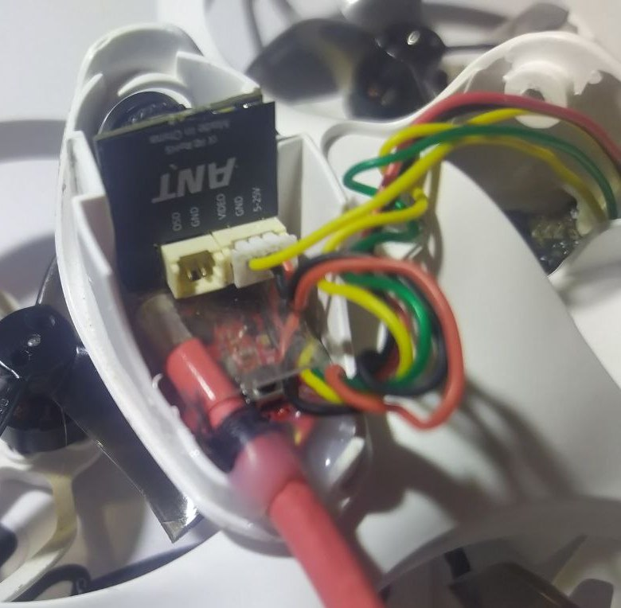
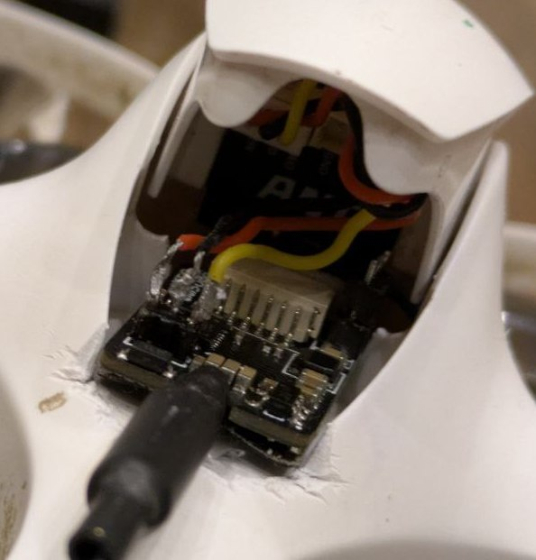

# Замена модуля С04 (VTX + камера) на BETAFPV Cetus X
На Cetus X стоит так называемый "бутерброд" из спаянных вместе камеры `Caddx ant 4:3` и VTX.  
[Подробности здесь](./../90_Компоненты/Camera_VTX_C04.md)  

В качестве альтернативы можно поменять бутерброд на любый аналоговые камеры и VTX. 
 
## Введение
Полетник накладывает ОСД с камеры.  
Есть два варианта схем:  
1. Видео с камеры напрямую идёт в полетник, он накладывает ОСД, и видео уходит в VTX на отправку.   
2. Видео с камеры идёт в VTX, оттуда сквозняком в полетник, там накладывается ОСД, и обратно в VTX на передачу.  

Второй вариант хоть и более сложен, но позволяет тянуть провода только от VTX к полетнику. А провода от камеры идут только в VTX.  

## Разборка бутерброда
[video & vtx how to fix it (как починить) cetus x. YouTube: cev chevron](https://www.youtube.com/watch?v=ieGqLArBH64)

## [Rush Tiny Tank](https://vi.aliexpress.com/item/1005005839526451.html) + [Caddx Ant Nano](https://www.aliexpress.com/item/4001223701881.html) 
[Подключение аналоговой камеры и vtx к FPV дрону на примере Betafpv Cetus X. YouTube: Petrokey](https://www.youtube.com/watch?v=D5YvAAP_2PU) 

## [Happymodel OVX300](https://www.aliexpress.com/item/1005003080175112.html) + [Caddx Ant Nano](https://www.aliexpress.com/item/4001223701881.html)  
[Подключение аналоговой камеры Caddx Ant и ovx300 vtx к FPV дрону на примере Betafpv Cetus X. YouTube: Petrokey](https://www.youtube.com/watch?v=GuXjhjdSays) 

## Еще альтернатива VTX: [HGLRC Zeus nano VTX](https://vi.aliexpress.com/item/1005006739923410.html)

## Схема подключения оригинального бутерброда и альтернативы

## Крепление камеры и VTX под канопой

От [Lex RES](https://t.me/meganoobe)

От `Timofey`  

