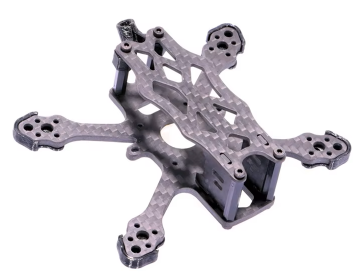
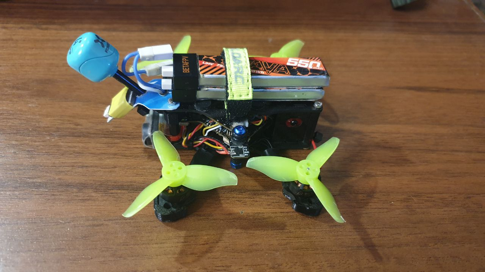

# Пересаживаем начинку на другую раму
Компоненты Cetus X, как и Meteor85, можно пересадить на другую раму, предназначенную для 2S дронов.  
И тогда получится более быстрая зубочистка с хорошим охлаждением.

## Darwin TinyApe Freestyle Frame
[Darwin TinyApe Freestyle Frame](https://darwinfpv.com/products/darwin-tinyapee-freestyle-frame)  

[CETUS X Долголет или как найти дрон. YouTube: FpvMania](https://www.youtube.com/watch?v=_AvySHJ7s5Y)  

## APEX 2 Frame Kit
[На aliexpress.com](https://vi.aliexpress.com/item/1005006105436873.html)  
  
Фото от пользователя `Neo`  
  
