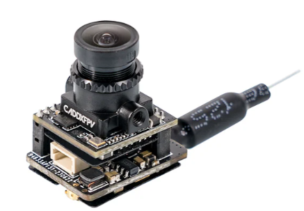
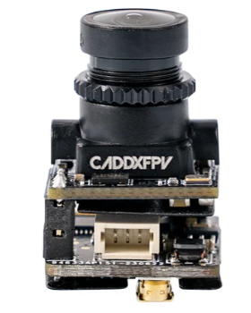
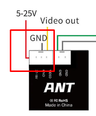
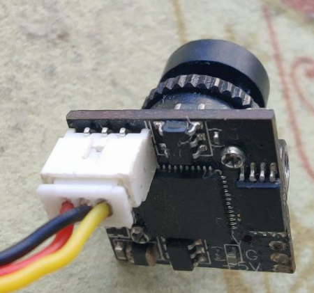
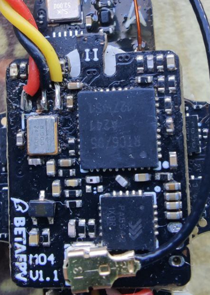

# Камера и VTX C04 (так называемый "бутрерброд")
Устанавливается преимущественно на Cetus X.   
Состоит из спаянных вместе камеры `Caddx Ant 4:3` и VTX.  
  
[Страница модуля на сайте производителя](https://betafpv.com/products/c04-camera-and-vtx-module)  

!! Обратите внимание, что у модулей разные коннекторы для разных контроллеров:  
 - M04 для Betaflight FC с встроенным ELRS  
  
 
 - M04 для Cetus FC с встроенным FrSky  
  
На бутерброд 3 провода идет. +/-/ и наверно м-линк. OSD кладет сам VTX.

## Недостатки
VTX сильно греется и часто выходит из строя. А приходится менять весь модуль, что порой экономически менее выгодно чем отдельные камера и VTX.   
Или если разбил камеру, тоже приходится менять весь модуль.  

## Распайка
Если камера или VTX вышли из строя, при определенных навыках их можно разъединить и спасти уцелевший элемент.  
Камера от бутерброда по распиновке в точности соответствует Сaddx ant Nano. 
 

На VTX подпаять камеру можно так:  
  
За объяснение и фото большая благодарность [Pavel Gavrilov](https://t.me/reeson2003)

## Разборка бутерброда
[video & vtx how to fix it (как починить) cetus x. YouTube: cev chevron](https://www.youtube.com/watch?v=ieGqLArBH64)

## Замена разбитого объектива камеры
Объектив на камере CADDX Ant Nano подходит идеально. Можно купить такую камеру, что выйдет дешевле чем весь бутерброд. Скрутить пальцами или аккуратно маленькими плоскогубцами.

