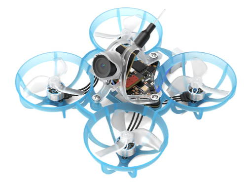
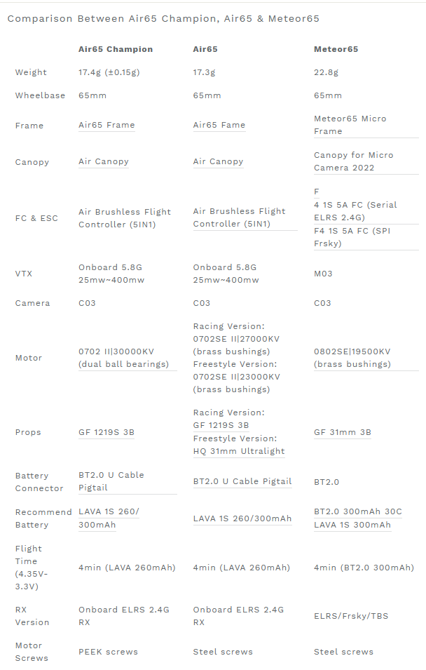

# Air65 
[Страница на сайте производителя](https://betafpv.com/collections/meteor-series/products/air65-brushless-whoop-quadcopter)  

[Micro Air Canopy](https://betafpv.com/products/micro-air-canopy)  
[Meteor65 Air Brushless Whoop Frame](https://betafpv.com/products/meteor65-air-brushless-whoop-frame)  
Air65 FC: [Air Brushless Flight Controller](https://betafpv.com/products/air-brushless-flight-controller)  
[Battery LAVA 1S 300mAh 75C Battery](https://betafpv.com/products/lava-1s-300mah-75c-battery-5pcs?variant=40374765387910)   
[Battery LAVA 1S 260mAh 80C Battery ](https://betafpv.com/products/lava-1s-260mah-80c-battery-5pcs?variant=41018561626246)  
[C03 FPV Micro Camera](https://betafpv.com/products/c03-fpv-micro-camera)  
Freestyle Version props: [HQ 31mm Ultralight 3-Blade Propellers (1.0mm Shaft)](https://betafpv.com/products/hq-31mm-ultralight-3-blade-propellers-1-0mm-shaft)  
Racing Version props: [Gemfan 1219S 3-Blade Propellers (1.0mm Shaft)](https://betafpv.com/products/gemfan-1219s-3-blade-propellers-1-0mm-shaft)

## VTX Table

## Bind
Полетный контроллер имеет встроенный ELRS приемник подключен через `UART`.

### [Перевод дрона в режим Bind](./../../../60_Bind/40_Режим_Bind_дрона_с_UART.md)

### [Ввод Bind фразы на дроне](./../../../60_Bind/44_Bind_фраза_дрона_с_UART.md)

## Обзоры
[Betafpv Air65 - дрон-электрон. YouTube: Петрокей](https://www.youtube.com/watch?v=JC9LpR21nRg)  

[Betafpv Air65: ГЕНИАЛЬНО или ОЧЕРЕДНОЙ ХАЙП?. YouTube: DRONOFLY](https://www.youtube.com/watch?v=9XhxKGq8v1w)

[ДЕШЁВЫЙ МИКРО ДРОН с FPV КАМЕРОЙ - КАК Я ПОПРОБОВАЛ TINYWHOOP. YouTube: recopter](https://www.youtube.com/watch?v=FoHaf32e7mc)

[Testing and Tuning the NEW BETAFPV Air65. YouTube: Chris Rosser](https://www.youtube.com/watch?v=N6B7GpprVBI)  

[Mobula6 vs BetaFPV AIR65: Ultimate Tiny Whoop Showdown for 2024 | TrickyFPV](https://www.youtube.com/watch?v=hAr059pClBg)

[New BetaFPV Air65 + Tinywhoop 300mah UPDATES +(Giveaway). YouTube: Infinity Loops](https://www.youtube.com/watch?v=PJTh98q0fgg)
