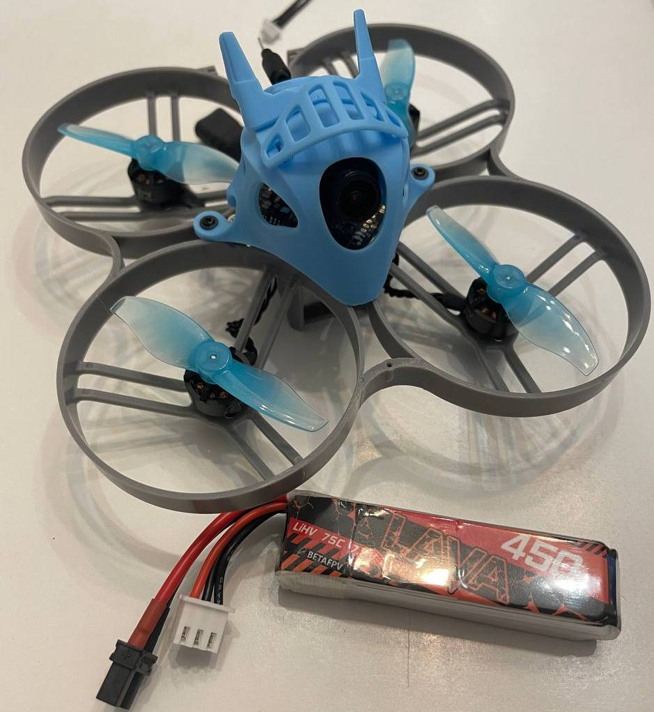
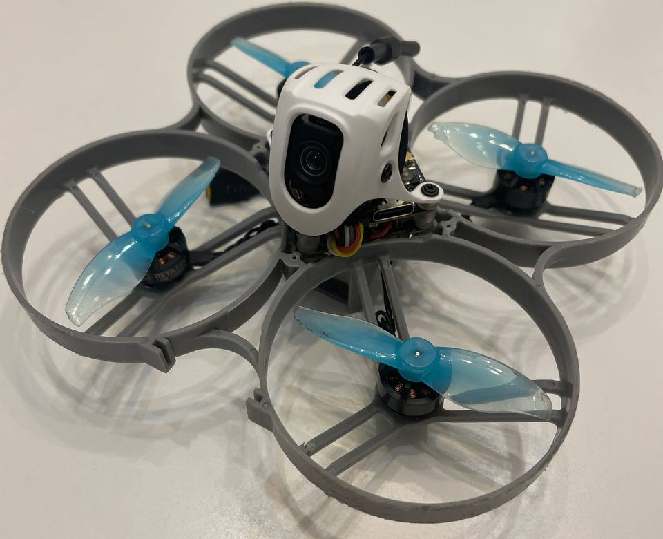
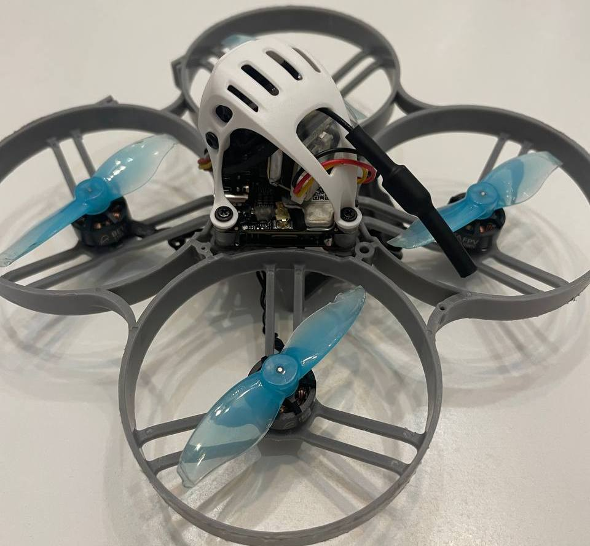
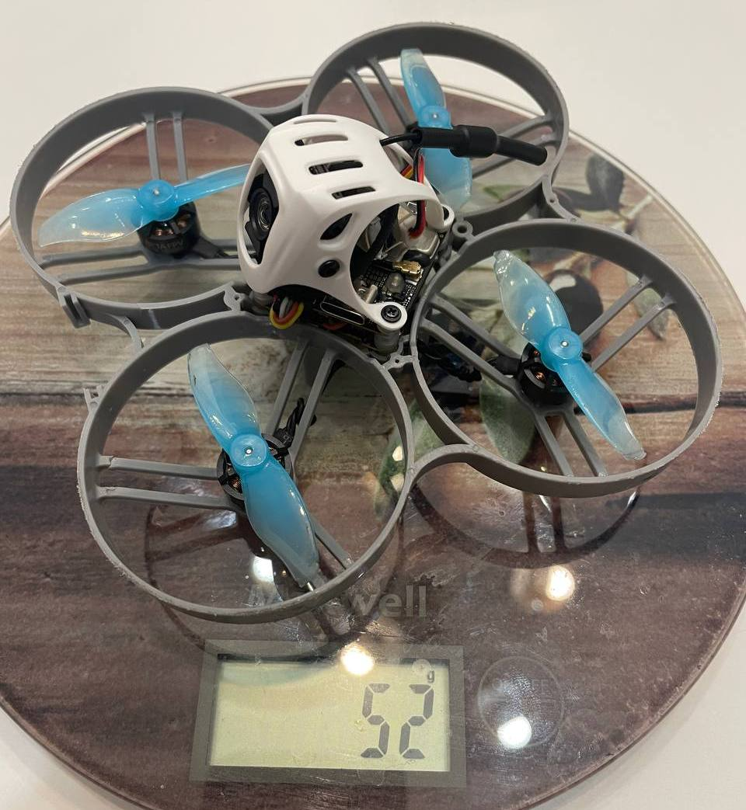
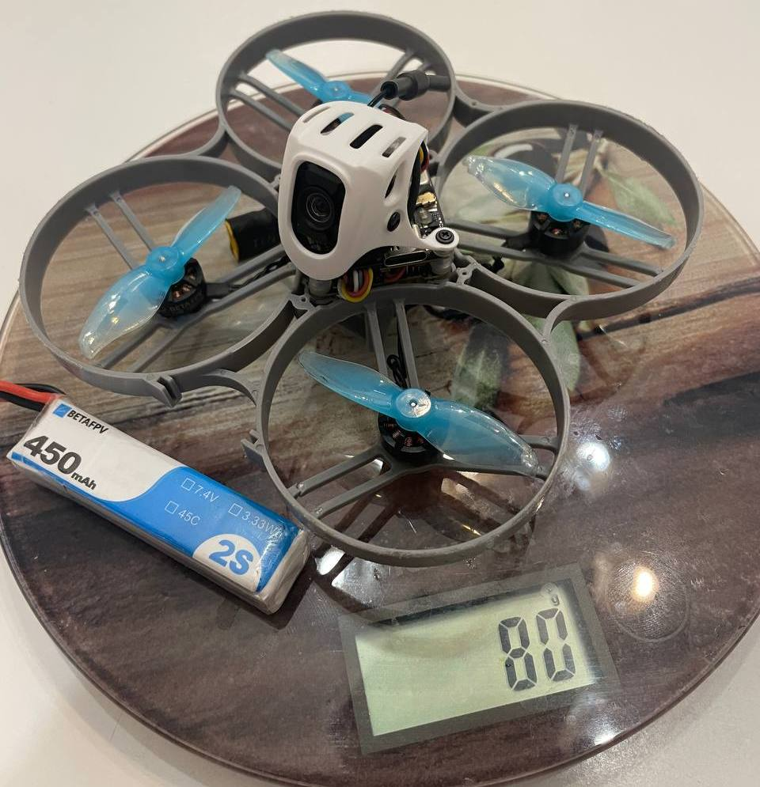
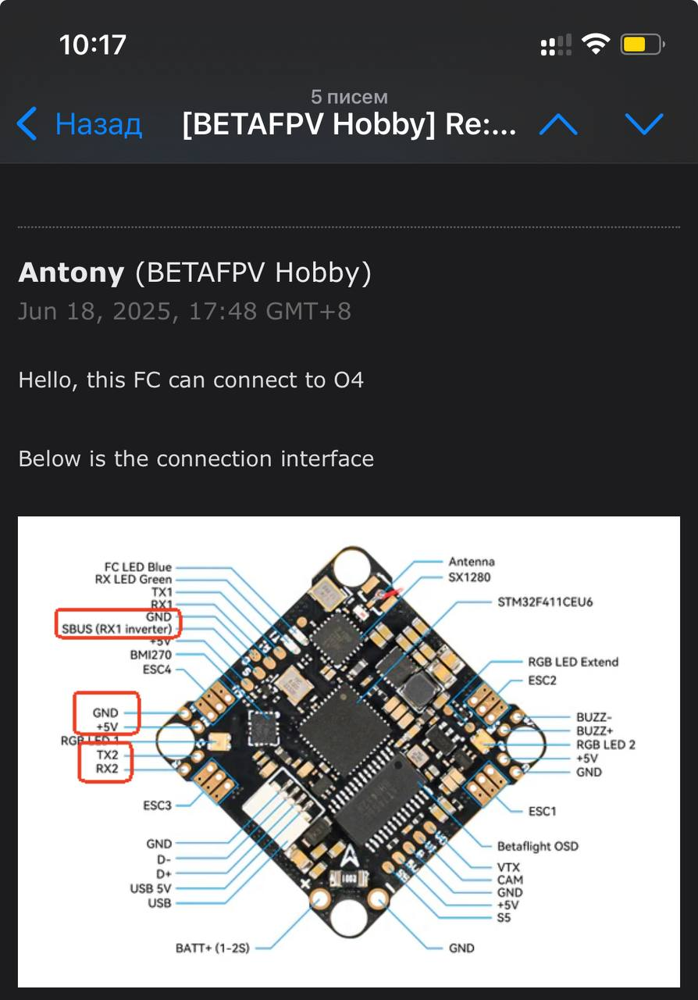

# Переделка Meteor85 под видеосистему DJI O4

Информация от пользователя `@V8787`:

Результатом доволен.
Переделка метеора 85 под о4 прошла успешно.  
На днях полетал - летается супер. В спокойном режиме 5,5 минут на батарейках 450 мач.  
В целом, дрон весит легче, чем аналог с тумбой.  
Если сравнивать со стоком - то всего на 8 грамм тяжелее. И это с бузером, который грамма 3 то весит..  

До переделки:  

Ну и собственно результат:  
  
  
  
  

Картинка с о4 похожа на гоу про 8.

Старую канопу с втх и камерой снял. Поставил модуль O4. Он продается с камерой.  
И отдельно купил канопу от 75 про как раз под DJI O4. Она на озоне 1000 руб стоила (12 евро?).

Единственный прикол это посадочные места.  
В 85 канопа крепится на раму (См фото). А в 75 про - на места полетника. (См фото)  
Все в комплекте с канопой и юнитом. Включая все резиновые прокладки и прослойки юнит ставить друг на друга с полетником.

Как будто меньше защиты. Но больше охлаждения.  
Кстати да, греется. Секунд 30 стоишь на месте и температура 70. Поэтому ставишь батку, арм, и надо лететь. В полете 38-40.

### Подключение
По сути только видеосистема меняется и канопа.  
Так как фишки на проводное подключение нет - паял.  
Мне тех поддержка BETAFPV прислал схему:

Запасной вариант был поставить полетник от 75про/фемто/пико/20про итд   
Он заточен под джи о4. У него на плате фишка.

Модуль подключается за секунду.

Но плата стоит 3-4к рублей. А цель проекта была собрать из того что есть. Без доп затрат.

