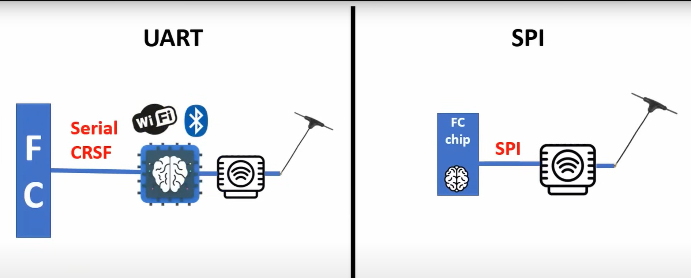

# Общая информация
Самый распространенный гражданский протокол - CRSF, у него есть 2 наиболее распространенных версии:
ExpressLRS (ELRS) — ExpressLRS является современной радиоуправляемой системой обеспечивающий передачу сигнала с пульта на приемник для управления дроном. В ней доступны все возможности, которые необходимы для операторов FPV. Более высокая частота обновления.  
Также ELRS обладает открытым кодом. Если имеются навыки и прямые руки можно даже прошивку модифицировать самостоятельно.

Предыстория: фирма [Team Blaсk Sheep](https://www.team-blacksheep.com/) разработала систему радиосвязи TBS Crossfire Tx, где название протокола связи - Crossfire.   
TBS CRSF - закрытая разработка, более защищенная, стабильная и все прочее, соответственно разработчик данного протокола берет дополнительную плату, в счет разработки данного протокола + за само устройство ("железо"). Yикто, кроме них, устройства на TBS CRSF не производит.  

Open Source сообщество разработало же свою систему радио связи ExpressLRS. Протокол связи тот же Crossfire, но обвязка другая.  
Производителей устройств на ELRS - десятки.
Соответственно различные устройства на ELRS, даже от разных производителей, при соответствии версий прошивок между собой работают без каких либо нареканий.   
Если же говорить о TBS, то придется всю аппаратуру покупать от них, так как кроме как между собой они не работают.  
Хорошая аналогия - устройства на Android и устройства на iOS

[ExpressLRS - взгляд изнутри. Принципы, алгоритмы, форматы... Youtube: Petrokey](https://www.youtube.com/watch?v=WoXPkvHTBi4)  

[Всё про ELRS (dzen.ru)](https://dzen.ru/a/ZiC61ueuLzUoSm3_)  

[Сайт по ELRS от Алексея Родина](https://expresslrs.ru/)

[Before First Flight](https://www.expresslrs.org/quick-start/pre-1stflight/)  

[ELRS dipole antenna orientation - horizontal or vertical](https://intofpv.com/t-elrs-dipole-antenna-orientation-horizontal-or-vertical)

## Отличия подключения через UART и  SPI
Картинка взята из видео Петрокея [ExpressLRS - взгляд изнутри. Принципы, алгоритмы, форматы... Youtube: Petrokey](https://www.youtube.com/watch?v=WoXPkvHTBi4)   

## Прошивка ELRS приемников, подключенных по SPI
На вупах часто стоят полётники с SPI приёмниками. Их не нужно отдельно прошивать, их прошивка уже содержится в Betaflight.

Betaflight 4.3.x идет с ELRS 2.x.x  
Betaflight 4.4.x идет с ELRS 3.x.x  

Также раньше были сборки Betaflight 4.3 с поддержкой ELRS 3, но с выпуском Betaflight 4.4 необходимость в них отпала, ставьте официальный 4.4.

[Взято отсюда](https://www.expresslrs.org/hardware/spi-receivers/).

Не забывайте, что при апгрейде с 4.3 на 4.4 слетают настройки, перед обновлением делайте бекап с помощью cli (diff all) или с помощью кнопки Save backup на вкладке "Presets". Тюнинг от 4.3 подходит к 4.4.

