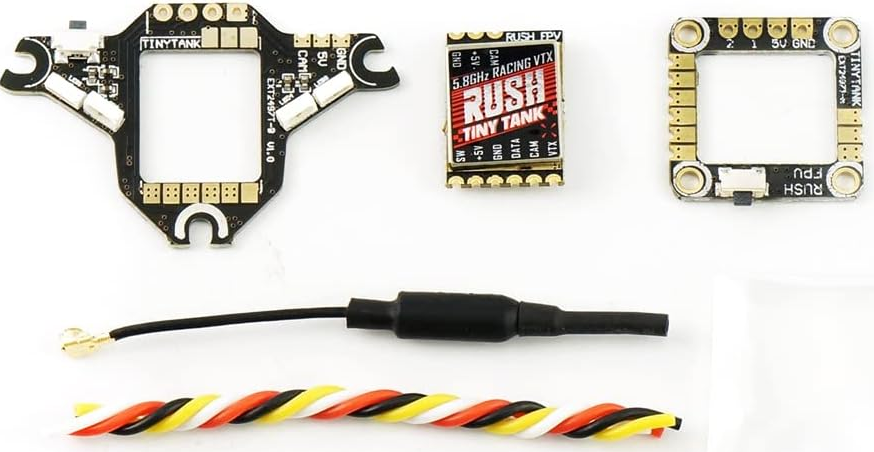
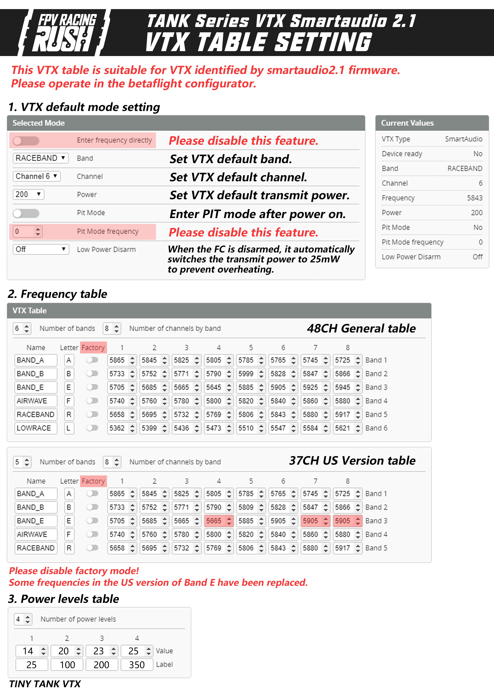
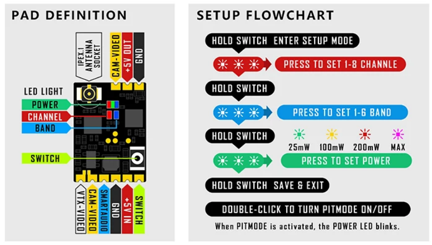
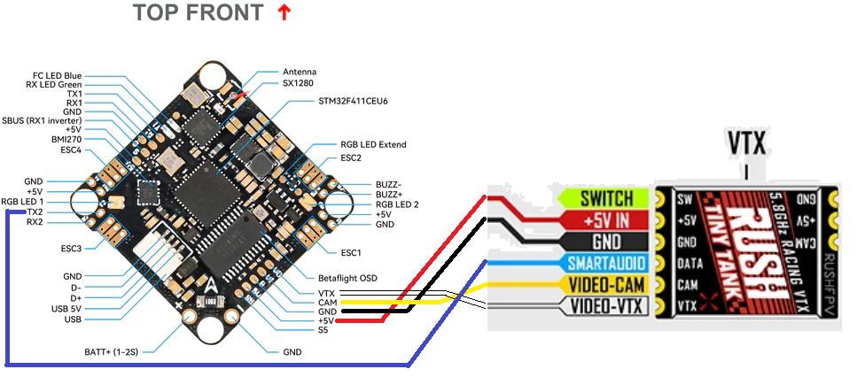

# RUSH TINY TANK Nano VTX

[На сайте производителя](https://rushfpv.net/products/tank-tiny-vtx)

## Настройки каналов и таблицы мощностей

**ВНИМАНИЕ!!** Если подключить дрон/полетник кабелем USB к компьютеру, но при переключение мощностей **изображение пропадает** - значит видеопередатчику не хватает мощности от USB. Нужно **подключить к дрону батарею**.

[Настройки VTX от производителя (Google Disk)](https://drive.google.com/drive/folders/1tNlJHf3u4hBi9kbhByogJR41M3KvzvMl)

## Светоиндикация
Глядя на светодиоды можно определить на каком банде и канале передается видеосигнал. Так же можно видеть текущую мощность.  

красный: номер канала 1-8  
синий: номер бенда 1-5  
цветной - горит одним из цветов - какая-то из мощностей (см. картинку ниже)  
цветной - медленное моргание - включен PIT mode
          
		  

## Подключение к полетному контроллеру

Подключение к BETAFPV FC F4 1S 12A AIO:  

## Обзоры
[Review- Rush VTX Lineup (Tank, Plus, Race, Mini, Tiny) - Oscar Liang](https://oscarliang.com/rush-vtx-tank-plus-race-mini-tiny/#Rush-Tiny-Tank-VTX)

[Подключение аналоговой камеры и vtx к FPV дрону на примере Betafpv Cetus X. YouTube: Петрокей](https://www.youtube.com/watch?v=D5YvAAP_2PU)  
