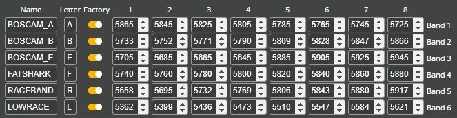
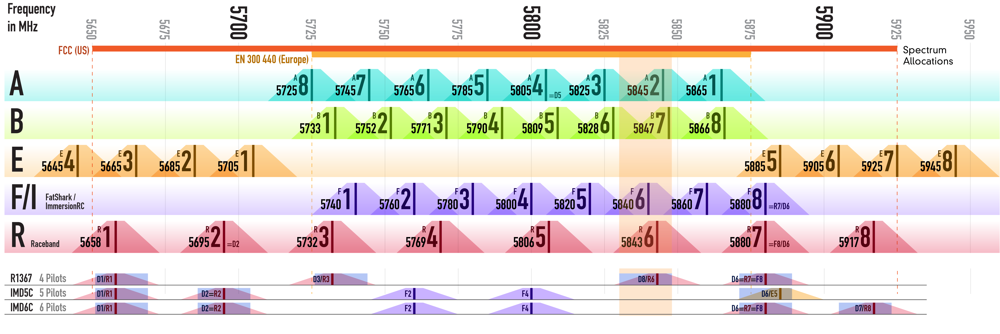

# Частоты передачи видео

## Таблица каналов в Betaflight Configurator

## Упрощенная диаграмма частот
  
Полная таблица в статье ниже

Еще есть `Lowrace` band. Частоты начинаются в районе 5300. Теоретически лучше проникновение, да и для vtx повышение частоты может быть сопряжено с падением мощности. При этом антенны должны быть эффективны на данной частоте, а они и в стандартной сетке не всегда соответствуют ожиданиям.

## Помехи от Wi-Fi
Согласно диаграмме частот из статьи ниже, диапазон частот у 5.8GHz WiFi роутеров находятся в диапазоне 5660-5870. Поэтому дома лучше выбирать каналы с частотами выше 5870: E5-8, F8, R7-8

## Переключение каналов с пульта (VTX Admin)
[setup vtx admin on ELRS protocol transmitter. YouTube: WestFPV](https://www.youtube.com/watch?v=32r2fWFrgr4)

[expresslrs.org: VTX Administrator](https://www.expresslrs.org/quick-start/transmitters/lua-howto/#vtx-administrator)

## Статьи и видео
[FPV Frequency Reference Chart](https://www.getfpv.com/learn/fpv-essentials/fpv-frequency-reference-chart/)

[Канали, Бенди, Частоти VTX. . YouTube: Жвавий Дрон](https://www.youtube.com/watch?v=1WV-2_DJHRE)  

