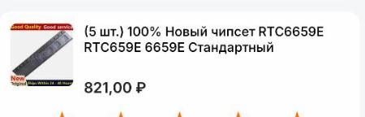
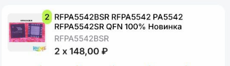

# Ремонт VTX

Случается, что VTX выходит из строя ввиду его перегрева, связь начинает деградировать, а потом совем выходит из строя.

Основная причина этого  - сгоревшая(подгоревшая) микросхема усилителя сигнала.

Поэтому заказываем на али

* Rtc 6659e - для даймондов, х12 (от хеппимодел)

* Rfpa5542 - для метеоров (при замене в метеорах нужно сразу заказывать ipx разъемы ибо они при плавятся при выпайке)
  

и паяем самостоятельно или в сервисе.

Автор Aleksey-G

