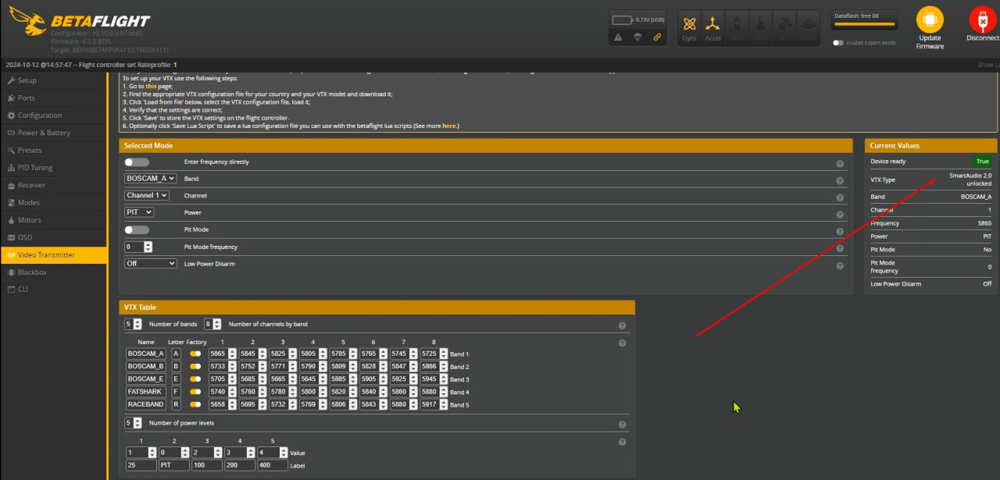
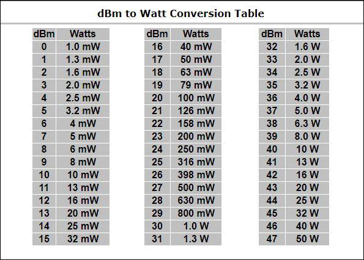
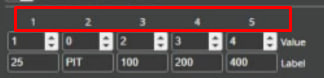

# Мощность передачи в VTX и PIT mode

## Управление мощностью
С полетника можно управлять VTX по разным протоколам. Один из них: Smart Audio.  
Вот тут ты можешь увидеть протокол связи:  

Есть две версии протокола 2.0 и 2.1.  

По версии 2.0 ты должен послать в передатчик число 0,1,2,3,4. Это будет как бы номер режима мощности. Причем у разных VTX могут быть разный набор режимов.  

Про версии 2.1 посылается значение мощности в децибелах.  
 

В Meteor65 pro стоит VTX BETAFPV M03. У него и подается число от 0 до 4. Оно прописывается в поле Value.
А в поле Label прописывается просто некий абстрактный текст, чтоб было понятно, что означает тот или иной режим мощности
Туда можно написать что угодно. Что напишешь, то и будет показано в OSD.  

А вот цифры НАД этими значениями - порядковые номера, который важны для Betaflight, когда мы хотим давать команды на переключение мощностей.  

Технически, ты можешь менять колонки в таблице переключения мощностей.  
Главное понимай, какое значение улетит в VTX, та мощность и будет.  
Ну а если поменяешь местами, имей в виду, что нужно будет в Betaflight поставить правильный индекс из верхней строки.

## PIT-mode
Это отдельный режим. Он есть не во всех VTX.  
Вне зависимости от того, на какой мощности стоит передатчик, заведя его в PIT - мощность упадет до минимума.  
Включать PIT mode можно отдельно. Повесить на кнопку зайдя в закладку Modes.  
В тех передатчиках, где PIT mode нет, можно добиться условного PIT mode, заведя мощность передатчика в значение 0.

Вот статья, где я заводил [переключение мощности на колесо в покете](./../../10_Аппаратура(Пульты)/10_Модели/10_Radiomaster/01_Pocket/03_переключение_колесом_мощности_VTX.md)  
В статье вверху есть ссылка на оригинальное видео от Петра. Он подробнее объясняет и про индексы и про то как повесить переключение мощностей на кнопку.

У меня 4 вупа, на всех разный VTX. С PIT Mode и без.  
Но все их я настроил так, чтобы переключать мощность колесом.  
Причем на крайнее положение я завожу значение 0мвт и в дополнение включение PIT mode для тех VTX где он есть.  
Дальше по мере вращения перевожу в 25мвт. Ну а в крайнем положении у меня максимум мощности.  
Итого. Дрон стоит, колесо влево до конца. 0 мвт и/или PIT.  
Крутнул чуть-чуть - получил 25мвт и PIT отключился. Летаю вокруг себя.  
Если улетаю дальше и качество падает - кручу колесо и врубаю максимум. 
