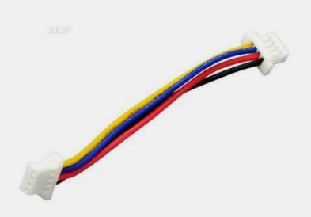

# Вопросы, проблемы и решения

## Длина антенн
Для VTX на 5.8 ГГц: Длина антенны обычно составляет около 12.92 мм или половину этого значения (6.46 мм), что соответствует полной или половинной длине волны. 

Для ELRS на 2.4 ГГц: Длина антенны обычно составляет около 31.23 мм или половину этого значения (15.61 мм), что соответствует полной или половинной длине волны  

## Много помех при полетах в помещении
Нужно на дрон и шлем ставить клевер- антенну. При отражении сигнала от стены он меняет поляризацию и практически не дает помех на приемную антенну.

## Дрон кувыркается при попытке взлететь 
Если квад армится, а при попытке лететь, кувыркается и дизармится, то надо проверить:  
1. Проверить, как себя моделька в Betaflight ведёт при наклонах/поворотах дрона, надо чтобы совпадало с тем что делаешь(иначе развернуть положение гиры в Betaflight)  
2. Совпадает мапинг моторов, т.е. что 1 мотор это задний правый и т.д.  
3. Совпадает направление вращения моторов  
4. Правильно установлены пропеллеры (не вверх ногами и не перепутаны левый правый)  
5. Стоит флажок props out, если это требуется на основе того как установлены пропы   
6. Порядок каналов стиков совпадаети в аппе и в Betaflight. Типичный порядок `AETR`.  

## Провод для коннекта дрона с компьютером через USB Type-C переходник
[JST1.0 SH1.0 4pin cable (AliExpress.ru)](https://aliexpress.ru/item/1005005796723171.html?sku_id=12000034384188766)  
[JST1.0 SH1.0 4pin cable (AliExpress.com)](https://aliexpress.com/item/1005005796723171.html?sku_id=12000034384188766)  
  
Только нужно будет ему порядок пинов поменять с одного конца.

## [Почему дрон не реагирует на пульт](https://dzen.ru/a/ZTnTOxoL4BMRPRHg)

## Почему дрон не армится
[FPV Drone Doesn’t Arm? Let’s Troubleshoot and Fix it.](https://oscarliang.com/quad-arming-issue-fix/)
В статье перечислены причины, таблица со значениями флагов.  

Если на дроне установлен бипер (buzzer), то он издает длинные и короткие писки указывающие на причину проблемы.  
Один длинный равен числу 5. Короткий - 1. Сложив, мы получим число, которое означает значение в таблице флагов.  
Например: 3 длинных, 2 коротких. 3*5 + 2 = 17. Что означает MSP connection is active

## В OSD и Betaflight не отображается ток и напряжение
Нужно проверить, чтобы в Betaflight на вкладке Power в обоих выпадающих списках стояло `Onboard ADC` (Встроенный АЦП).  
[I Don't Have Any Voltage In Betaflight! Help! - FPV Troubleshooting. YouTube:L Joshua Bardwell Livestream Clips](https://www.youtube.com/watch?v=X0aFJ_YZqi4)

## Помехи в изображении шлема
**Вопрос**: В шлеме BETAFPV VR03 появляются помехи.  Записал DVR, а на нем идеальное изображение без помех.  
Связка: Foxeer f405, VTX Zeus nano. Отдельно VTX с камерой и другим полетником нормально работают. Как такое может быть?

**Решение**: Переключил камеру с PAL на NTSC и помехи ушли

## Видео в очках плавно смещается в сторону
[Analog Video Scrolls To The Right? How Do I Fix It? Bad Camera?. YouTube: Joshua Bardwell Livestream Clips](https://www.youtube.com/watch?v=CbkhxywTZZs)

## Propwash (пропвош)
[Турбулентность (Propwash) у квадрокоптера, как исправить](https://profpv.ru/turbulentnost-propwash-u-kvadrokoptera-ka/)  
[Что такое пропвош. Почему появляется и как с ним бороться. YouTube: Записки FPV пилота](https://www.youtube.com/watch?v=KgLhCgSpCrY)  
[Propwash или PID осцилляции?. YouTube: Кошерное Хобби](https://www.youtube.com/watch?v=cQ-U_fNLXmw)  

## Мой приемник всегда светится зеленым и не биндится
Проблема бывает, если полетник от iFlight и при подключении приемника он всегда светится, не шьется, не поднимает WiFi.  
Решения:
1. Перенести приемник на UART1
2. Сделать подтяжку как на картинке (но проще перенести на 1й юарт)  

[Отсюда](https://t.me/expresslrs_rus/66110)
