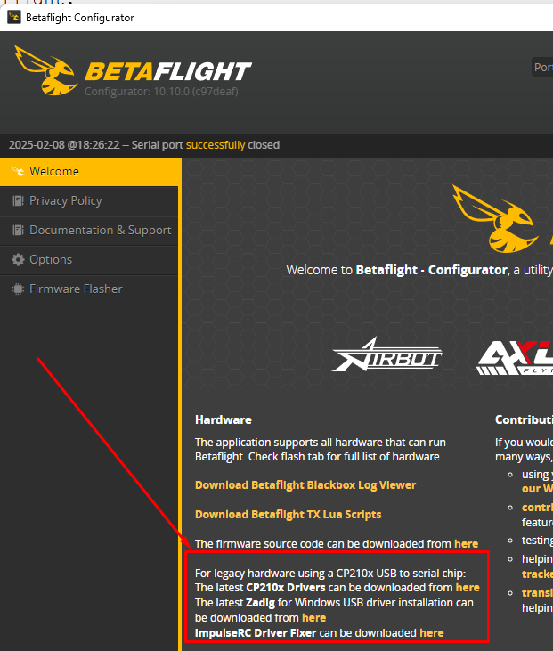
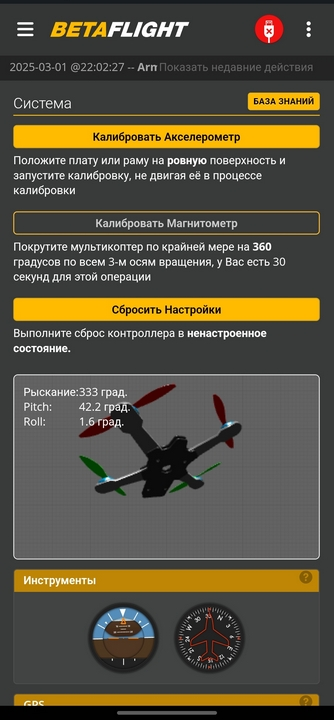
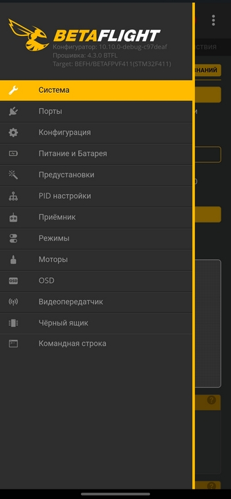
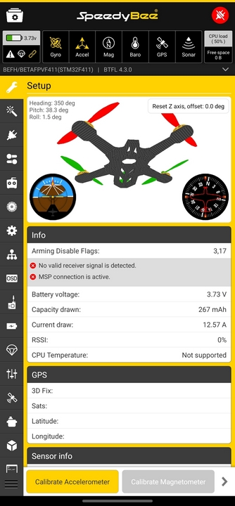

# Подключение дрона к Betaflight Configurator 

## На Windows
К конфигуратору можно подключать **только дроны на прошивке Betaflight**.

Если дрон подключен, но конфигуратор не видит его в списке портов, возможно имеется проблема с драйвером. Это можно увидеть перейдя в Диспетчер устройств. Если там неизвестное устройство - нужно ставить драйвера.  
Ссылки на драйвера можно увидеть на главной странице конфигуратора:  

Так же возможные варианты перечислены в статье [FAQ / Betaflight Configurator Cannot Connect USB](https://hackmd.io/@nerdCopter/rJv5TUrQ2)

## На телефоне с Android
Дрон можно подключить кабелем к телефону на Android через OTG переходник (с одной стороны USB-A, с другой USB-С).   
**Внимание!!!** Питания дрона от телефона может не хватить, поэтому лучше подключить к дрону батарею.  

На телефон нужно установить одну из двух программ: 
- Betaflight Configurator for Android. APK файл находится [на странице скачивания](https://github.com/betaflight/betaflight-configurator/releases).  
   

- [SpeedyBee приложение из Google Play](https://play.google.com/store/apps/details?id=com.runcam.android.runcambf)  
  

[Видео, как выглядит подключение](Dron_Android_SpeedyBee.mp4)

## Подключение к конфигуратору через WiFi
Вы можете подключиться к Betaflight Configurator на компьютере или телефоне/планшете через WiFi, используя возможности приёмника **ExpressLRS (ELRS)** с поддержкой WiFi.

1.  **Вход в режим WiFi**:  
**Вариант 1**: Включите дрон, не включая пульт, и приёмник ELRS через некоторое время автоматически перейдёт в режим точки доступа WiFi, если не получит сигнала с пульта. Обычно для этого требуется подождать около минуты. Организуйте обдув дрона на время пока он стоит включенным.  
**Вариант 2**. Включите дрон при включенном пульте с прошивкой EdgeTX. Когда произойдет связь с пультом нужно открыть ExpressLRS Lua script, зайти в пункт `WiFi Connectivity` и выбрать `Enable Rx WiFi`. Пульт пошлет ELRS приемнику команду на переход в WiFi режим, при этом связь между пультом и полетником прервется. 

2.  **Подключение**: Подключитесь к созданной дроном сети WiFi с компьютера или смартфона. Имя сети будет **"ExpressLRS RX"**.

3.  **Конфигурация**: Откройте Betaflight Configurator. В поле порта вместо `COM` выберите `tcp://10.0.0.1` и нажмите **Connect**.

Так же можно увидеть как это выглядит в видео [How to connect to Betaflight wirelessly using ELRS and Android Devices! YouTube: WestFPV](https://www.youtube.com/watch?v=xd1u6SfyveI)
