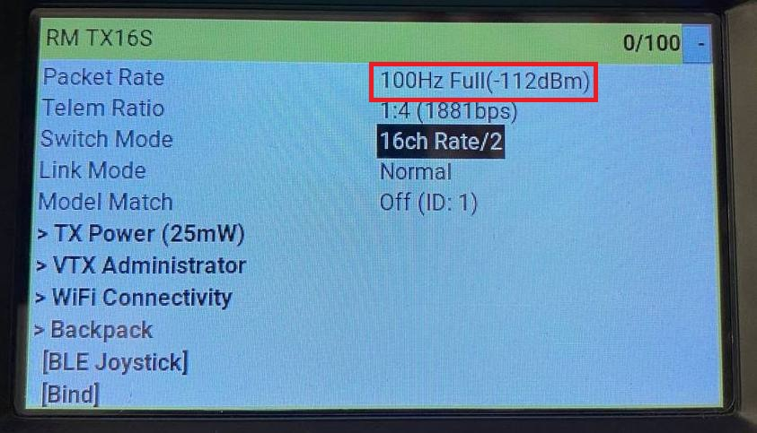

# Общая информация
Самый распространенный гражданский протокол - CRSF, у него есть 2 наиболее распространенных версии:
`ExpressLRS (ELRS)` — ExpressLRS является современной радиоуправляемой системой обеспечивающий передачу сигнала с пульта на приемник для управления дроном. В ней доступны все возможности, которые необходимы для операторов FPV. Более высокая частота обновления.  
Также ELRS обладает открытым кодом. Если имеются навыки и прямые руки можно даже прошивку модифицировать самостоятельно.

Предыстория: фирма [Team Blaсk Sheep](https://www.team-blacksheep.com/) разработала систему радиосвязи TBS Crossfire Tx, где название протокола связи - Crossfire.   
TBS CRSF - закрытая разработка, более защищенная, стабильная и все прочее, соответственно разработчик данного протокола берет дополнительную плату, в счет разработки данного протокола + за само устройство ("железо"). Никто, кроме них, устройства на TBS CRSF не производит.  

Open Source сообщество разработало же свою систему радио связи ExpressLRS. Протокол связи тот же Crossfire, но обвязка другая.  
Производителей устройств на ELRS - десятки.
Соответственно различные устройства на ELRS, даже от разных производителей, при соответствии версий прошивок между собой работают без каких либо нареканий.   
Если же говорить о TBS, то придется всю аппаратуру покупать от них, так как кроме как между собой они не работают.  
Хорошая аналогия - устройства на Android и устройства на iOS

## Отличия подключения через UART и  SPI
Картинка взята из видео Петрокея [ExpressLRS - взгляд изнутри. Принципы, алгоритмы, форматы... Youtube: Petrokey](https://www.youtube.com/watch?v=WoXPkvHTBi4)   

## Прошивка ELRS приемников, подключенных по SPI
На вупах часто стоят полётники с SPI приёмниками. Их не нужно отдельно прошивать, их прошивка уже содержится в Betaflight.
 
Betaflight 4.3.x идет с ELRS 2.x.x  
Betaflight 4.4.x идет с ELRS 3.x.x  

Также раньше были сборки Betaflight 4.3 с поддержкой ELRS 3, но с выпуском Betaflight 4.4 необходимость в них отпала, ставьте официальный 4.4.

[Взято отсюда](https://www.expresslrs.org/hardware/spi-receivers/).

Не забывайте, что при апгрейде с 4.3 на 4.4 слетают настройки, перед обновлением делайте бекап с помощью cli (diff all) или с помощью кнопки Save backup на вкладке "Presets". Тюнинг от 4.3 подходит к 4.4.

## Телеметрия
📡 Как работает телеметрия в ELRS (ExpressLRS)
ELRS — это не только управление дроном, но и двусторонняя связь. Это ключевой момент. В отличие от некоторых старых протоколов, ELRS умеет:  
- Принимать команды с пульта (uplink)  
- Отправлять данные обратно на пульт (downlink / телеметрия)  

### Как телеметрия доходит до пульта
Передатчик на дроне (Receiver ELRS) умеет передавать информацию обратно на модуль ELRS в пульте (или встроенный модуль).  
Пульт (с модулем ELRS) принимает эти данные, и:  
Показывает их на экране пульта (если он умеет)  
Или пересылает в очки/дисплей (через Bluetooth/USB/или физически)

### Что может включать телеметрия:
RSSI, LQ (сигнал связи)  
Напряжение аккумулятора  
Ток  
GPS-координаты  
Высота, скорость, температура, и др.  

Эти данные берутся из полетного контроллера (FC) — например, через UART-порт или через CRSF-протокол.  

### На каком канале передаётся телеметрия?
На том же радиоканале, что и управление дроном.  
ELRS использует двунаправленную связь на частоте 2.4 ГГц или 900 МГц (в зависимости от оборудования).  
Просто он чередует uplink и downlink в каждом слоте времени (TDMA).  

💡 Простой пример:  
Ты управляешь дроном через ELRS на 2.4 ГГц.  
В полетном контроллере настроена телеметрия CRSF.  
Дрон отправляет данные о батарее → по UART → в приёмник ELRS → по воздуху → обратно на пульт.  
Пульт показывает тебе напряжение, RSSI и т.д.  

### Как ELRS передаёт телеметрию (под капотом)
1. 📤 Передача с пульта (uplink — ты управляешь дроном)  
Передатчик (TX) находится в пульте (например, модуль ELRS на 2.4 ГГц).  
Он отправляет команды управления (throttle, yaw, pitch, roll и др.) по радиоканалу на дрон.  
2. 📥 Приём на дроне (receiver RX)  
Дрон оснащён приёмником ELRS (например, Happymodel EP1/EP2, BetaFPV Micro RX и т.п.)  
Этот приёмник подключён к полетному контроллеру (FC) через UART.  
Данные управления передаются в полетный контроллер по CRSF-протоколу.  
3. 📡 Отправка телеметрии обратно (downlink)Вот тут происходит магия телеметрии:  
Полетный контроллер (FC) формирует телеметрию: например, данные о батарее, RSSI, GPS.  
Эти данные отправляются через тот же UART в обратном направлении — от FC → в приёмник ELRS.  
Приёмник ELRS, получив телеметрию, отправляет её по тому же радиоканалу обратно на модуль ELRS в пульте.  
4. 📶 Как передаётся по радиоканалу (важно!)  
ELRS использует двунаправленный протокол на одном радиоканале (Half Duplex TDMA).  
Он поочередно передаёт пакеты:  
В одном временном слоте: команда управления от пульта → дрон  
В другом временном слоте: телеметрия от дрона → пульт  
Всё это происходит очень быстро, с частотой до 500 Гц, поэтому ты не замечаешь задержки.  
5. 🧾 Как пульт это принимает  
Пульт (например, Radiomaster, Zorro, Boxer и т.п.) принимает телеметрию через свой ELRS-модуль.  
Далее:  
Он может отображать данные на экране.  
Или передавать их в симулятор/на очки/через Bluetooth/USB/или на логгер.  

## Прошивка ELRS
[Полный гайд: 4 способа прошивки ELRS приемника. YouTube: DRONOFLY FPV](https://www.youtube.com/watch?v=meUq4ThdNGc)

## Использование 16 каналов
Вопрос: Хочу задействовать кнопки на пульте, но почему-то в бетке они не реагируют. Elrs передает 16 каналов 4 из которых это стики по умолчанию. С 9 по 12 aux - свободны. Никакие тумблеры на пульте с ними не связаны. На пульте в миксах добавил канал, но в бетке они не реагируют. Как правильно это настроить?

Ответ от `Maksim Klipa`: В настройках ELRS нужно переключить Packet Rate на частоты с буквой F (Full). 100Hz Full или 333Hz Full. Тогда откроется режим для 16-ти каналов:  

## Статьи и видео
[ExpressLRS - взгляд изнутри. Принципы, алгоритмы, форматы... Youtube: Petrokey](https://www.youtube.com/watch?v=WoXPkvHTBi4)  

[ELRS Complete Beginner Guide 2025. YouTube: Joshua Bardwell](https://www.youtube.com/watch?v=N0ajKoef3qs)

[Всё про ELRS (dzen.ru)](https://dzen.ru/a/ZiC61ueuLzUoSm3_)  

[Сайт по ELRS от Алексея Родина](https://expresslrs.ru/)

[Before First Flight](https://www.expresslrs.org/quick-start/pre-1stflight/)  

[ELRS dipole antenna orientation - horizontal or vertical](https://intofpv.com/t-elrs-dipole-antenna-orientation-horizontal-or-vertical)

[Чому не працює ExpressLRS? 13 типових випадків #fpv #українською. YouTube: FPV питаннячка (укр.)](https://www.youtube.com/watch?v=ffJMgkCRWZk)

