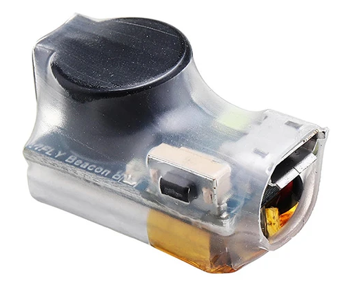
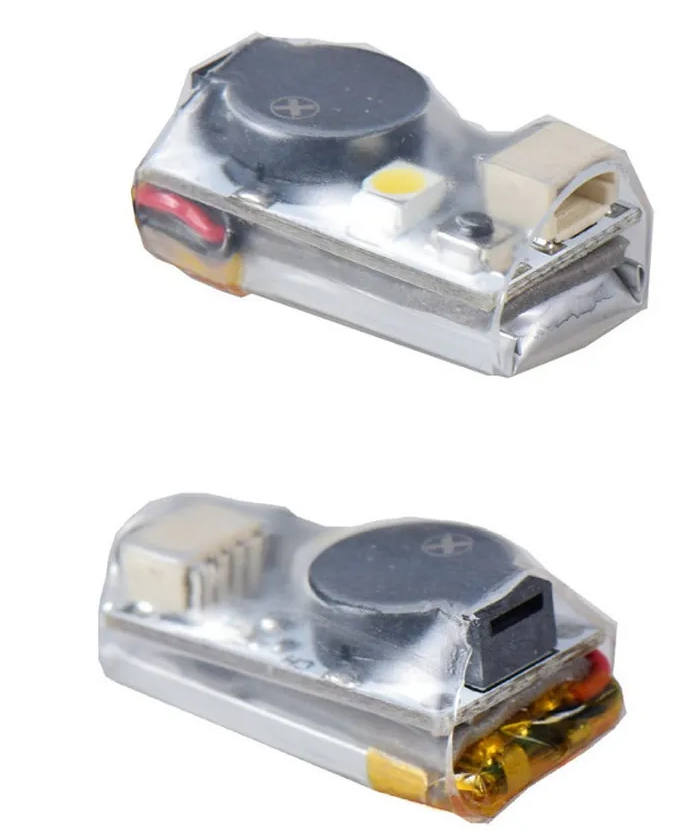
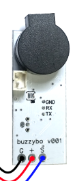
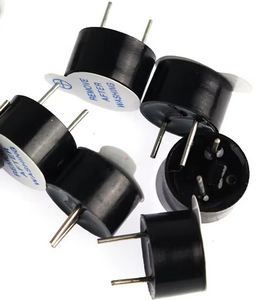
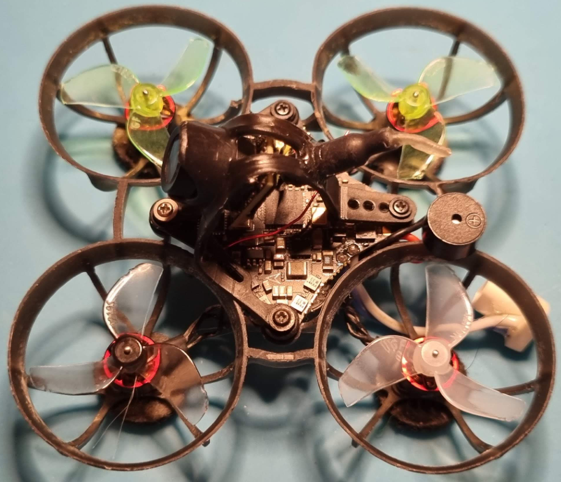

# Внешний бузер (buzzer, бипер, пищалка)

## VIFLY Beacon Wireless Drone Buzzer
[На Aliexpress.com](https://aliexpress.com/item/4000645203533.html)  
  
[Как не потерять дрон, или установка и тест Vifly beacon пищалки на Betafpv Cetus X FPV. YouTube: Petrokey](https://www.youtube.com/watch?v=jTDNMKAEFCI)  

Работой бузера доволен. 
Я прикрепил на боковой луч Cetus X. На балансировку не повлияло. Правда при падении вверх ногами погнул зарядный разъем на бузере. Поэтому стал вешать снизу. Там он более защищенный...  м
На Meteor85 тоже повесил под боковым лучом.

## JHE20B Mini Finder 5V 
[На Aliexpress.com](https://aliexpress.com/item/1005004901077071.html)  
  
[Cetus X Vifly Finder Mini installation - YouTube](https://www.youtube.com/shorts/3XbDSjdwDVc)  

### Подключение к полетнику без контактов `buz`
На полетнике для дронов типа Meteor65/75/Air65/75 отсутствует пятка `buzz`.  
Поэтому можно запитать от контактов `LED`  
'+' на 5v  
'-' на gnd    
Зеленый на LED -  

Подробности в видео [Подключить неподключаемое - vifly mini на meteor75 где нет контактов BUZ. YouTube: Petrokey](https://www.youtube.com/watch?v=JfopONCaKm4)    

Но при подключении питания может начать сразу пищать сплошным звуком, а при нажатии на соотв. клавишу пульта - прерывистым. Если отключаю ее мелкой кнопкой - просто замолкает насовсем, и не реагирует на пульт.  
Причина: На контакте линия (+), а ему нужен управляющий (-).  
Нужно инвертировать командой
```
set beeper_inversion = OFF
```
Подробности в видео [Лечение проблемы при подключении буззеров HE42B/ JHE42B _ s/JHE20B на дроны серии meteor 75 pro. YouTube: practic61](https://www.youtube.com/watch?v=kq6BvsVIpjo)

## tBeacon buzzybo
[tBeacon buzzybo](https://tbeacon.org/magazin/mayaki/tbeacon-buzzybo-ru)  


[Buzzybo- Продвинутая поисковая пищалка от tBeacon! YouTube: RCSchoolmodels](https://www.youtube.com/watch?v=jb2ZlR3dbec)

## Active Buzzer 95.5mm TMB09A05


[10PCS 5V Active Buzzer 9*5.5mm TMB09A05 Mini Active Piezo Buzzer](https://vi.aliexpress.com/item/1005007267575526.html)

Альтернатива:  
[Electromagnetic Active Buzzer Alarm 12V 5V 3.3V TMB9650 9650 SOT](https://vi.aliexpress.com/item/4000159400448.html)

### Подключение к BETAFPV Air65
Просто напаиваем на контакты полетника BZ+ и BZ-. Сразу начинает работать.  


### Подключение к BETAFPV Meteor65 Pro
На полетнике (кресте) нет выводов на бипер. Можно подключить на один из RX UART2 выходов, но через транзистор. Потом вывод будет переназначен на BEEPER ресурс:  
```
resource SERIAL_RX 2 none
resource BEEPER 1 A03
save
```

В качестве транзистора можно взять один из вариантов:  
- Mosfet: BSS138 (SMD) / 2N7002 (SMD)  
- Обычный корпус: BS170 / 2N7000  

Подробности в видео [Pimp my Whoop: Meteor65 Pro buzzer and LEDs mods. YouTube: Mustikkakeitto](https://www.youtube.com/watch?v=Pm72lBBX2G0)

### Проблема с неверным напряжением на контактах
[Все проблемы пищалки на 1s тайнивупах. Youube: Петрокей](https://www.youtube.com/watch?v=PY_xzGA5Gf0)