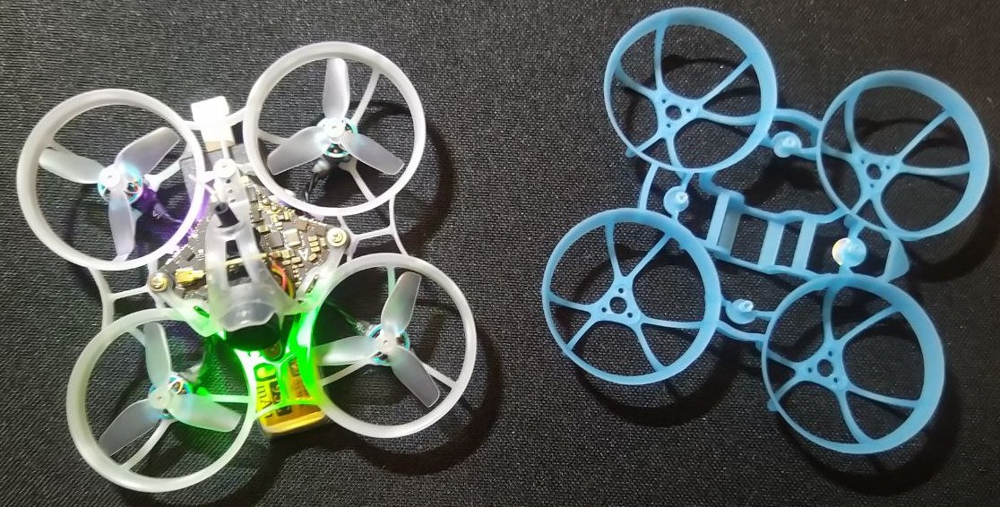

# Рама для 1S вупа с баткой 450mah
Пользователь `Lex RES` поделился опытом:  
В хозяйстве появился мелкий 65. Но что бы не переходить на новый тип баток, и остаться на 450, возникла потребность в креплении их на раме.  
Был вариант- "пилить" раму.  
Был вариант сесть потрохами от 65 на раму от 75.  
Но в итоге была приобретена рама (* не реклама) [NewBeeDrone Cockroach V3 65mm Brushless Ultra Light Frame](https://newbeedrone.com/collections/newbeedrone-frame/products/newbeedrone-cockroach-v3-65mm-brushless-ultra-light-frame), которая отлично подошла по размерам, под мою задачу.

  
  

