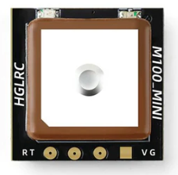
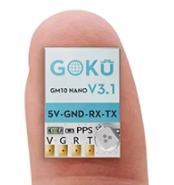
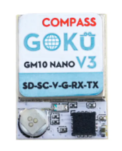
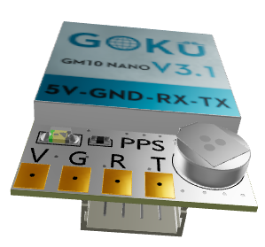
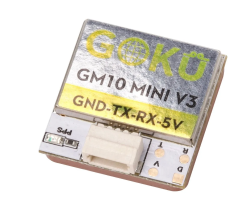

# Установка и настройка GPS модуля

## Проверенные модели

### HGLRC M100_MINI GPS
[На сайте производителя](https://www.hglrc.com/products/hglrc-m100_mini-gps)  


### GOKU GM10 Nano V3 GPS без компаса
[На сайте производителя](https://flywoo.net/products/goku-gm10-nano-v3-gps)  
[Aliexpress.com](https://aliexpress.com/item/1005005035552894.html)  


### GOKU GM10 Nano V3 GPS с компасом
[На сайте производителя](https://flywoo.net/products/goku-gm10-nano-v3-gps-w-compass)  


### FLYWOO GOKU GM10 Nano V3.1 GPS
[На сайте производителя](https://flywoo.net/products/goku-gm10-nano-v3.1-gps)  
[Aliexpress.ru](https://aliexpress.ru/item/1005005035552894.html)  
[Aliexpress.com](https://vi.aliexpress.com/item/1005005035552894.html)  
 

### FLYWOO GOKU GM10 Mini V3 GPS
[На сайте производителя](https://flywoo.net/products/goku-gm10-mini-v3-gps)  


## Установка и настройка
[Cetus X GPS module installation. YouTube: Mustikkakeitto](https://www.youtube.com/watch?v=C2e9Owgp-a8)  

[Как настроить GPS на FPV дроне - возврат домой, FAILSAFE, RESCUE в BETAFLIGHT 4.5. YouTube: recopter](https://www.youtube.com/watch?v=l4f07dlX5eQ)  

[ИДЕАЛЬНАЯ НАСТРОЙКА FAILSAFE и GPS RESCUE в BETAFLIGHT | Практическое руководство](https://www.youtube.com/watch?v=ybucv4Lv9Uc)  

[Подключаем GPS к FPV, ViFly GPS mate, ost, телеметрия на апе. YouTube: Петрокей](https://www.youtube.com/watch?v=AULG-AP712E)  
[VIFLY GPS-Mate 3.7V 50mAh LIPO Exclusive Power Module with Built-in Lost Drone Alarm](https://vi.aliexpress.com/item/1005003676846838.html)

[How to Install a GPS On your FPV Drone and activate POSITION HOLD! YouTube: Rimzler](https://www.youtube.com/watch?v=nWHjarJv7cU)

[Softserial with GPS](https://betaflight.com/docs/wiki/guides/current/softserial#softserial-with-gps)


## Отзывы и комментарии от пользователей

### Отзыв №1
HGLRC Draknight 2-inch + FLYWOO GOKU GM10 Nano V3.1 GPS   
Я сейчас пришел по теме GPS к практическому выхлопу. Раньше все это было далеко, теоретически, заковыристо, и непонятно. Теперь устаканилось. Может кому пригодится.
Итак.  
1. Датчик работает, на открытом месте ловит отлично... но (???) на очки координаты не выводит. Ну и ладно.  
2. Зато он дает координаты на пульт.  
3. И главное - при обрыве связи на экране ТЕЛЕМЕТРИИ (настроить!!!) остаются последние зафиксированные координаты (+++!!!+++), и прям так настойчиво мигают. То есть, уточняю - связи уже давно нет, дрон пропал - а координаты есть. Берем телефон - и вперед.  
4. Поэтому в очках (FPV) в принципе они не так уж необходимы.  

### Отзыв №2

Итог сие квеста:   
1. Оживил SoftSerial при помощи команд. А именно:  
А) включил SoftSerial в конфиге в Betaflight  
Б) ввёл команды назначающие tx/rx софтсириала  
2. в настройках порта поставил, что сенсор GPS  
3. вывел инфу GPS на апgу (через телеметрию) и на OSD  


Всё бы ничего и всё хорошо работает, но опрос GPS один раз в секунду и такой частоты недостаточно для успешного "возврата домой". Об этом пишут в глубинах китайских форумов и на сайте бетафлай. А именно:
```
GPS modules can be used for two quite different purposes:
    to collect data such as latitude, longitude, altitude, speed etc, at low data rates, eg 1-2 Hz, to assist with finding the quad if it is lost, or to log flight paths.
    for GPS Rescue and position hold purposes, where data is typically received at 10Hz.
```
Поэтому пересадил управление VTX на SoftSerial, а GPS повесил на освободившейся от VTX порт UART.

Про SoftSerial можно посмотреть [в этой статье](./22_Прошивка_полетника/30_Betaflight/SoftSerial.md)

## Position Hold, Altitude Hold
[Утримання позиції на FPV дроні по GPS. Betaflight 4.6 Прошивка, налаштування і тести. YouTube: Є-Дрон (укр.)](https://www.youtube.com/watch?v=VrKpEzWQol0)

## Проблема: GPS долго ловит спутники
1. Первый раз подключение (или подключение в новой локации) к спутникам может быть 10-20 минут, в GPS модуле есть своя маленькая батарейка, которая запоминает координаты и в следующий раз подключается быстрее. Если каждый раз подключается долго, то возможно села эта маленькая батарейка.  
2. На GPS влияет антенна VTX, и рекомендуют не размещать антенну рядом. При первом подключении GPS рекомендуют даже отключать VTX.


