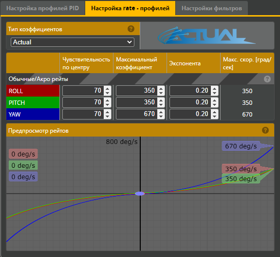
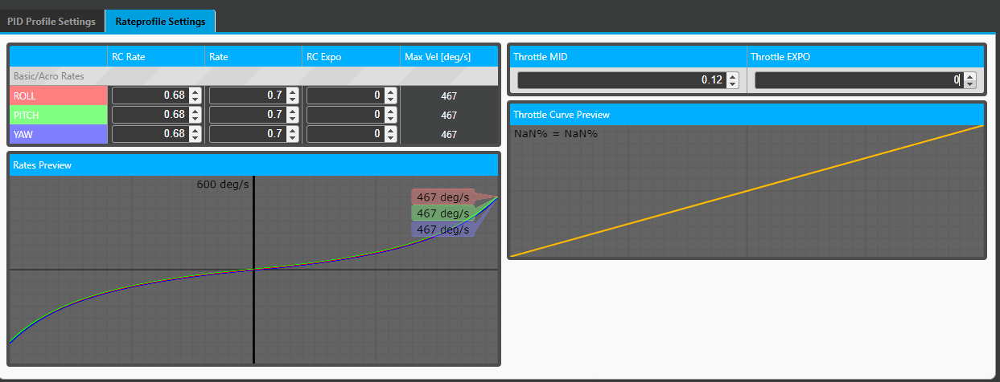
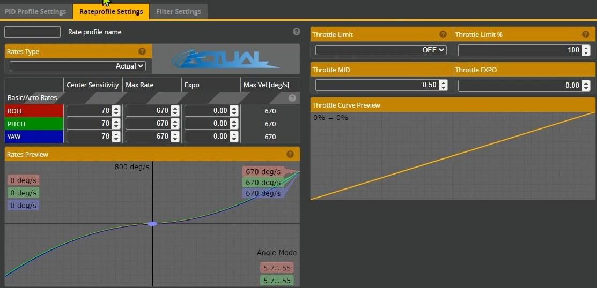
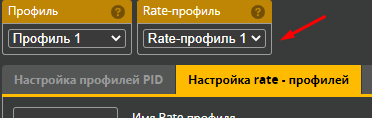

# Все о рейтах (rates) и их настройке

## Скорость вращения
При управлении дроном важна величина скорость вращения. Измеряется в градусах в секунду. Эта величина показывает, на сколько градусов прокрутится твой дрон по определенной оси при отклонении стика на одну секунду.  
Например, если эта величина равно `360`, то за секунду дрон провернется на `360` градусов. То есть сделает **полный оборот** (флип или ролл) за одну секунду.
Этого конечно мало. Тупо жать секунду стик, чтобы крутануть один оборот. Сто раз успеешь куда-нибудь врезаться.  
У фристайлеров может стоять величина близкая к `1000` градусам. То есть за секунду примерно 3 полных оборота. Ну и естественно нужно понимать, насколько нужно хорошо владеть стиками, чтобы отклонив всего на треть секунды крутануть ролл и вовремя вернуть стик назад.  

## Настройка в Betaflight Configurator
Рейты настраиваются в Betaflight Configurator, в разделе `PID Настройки` на закладке `Настройка rate - профилей`.  
  

Мы видим три колонки, в которые можно вводить значения.  
Рейты настраиваются отдельно для трех осей: Roll, Pitch и Yaw. За скорость флипа отвечает строчка в которой написано PITCH (это правый стик вверх/вниз), а за ролл - строчка ROLL (левый стик лево/право).  

Ниже таблицы значений расположен график с линиями (прямыми или кривыми) разных цветов `Rates Preview (Предпросмотр рейтов)`. Эти линии показывают скорость вращения в разных положениях отклонения стика от своего центра. Если пульт подключен к дрону, можно двигать стиками и на графике будет видна точка положения и текущее значение скорости вращения.

### Типы коэффициентов
Есть несколько типов коэффициентов для настройки рейтов.  
Часто используемые: `Actual`, `Betaflight`.  
В них разные коэффициенты. Но в результате кривая рейтов будет одинаковая и смысл будет тот же.  
Есть [конвертер рейтов (rates converter)](https://rates.metamarc.com/) из одного типа в другой.

### Тип **Actual**
Рассмотрим тип **Actual** (на скриншоте выше).  
Принцип настройки одинаков для всех осей.  
Рассмотрим настройку на примере Roll. 
 
#### Max Rate (Максимальный коэффициент)
Показывает, на сколько градусов в секунду прокрутится твой дрон по оси при **максимальном** отклонении стика.  
Например, если стоит `360`, то если стик отклонить максимально в сторону, за секунду дрон провернется на `360` градусов.

#### Center Sensitivity (Чувствительность по центру)
Показывает, на сколько градусов в секунду прокрутится твой дрон по оси при **минимальном** отклонении стика.  
Иметь эту величину меньше чем та что на максимальном очень удобно, когда летишь медленно и нужна точность управления.  
Например, если там стоит 70, это значит, что при минимальном отклонении стика дрон будет поворачиваться всего на 70 градусов за секунду удержания стика в таком положении. Если же отклонить на долю секунды, то и того меньше.

#### Expo (Экспонента)
Если это значение равно 0, то по мере отклонения стика от минимального положения к максимальному, скорость вращения будет менять **почти линейно**, от значения `Center Sensitivity` до `Max Rate`.  
При такой настройке на графике будет видна **слегка искривленная линия**, идущая от нижнего левого угла до верхнего правого.

И это не всегда удобно. Может хотеться, чтобы, например даже при отклонении на стика на треть, скорость вращения была так же близка к начальным тем же 70.  
И тут на помощь приходит параметр Expo. Если в него ставить что-то, больше 0, мы достигнем описанного выше эффекта. И тогда на графике будет уже не прямая линия, а дуга или **кривая**. 

### Тип **Betaflight** (кратко)
Подробнее почитать можно [в этой статье](https://oscarliang.com/rates/#Delving-into-Betaflight-Rates).  

#### RC Rate
Увеличивает макс рейт без экспоненты. Есть выставить его в 1 а остальные в 0, то будет прямая линия: 200 как в начале стика, так и в конце.

#### Rate
Поднимает рейты с экспонентой, начинающейся с 50 процентов хода стика

#### RC Expo
Искривляет всю линию вокруг центра (те же 50% хода стика)

## Настройка в BETAFPV Configurator
Некоторые дроны от BETAFPV имеют нестандартную прошивку, несовместимую с Betaflight. Поэтому их настройка осуществляется в другой программе: `BETAFPV Configurator`. Данный конфигуратор поддерживает только рейты типа `Betaflight`.  
Принцип настройки и коэффициенты похожи.  
  

**Конфигуратор имеет глюк отображения**:  
Когда открываешь закладку с рейтами - отсутствуют графики и в правой колонке нули
Если поклацать вверх/вниз на стрелочки в каждой строчке, появятся и графики и цифры.

## Настройка стика газа (Throttle)
[Настраиваем кривую газа для плавного полета. YouTube: Mustfly](https://www.youtube.com/watch?v=ujsEnSDha84)

## Типичные настройки рейтов
Рейты у фристайлеров и гонщиков могут отличаться. Обычно у гонщиков рейты ниже.

### Стандартные рейты по умолчанию.  
Если к ним привыкнуть можно летать без перенастройки. И даже неплохо фристайлить :)  

### Рекомендуемые рейты для начинающих. 
Летаем медленно и аккуратно.  

### Рейты у фристайлера [Patrick Watkins](https://www.youtube.com/@fpvwithpatrick)

### Рейты от [Dinglez](https://www.youtube.com/@Dinglez44)
I use betaflight rates.  
For freestyle:  
The numbers are on roll/pitch 1.12 - .72 - 0 = 800 degrees/sec  
Yaw is 1.12 - .65 - 0 = 640 degrees/second.  
My race rates are the five33 rates which is .8 - .7 - 0 = 533 degrees/second

## Профили рейтов
Можно настроить несколько разных наборов рейтов и переключаться между ними. Причем даже в полете.
Профили переключаются на той же странице.  
  
То есть можно указать разные рейты в профиль, сохранить, переключиться на другой профиль, настроить и тоже сохранить.

### Переключение профилей рейтов в полете
Переключение профилей рейтов можно настроить на какую-нибудь кнопку.  
Для этого нужно:  
- включить `Expert Mode`. Появиться вкладка `Adjustments`  
- выставить как на скриншоте ниже, выбрав свой канал с кнопкой.  

## Статьи и видео
[НАСТРОЙКА РЕЙТОВ НА КВАДРОКОПТЕРЕ. YouTube: АквариуМИСТИКА FPV](https://www.youtube.com/watch?v=0IswQO2v-WY)

[Betafpv Cetus X - угомонись! Дрон прыгает, дрейфует и прилипает к стенам. Настройка FPV для квартиры. YouTube: Petrokey](https://www.youtube.com/watch?v=kPr2hmY9g5g)

[Find YOUR perfect rates! With science! YouTube: Joshua Bardwell](https://www.youtube.com/watch?v=Ql62iRkLX3s)

[FPV Drone Rates Explained_ Betaflight & Actual Rates - Oscar Liang](https://oscarliang.com/rates/)

