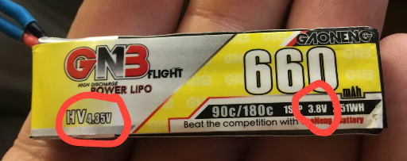
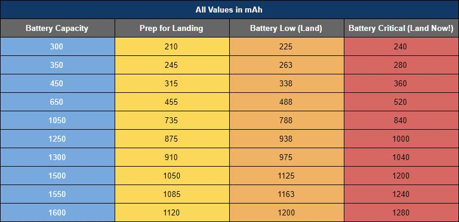

# Батареи

## Уход за батареей
Чтобы продлить срок службы батареи лучше следовать таким правилам:  
 - Можно сразу заряжать новые батки.  
 - Полный заряд на одну банку: 4.2 (4.35 для LiHV).   
 - Хранить полностью заряженными **не более трех суток**  
 - НЕ разряжать ниже 3.3в на банку.  
 - Хранить зарядив до значения Storage около 3.8-3.85в на банку. Обычно напряжение хранения пишется на самой батке.  
  
 - Заряжать батарею желательно током не превышающим определенного расчетного значения. См.пункт ниже.
 
## Каким током заряжать
Чтобы продлить срок службы батареи, желательно ее заряжать током, не превышающим определенного расчетного значения.  
На батарее есть емкость, например, 450мАч.  
Может присутствовать характеристика Charge Rate. Например, 2С.
Если ее нет, то значит Charge Rate = 1С

Формула:  
 **Емкость(мАч) / 1000 * ChargeRage = ХХ ампер**

Например:  
450mAh/1000*1 = 0,45А +-10%
То есть рекомендуемый ток зарядки 0.4-0.5А

Подробнее почитать можно в статье [Всё о LiPo батареях для FPV дронов](https://dronomania.ru/faq/vsyo-o-lipo-batareyah-dlya-fpv-dronov.html)

## Внутреннее сопротивление
0-6 мОм - отлично  
7-12 мОм - хорошо  
13-20 мОм - плохо  
более 20 мОм - в утиль  

## Расход батареи
Дроны на прошивке Betaflight позволяют выводить в OSD расход батареи, что бывает удобно для понимания израсходованного количества и степени деградации емкости.  

Однако может потребоваться калибровка сенсора. Вот статья об этом:  
[Current Sensor Calibration in Betaflight](https://oscarliang.com/current-sensor-calibration/)

Ниже представлена таблица, показывающая критические значения уровней расхода батареи в зависимости от ее емкости.  

