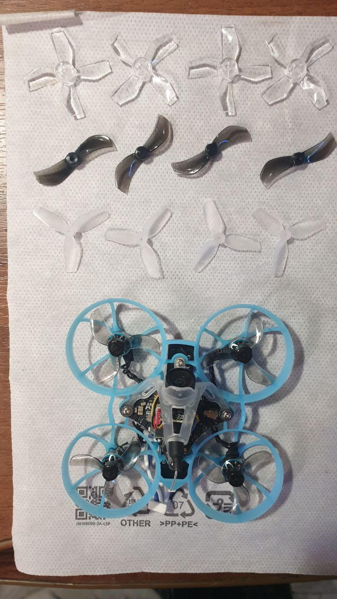

# Пропеллеры

## Как снять/надеть пропы пальцами на примере Meteor75
[Видео от Виталия (@V8787)](PropsInOut.mp4)

## Сравнение пропеллеров
Резюме от пользователя I_Neo_USSR:
В сравнении со стоковыми 3-х лопастными стоковыми. 
  

1210 двух лопастные - по ощущениям легче отрывается от земли, отрыв резкий, посадка плавная, газ висения примерно тот же 45-47% ну может чуть меньше на 3-5%. Не так прыгает у пола, можно стабилизировать, стабильнее держит высоту. По ощущениям стал чуть шустрее и более чувствителен и отзывчив. Под стулом пролететь сложновато из за повышенной чувствительности, но возможно. Время полёта 5.10м. Пропы снимаются удобнее и легче всех.

1220 4-х лопастные - очень стабильно висит в воздухе, легко и уверенно отрывается без рывка, плавно отзывается, очень управляемый, не такой резвый и отзывчивый, более вялый, но очень управляемый и стабильный. Практически не прыгает у пола, слегка покачивается. Газ зависания 43-45 %. Легко и стабильно пролетает под стулом, столом, держит высоту у пола. Время полёта 5.20м

1208 3-х лопастные - управляемость так себе, отзывчивый, но менее манёвренный. Газ зависания стал чуть больше, где то 55-57%. Под стулом пролететь сложнее всех предыдущих. Понравились меньше всех. Время полёта 5.10м

Ну и стоковые трёхлопастные - стабильнее чем 1208, усреднённые универсальные, так назвал бы. Под стулом пролететь можно, но сложно, подбрасывает у пола. Ни то ни сё. Летают, но ярких особенностей нет. Газ висения 48-52%. Время полёта 4.30. Подумал бы на батку, но судя по послкдним видосам так и было до этого теста на всех батках плюс минус.

Итого выделил бы двух лопастные для фристала и ловких рук и четырёх лопастные для аккуратных и точных полётов по дому без суеты.
 
Время полёта плюс минус будем считать одинаковое с погрешностью + - 10 сек ну или трёшки всё же самые менее продолжительные