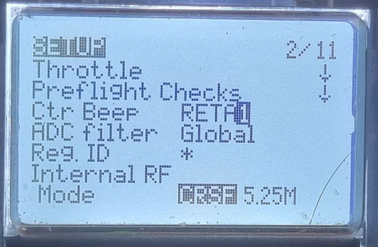

# RadioMaster Pocket

[Страница на сайте производителя](https://www.radiomasterrc.com/products/pocket-radio-controller-m2)

[How to Setup Radiomaster Pocket Radio | Upgrades, Tips and Tricks](https://oscarliang.com/setup-radiomaster-pocket/)

[User Manual](Pocket_User_Manual.pdf)

## Аккумуляторы
Аппаратура требует два аккумулятора стандарта 18650. Неплохой производитель таких аккумов: `Litokala`.  

Важный момент - аккумуляторы должны быть БЕЗ защиты.  
Выглядят вот так:  
  

Если же есть защита (это такая встроенная платка), то аккумуляторы чуть длиннее и часто не влезают в устройства.  
Аккумулятор с защитой выглядит вот так:  

## Обзоры
[Radiomaster Pocket - карманная аппаратура. Обзор. от ZhukoRama FPVlog (ZRFPV)](https://www.youtube.com/watch?v=wqdwZkqQtCA)   

[Radiomaster Pocket - обзор, разбор, пейр от Петрокей](https://www.youtube.com/watch?v=xYzz5JtX9GE)  

[Radiomaster Pocket - ОБЗОР ОТ А ДО Я 🔥 Аппаратура для начинающего FPV пилота? youTube: DRONOFLY FPV](https://www.youtube.com/watch?v=rgTbqERtoGc)

[Огляд Radiomaster Pocket. Для кого він? + тестовий політ от Є-Дрон](https://www.youtube.com/watch?v=H7OgTsX0HKI) 

## Bind
[Перевод пульта в режим Bind](./../../../../60_Bind/60_Rezhim_Bind_pulta_EdgeTX.md)

[Указание Bind фразы](./../../../../60_Bind/56_Bind_fraza_pulta_EdgeTX.md)

[Я забыл BIND-фразу ELRS ! Что делать ? YouTube: ZhukoRama FPVlog (ZRFPV)](https://www.youtube.com/watch?v=c6mdZVzCn58)  

[Аппаратура не биндится с Meteor85][bind_meteor85]

## [Оригинальные запчасти на AliExpress](https://aliexpress.com/item/1005006011760235.html)

## Кнопки и каналы
Aux1 SA (2-х позиционный)  
Aux2 SB (3-х позиционный)  
Aux3 SC (3-х позиционный)  
Aux4 SD (2-х позиционный)  
Aux5 SE (не фиксируется)  
Aux6 SI (колесо)  

Пример использования:  
Aux1 SA (2-х позиционный) - Arm  
Aux2 SB (3-х позиционный) - Acro/Angle/Air  
Aux3 SC (3-х позиционный) - Три профиля рейтов с разными ограничениями троттла  
Aux4 SD (2-х позиционный) - пищалка  
Aux5 SE (не фиксируется) - черепаха + Arm  
Aux6 SI (колесо) - PIT и разная мощность VTX  

## [Меняем яркость экрана колесиком. YouTube: DRONOFLY FPV](https://www.youtube.com/shorts/s-NqV8Y4suE)

## При вращении колеса не раздается звуковой сигнал
В модели на странице `SETUP 2/11` нужно выставить в поле `Ctr Beep` значение `RETA1`. Причем именно так как на фото ниже.  

## Как разобрать аппаратуру
Видео по разборке: [Апгрейд Radiomaster Pocket: ставим AG01 Nano CNC стики. YouTube: DRONOFLY FPV]()

## Замена кнопок на переключатели
[Radiomaster Pocket - Toggle Switch Mod - YouTube](https://youtu.be/F5A1zEVDFRo)
